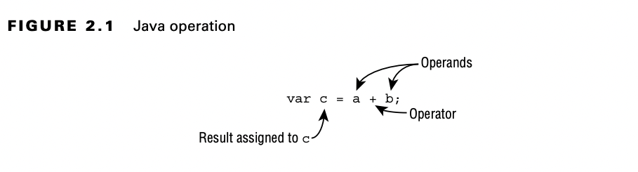

# Understanding Java Operators

A Java operator is a special symbol that can be applied to a set of variables, values, or literals—referred to as
operands— and that returns a result.

The term operand, which we use throughout this chapter, refers to the value or variable the operator is being applied
to.

## Types of Operators

Java supports three flavors of operators: unary, binary, and ternary. These types of operators can be applied to one,
two, or three operands, respectively.

Java operators are not necessarily evaluated from left-to-right order. In this following example, the second expression
is actually evaluated from right to left, given the specific operators involved:

    int cookies = 4;
    double reward = 3 + 2 * --cookies;
    System.out.print("Zoo animal receives: " + reward + " reward points");

## Operator Precedence

In mathematics, certain operators can override other operators and be evaluated first. Determining which operators are
evaluated in what order is referred to as operator precedence. In this manner, Java more closely follows the rules for
mathematics.

Consider the following expression:

    var perimeter = 2 * height + 2 * length;

The multiplication operator (*) has a higher precedence than the addition operator (+), so the height and length are
both multiplied by 2 before being added together. The assignment operator (=) has the lowest order of precedence, so the
assignment to the perimeter variable is performed last.

If two operators have the same level of precedence, then Java guarantees left-to-right evaluation for most operators
other than the ones marked in the table.

| Operator                         | Symbols and examples                                                                  | Evaluation    |
|----------------------------------|---------------------------------------------------------------------------------------|---------------|
| Post-unary operators             | expression++, expression--                                                            | left-to-right |
| Pre-unary operators              | ++expression, --expression                                                            | left-to-right |
| Other unary operators            | -, !, ~, +, (type)                                                                    | right-to-left |
| Cast                             | (Type)reference                                                                       | right-to-left |
| Multiplication/division/modulus  | *, /, %                                                                               | left-to-right |
| Addition/subtraction             | +,-                                                                                   | left-to-right |
| Shift operators                  | <<, >>, >>>                                                                           | left-to-right |
| Relational operators             | <, >, <=, >=, instanceof                                                              | left-to-right |
| Equal to/not equal to            | ==, !=                                                                                | left-to-right |
| Logical AND                      | &                                                                                     | left-to-right |
| Logical exclusive OR             | ^                                                                                     | left-to-right |
| Logical inclusive OR             | &#124;                                                                                | left-to-right |
| Conditional AND                  | &&                                                                                    | left-to-right |
| Conditional OR                   | &#124; &#124;                                                                         | left-to-right |
| Ternary operators                | boolean exp?exp1: exp2                                                                | right-to-left |
| Assignment operators             | =, +=, -=, *=, /=, %=, &=,  ^=, &#124;=, <<=, >>=, >>>=                           | right-to-left |
| Arrow operator                   | ->                                                                                    | right-to-left |

