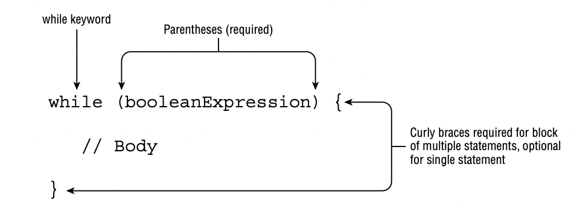
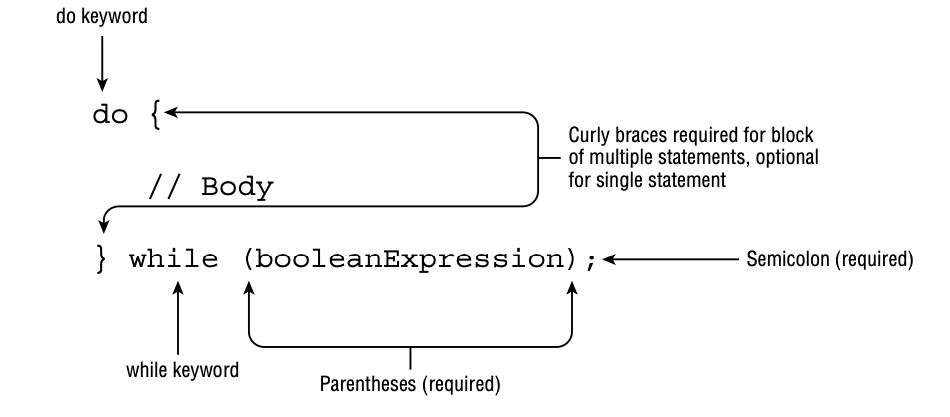

# Writing while Loops

A loop is a repetitive control structure that can execute a statement of code multiple times in succession.

## The while Statement

The simplest repetitive control structure in Java is the while statement.
Like all repetition control structures, it has a termination condition, implemented as a boolean expression, that will
continue as long as the expression evaluates to true.

## The do/while Statement

The second form a while loop can take is called a do/while loop, which, like a while loop, is a repetition control
structure with a termination condition and statement, or a block of statements.

Unlike a while loop, though, a do/while loop guarantees that the statement or block will be executed at least once.

## Infinite Loops

The single most important thing you should be aware of when you are using any repetition control structures is to make
sure they always terminate! Failure to terminate a loop can lead to numerous problems in practice, including overflow
exceptions, memory leaks, slow performance, and even bad data.

An infinite loop is a loop whose termination condition is never reached during runtime.