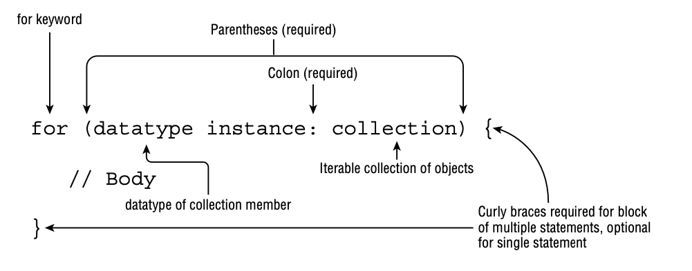

# Constructing for Loops

Even though while and do/while statements are quite powerful, some tasks are so common in writing software that special
types of loops were created—for example, iterating over a statement exactly 10 times or iterating over a list of names.

With that, we present the most convenient repetition control structure, for loops. There are two types of for loops,
although both use the same for keyword. The first is referred to as the basic for loop, and the second is often called
the enhanced for loop. For clarity, we refer to them as the for loop and the for-each loop, respectively, throughout the
book.

## The for Loop

A basic for loop has the same conditional boolean expression and statement, or block of statements, as the while loops,
as well as two new sections: an initialization block and an update statement.

    for(int i=0; i < 10; i++) 
        System.out.println("Value is: "+i);
    System.out.println(i); // DOES NOT COMPILE

Alternatively, variables declared before the for loop and assigned a value in the initialization block may be used
outside the for loop because their scope precedes the creation of the for loop.

    int i;
    for(i=0; i < 10; i++)
        System.out.println("Value is: "+i); 
    System.out.println(i);

### Printing Elements in Reverse

Let’s say you wanted to print the same first five numbers from zero as we did in the previous section, but this time in
reverse order. The goal then is to print 4 3 2 1 0.

    for (var counter = 4; counter >=1 0; counter--) 
    { 
        System.out.print(counter + " ");
    }

For the exam, you are going to have to know how to read forward and backward for loops. When you see a for loop on the
exam, pay close attention to the loop variable and operations if the decrement operator, --, is used. While incrementing
from 0 in a for loop is often straightforward, decrementing tends to be less intuitive. In fact, if you do see a for
loop with a decrement operator on the exam, you should assume they are trying to test your knowledge of loop operations.

### Working with for Loops

There are a number of variations and edge cases you could see on the exam.

**Creating an Infinite Loop**

    for( ; ; )
        System.out.println("Hello World");

It is actually an infinite loop that will print the same statement repeatedly.
Note that the semicolons separating the three sections are required, as for( ) without any semicolons will not compile.

**Adding Multiple Terms to the for Statement**

    int x = 0;
    for(long y = 0, z = 4; x < 5 && y < 10; x++, y++) {
        System.out.print(y + " "); 
    } 
    System.out.print(x + " ");

First, you can declare a variable, such as x in this example, before the loop begins and use it after it completes.
Second, your initialization block, boolean expression, and update statements can include extra variables that may or
may not reference each other.

**Redeclaring a Variable in the Initialization Block**

    int x = 0;
    for(int x = 4; x < 5; x++) // DOES NOT COMPILE
        System.out.print(x + " ");

This example looks similar to the previous one, but it does not compile because of the initialization block. The
difference is that x is repeated in the initialization block after already being declared before the loop, resulting in
the compiler stopping because of a duplicate variable declaration. We can fix this loop by removing the declaration of x
from the for loop as follows:

    int x = 0;
    for(x = 0; x < 5; x++)
        System.out.print(x + " ");

**Using Incompatible Data Types in the Initialization Block**

    int x = 0;
    for(long y = 0, int z = 4; x < 5; x++) // DOES NOT COMPILE
        System.out.print(y + " ");

The variables in the initialization block must all be of the same type.

**Using Loop Variables Outside the Loop**

    for(long y = 0, x = 4; x < 5 && y < 10; x++, y++) 
        System.out.print(y + " ");
    System.out.print(x); // DOES NOT COMPILE

Since x was only scoped for the loop, using it outside the loop will cause a compiler error.

**Modifying Loop Variables**

As a general rule, it is considered a poor coding practice to modify loop variables due to the unpredictability of the
result, such as in the following examples:

    for(int i=0; i<10; i++) 
        i = 0;

    for(int j=1; j<10; j++) 
        j++;

## The for-each Loop

The for-each loop is a specialized structure designed to iterate over arrays and various Collections Framework classes.

The for-each loop declaration is composed of an initialization section and an object to be iterated over.
The right side of the for-each loop must be one of the following:

- A built-in Java array
- An object whose type implements java.lang.Iterable

The left side of the for-each loop must include a declaration for an instance of a variable whose type is compatible
with the type of the array or collection on the right side of the statement.

    private static void printNamesForEach(String[] names) {
        for (var name : names)
            System.out.println(name);
    }

    private static void printNamesForEach(List<String> names) {
        for (var name : names)
            System.out.println(name);
    }

A for-each loop assigns a variable with the same type as the generic argument.

    String birds = "Jay";
    for(String bird : birds) // DOES NOT COMPILE
        System.out.print(bird + " ");

    String[] sloths = new String[3];
    for(int sloth : sloths) // DOES NOT COMPILE
        System.out.print(sloth + " ");