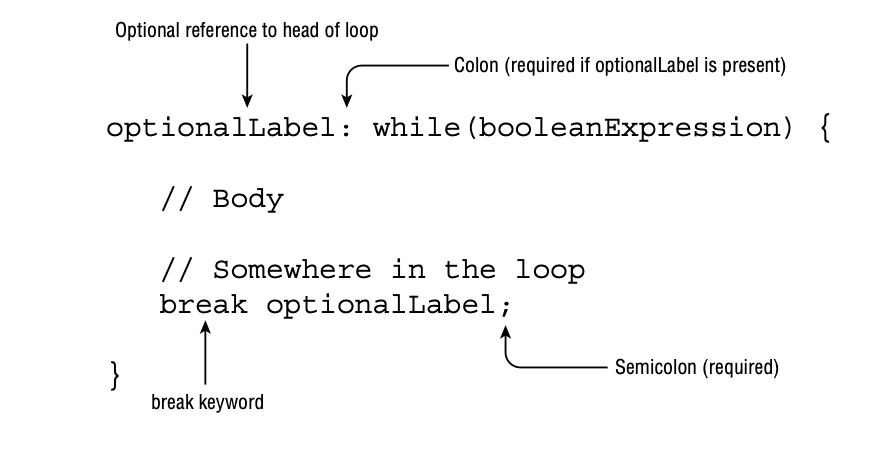

# Controlling Flow with Branching

## Nested Loops

A nested loop is a loop that contains another loop, including while, do/while, for, and for-each loops.

    int[][] myComplexArray = {{5, 2, 1, 3}, {3, 9, 8, 9}, {5, 7, 12, 7}};

    for (int[] mySimpleArray : myComplexArray) {
        for (int i = 0; i < mySimpleArray.length; i++) {
            System.out.print(mySimpleArray[i] + "\t");
        }
        System.out.println();
    }

Nested loops can include while and do/while, as shown in this example. See whether you can determine what this code will
output:

    int hungryHippopotamus = 8;
    while (hungryHippopotamus > 0) {
        do {
            hungryHippopotamus -= 2;
        } while (hungryHippopotamus > 5);
        hungryHippopotamus--;
        System.out.print(hungryHippopotamus + ", ");
    }

### Adding Optional Labels

A label is an optional pointer to the head of a statement that allows the application flow to jump to it or break from
it. It is a single identifier that is followed by a colon (:).

    int[][] myComplexArray = {{5, 2, 1, 3}, {3, 9, 8, 9}, {5, 7, 12, 7}};
    
    OUTER_LOOP:
    for (int[] mySimpleArray : myComplexArray) {
        INNER_LOOP:
        for (int i = 0; i < mySimpleArray.length; i++) {
            System.out.print(mySimpleArray[i] + "\t");
        }
        System.out.println();
    }

While this topic is not on the exam, it is possible to add optional labels to control and block statements. For example,
the following is permitted by the compiler, albeit extremely uncommon:

### The break Statement

As you saw when working with switch statements, a break statement transfers the flow
of control out to the enclosing statement. The same holds true for a break statement that appears inside of a while,
do/while, or for loop, as it will end the loop early.

The break statement can take an optional label parameter. Without a label parameter, the break statement will terminate
the nearest inner loop it is currently in the process of executing. The optional label parameter allows us to break out
of a higher-level outer loop.

        public static void main(String[] args) {
            int[][] list = {{1, 13}, {5, 2}, {2, 2}};
            int searchValue = 2;
            int positionX = -1;
            int positionY = -1;
            PARENT_LOOP:
            for (int i = 0; i < list.length; i++) {
                for (int j = 0; j < list[i].length; j++) {
                    if (list[i][j] == searchValue) {
                        positionX = i;
                        positionY = j;
                        break PARENT_LOOP;
                    }
                }
            }
            if (positionX == -1 || positionY == -1) {
                System.out.println("Value " + searchValue + " not found");
            } else {
                System.out.println("Value " + searchValue + " found at: " +
                        "(" + positionX + "," + positionY + ")");
        }

### The continue Statement

The continue statement, a statement that causes flow to finish the execution of the current loop iteration.

You may notice that the syntax of the continue statement mirrors that of the break statement. In fact, the statements
are identical in how they are used, but with different results.

    CLEANING:
    for (char stables = 'a'; stables <= 'd'; stables++) {
        for (int leopard = 1; leopard < 4; leopard++) {
            if (stables == 'b' || leopard == 2) {
                continue CLEANING;
            }
            System.out.println("Cleaning: " + stables + "," + leopard);
        }
    }

### The return Statement

For now, though, you should be familiar with the idea that creating methods and using return statements can be used as
an alternative to using labels and break statements.

    private static int[] searchForValue(int[][] list, int v) {
        for (int i = 0; i < list.length; i++) {
            for (int j = 0; j < list[i].length; j++) {
                if (list[i][j] == v) {
                    return new int[]{i, j};
                }
            }
        }
        return null;
    }

    public static void main(String[] args) {
        int[][] list = {{1, 13}, {5, 2}, {2, 2}};
        int searchValue = 2;
        int[] results = searchForValue(list, searchValue);
        if (results == null) {
            System.out.println("Value " + searchValue + " not found");
        } else {
            System.out.println("Value " + searchValue + " found at: " +
                    "(" + results[0] + "," + results[1] + ")");
        }
    }

Just remember that return statements can be used to exit loops quickly and can lead to more readable code in practice,
especially when used with nested loops.

### Unreachable Code

One facet of break, continue, and return that you should be aware of is that any code placed immediately after them in
the same block is considered unreachable and will not compile.

    int checkDate = 0;
    while (checkDate < 10) {
        checkDate++;
        if (checkDate > 100) {
            break;
            checkDate++; // DOES NOT COMPILE
        }
    }

Even though it is not logically possible for the if statement to evaluate to true in this code sample, the compiler
notices that you have statements immediately following the break and will fail to compile with “unreachable code” as the
reason. The same is true for continue and return statements, as shown in the following two examples:
    
    int minute = 1;
    WATCH:
    while (minute > 2) {
        if (minute++ > 2) {
            continue WATCH;
            // System.out.print(minute); // DOES NOT COMPILE
        }
    }

    int hour = 2;
    switch (hour) {
        case 1:
            return;
        // hour++; // DOES NOT COMPILE
        case 2:
    }

One thing to remember is that it does not matter if the loop or decision structure actually visits the line of code.
For example, the loop could execute zero or infinite times at runtime. Regardless of execution, the compiler will
report an error if it finds any code it deems unreachable, in this case any statements immediately following a break,
continue, or return statement.

### Reviewing Branching

|          | Support labels | Support break/continue | Support yield |
|----------|----------------|------------------------|---------------|
| while    | Yes            | Yes                    | No            |
| do/while | Yes            | Yes                    | No            |
| for      | Yes            | Yes                    | No            |
| switch   | Yes            | No                     | Yes           |

Some of the most time-consuming questions you may see on the exam could involve nested loops with lots of branching.
Unless you spot an obvious compiler error, we recommend skipping these questions and coming back to them at the end.