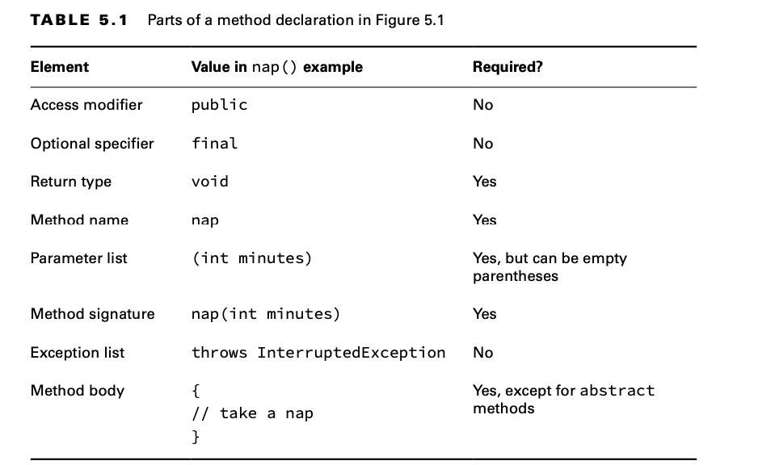
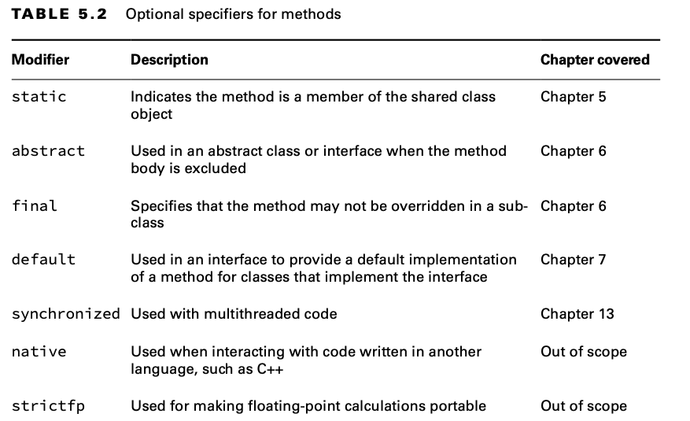

# Designing Methods

## Access Modifiers

An access modifier determines what classes a method can be accessed from.
Access modifiers help to enforce when these components are allowed to talk to each other. Java offers four choices of
access modifier:

**private**
The private modifier means the method can be called only from within the same class.

**package access**
With package access, the method can be called only from a class in the same package. This one is tricky because there is
no keyword. You simply omit the access modifier. Package access is sometimes referred to as package-private or default
access

**protected**

The protected modifier means the method can be called only from a class
in the same package or a subclass.

**public**
The public modifier means the method can be called from anywhere.

We explore the impact of the various access modifiers later in this chapter. For now, just master identifying valid
syntax of methods. The exam creators like to trick you by putting method elements in the wrong order or using incorrect
values.

    public class ParkTrip {
        public void skip1() {}
        default void skip2() {} // DOES NOT COMPILE 
        void public skip3() {} // DOES NOT COMPILE 
        void skip4() {}
    }

## Optional Specifiers

There are a number of optional specifiers for methods. You can have multiple specifiers in the same method (although not
all combinations are legal). When this happens, you can specify them in any order.
You can have zero or more specifiers in a method declaration.

While access modifiers and optional specifiers can appear in any order, they must all appear before the return type.
In practice, it is common to list the access modifier first.

    public class Exercise {
        public void bike1() {}
        public final void bike2() {}
        public static final void bike3() {}
        public final static void bike4() {}
    
        // public modifier void bike5() {} // DOES NOT COMPILE
        // The bike5() method doesn’t compile because modifier is not a valid optional specifier.
    
        // public void final bike6() {} // DOES NOT COMPILE
        // The bike6() method doesn’t compile because the optional specifier is after the return type.

        final public void bike7() {}
    }

## Return Type

The next item in a method declaration is the return type. It must appear after any access modifiers or optional
specifiers and before the method name.
The return type might be an actual Java type such as String or int. If there is no return type, the void keyword is
used.

Remember that a method must have a return type. If no value is returned, the void keyword must be used. You cannot omit
the return type.

    public void swim(int distance) {
        if(distance <= 0) {
            // Exit early, nothing to do!
            return; 
        }
    System.out.print("Fish is swimming " + distance + " meters"); 
    }

When returning a value, it needs to be assignable to the return type.

## Method Name

An identifier may only contain letters, numbers, currency sym- bols, or _. Also, the first character is not allowed to
be a number, and reserved words are not allowed. Finally, the single underscore character is not allowed.

By convention, methods begin with a lowercase letter, but they are not required to.

    public class BeachTrip {
    
        public void jog1() {}
    
        // The 2jog() method doesn’t compile because identifiers are not allowed to begin with numbers.
        // public void 2jog() {} // DOES NOT COMPILE
    
        // The jog3() method doesn’t compile because the method name is before the return type.
        // public jog3 void() {} // DOES NOT COMPILE
    
        public void Jog_$() {}
    
        // The _ method is not allowed since it consists of a single underscore
        // public _() {} // DOES NOT COMPILE
    
        //The final line of code doesn’t compile because the method name is missing.
        // public void() {} // DOES NOT COMPILE
    }

## Parameter List

Although the parameter list is required, it doesn’t have to contain any parameters.

    public class Sleep { 
        void nap() {}
    }

If you do have multiple parameters, you separate them with a comma.

    public class PhysicalEducation {

        public void run1() {}
    
        // The run2() method doesn’t compile because it is missing the parentheses around the parameter list.
        // public void run2{} // DOES NOT COMPILE
    
        public void run3(int a) {}
    
        // The run4() method doesn’t compile because the parameters are separated by a semicolon rather than a comma.
        // public void run4(int a;int b){ } // DOES NOT COMPILE
    
        public void run5(int a, int b) {}
    }

## Method Signature

A method signature, composed of the method name and parameter list, is what Java uses to uniquely determine exactly
which method you are attempting to call. Once it determines which method you are trying to call, it then determines if
the call is allowed.

The following two methods have the exact same signature:

    public class Trip {
        public void visitZoo(String name, int waitTime) {}
        public void visitZoo(String attraction, int rainFall) {} // DOES NOT COMPILE
    }

Changing the order of parameter types does allow the method to compile, though:

    public class Trip {
        public void visitZoo(String name, int waitTime) {} 
        public void visitZoo(int rainFall, String attraction) {}
    }

## Exception List

For now, you just need to know that it is optional and where in the method declaration it goes if present.

    public class ZooMonorail {
    
        public void zeroExceptions() {
        }
    
        public void oneException() throws IllegalArgumentException {
        }
    
        public void twoExceptions() throws IllegalArgumentException, InterruptedException {
        }
    
    }

## Method Body

The final part of a method declaration is the method body. A method body is simply a code block. It has braces that
contain zero or more Java statements.

    public class Bird {
        public void fly1() {}
        public void fly2() // DOES NOT COMPILE 
        public void fly3(int a) { int name = 5; }
    }