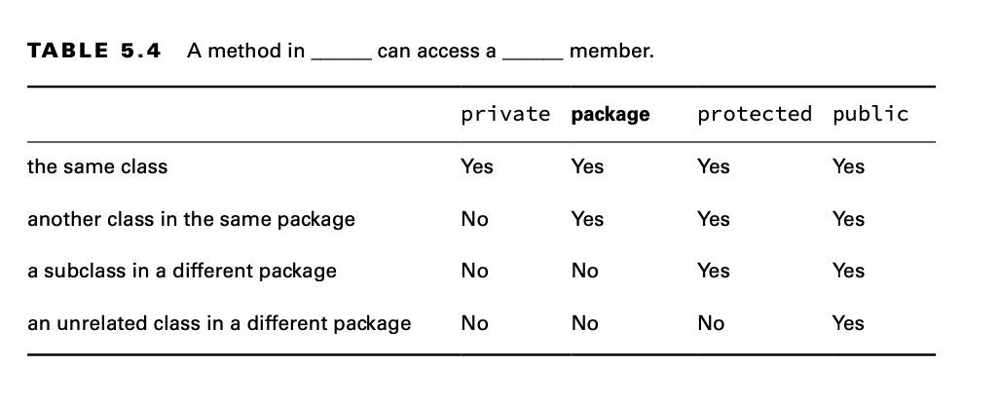

# Applying Access Modifiers

- private: Only accessible within the same class.
- Package access: private plus other members of the same package. Sometimes referred to as package-private or default
  access.
- protected: Package access plus access within subclasses.
- public: protected plus classes in the other packages.

## Private Access

Only code in the same class can call private methods or access private fields.

## Package Access

When there is no access modifier, Java assumes package access.

## Protected Access

Protected access allows everything that package access does, and more. The protected access modifier adds the ability to
access members of a parent class.

By extending a class, the subclass gains access to all protected and public members of the parent class, as if they were
declared in the subclass. If the two classes are in the same package, then the subclass also gains access to all package
members.

A member is used without referring to a variable. In this case, we are taking
advantage of inheritance, and protected access is allowed.

A member is used through a variable. In this case, the rules for the
reference type of the variable are what matter. If it is a subclass, protected access is allowed. This works for
references to the same class or a subclass.

## Public Access

public means anyone can access the member from anywhere.

The Java module system redefines “anywhere,” and it becomes pos- sible to restrict access to public code outside a
module. We cover this in more detail in Chapter 12, “Modules.” When given code samples, you can assume they are in the
same module unless explicitly stated otherwise.

## Reviewing Access Modifiers

