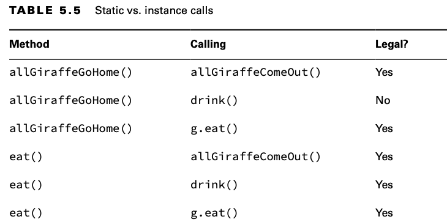

# Accessing static Data

When the static keyword is applied to a variable, method, or class, it belongs to the class rather than a specific
instance of the class. In this section, you see that the static keyword can also be applied to import statements.

## Designing static Methods and Variables

Methods and variables declared static don’t require an instance of the class. They are shared among all users of the
class.

    public class Penguin {
    
        String name;
        static String nameOfTallestPenguin;
    
        public static void main(String[] args) {
    
            var p1 = new Penguin();
            p1.name = "Lilly";
            p1.nameOfTallestPenguin = "Lilly";
    
            var p2 = new Penguin();
            p2.name = "Willy";
            p2.nameOfTallestPenguin = "Willy";
    
            System.out.println(p1.name); // Lilly
            System.out.println(p1.nameOfTallestPenguin); // Willy
            System.out.println(p2.name); // Willy
            System.out.println(p2.nameOfTallestPenguin); // Willy
    
    
        }
    }

The main() method is a static method.

    public class Koala {
        public static int count = 10;
    
        public static void main(String[] args) {
            System.out.println(count);
        }
    }

In addition to main() methods, static methods have two main purposes:

- For utility or helper methods that don’t require any object state. Since there is no need to access instance
  variables, having static methods eliminates the need for the caller to instantiate an object just to call the method.
- For state that is shared by all instances of a class, like a counter. All instances must share the same state. Methods
  that merely use that state should be static as well.

## Accessing a static Variable or Method

Usually, accessing a static member is easy.
You just put the class name before the method or variable, and you are done.

    public class Snake {
      public static long hiss = 2;
    }

    System.out.println(Snake.hiss);

There is one rule that is trickier. You can use an instance of the object to call a static method. The compiler checks
for the type of the reference and uses that instead of the object—which is sneaky of Java.

    Snake s = new Snake();
    System.out.println(s.hiss);
    s = null;
    System.out.println(s.hiss);

Remember to look at the reference type for a variable when you see a static method or variable. The exam creators will
try to trick you into thinking a NullPointerException is thrown because the variable hap- pens to be null. Don’t be
fooled!

    Snake.hiss = 4;
    Snake snake1 = new Snake();
    Snake snake2 = new Snake();
    snake1.hiss = 6;
    snake2.hiss = 5;
    System.out.println(Snake.hiss); // 5

## Class vs Instance Membership

There’s another way the exam creators will try to trick you regarding static and instance members. A static member
cannot call an instance member without referencing an instance of the class.

    public class MantaRay {
    
        private String name = "Sammy";
    
        public static void first() {
        }
    
        public static void second() {
        }
    
        public void third() {
            System.out.print(name);
        }
    
        public static void main(String[] args) {
            first();
            second();
            third(); // DOES NOT COMPILE
    
        }
    }

The compiler will give you an error about making a static reference to an instance method. If we fix this by adding
static to third(), we create a new problem.

      var ray = new MantaRay();
      ray.third();

Only an instance method can call another instance method on the same class without using a reference variable, because
instance methods do require an object.

    public class Giraffe {
        public void eat(Giraffe g) {}
        public void drink() {}
        public static void allGiraffeGoHome(Giraffe g) {}
        public static void allGiraffeComeOut() {}
    }

Let’s try one more example so you have more practice at recognizing this scenario.

    public class Gorilla {
    
        public static int count;
    
        public static void addGorilla() {
            count++;
        }
    
        public void babyGorilla() {
            count++;
        }
    
        public void announceBabies() {
            addGorilla();
            babyGorilla();
        }
    
        public static void announceBabiesToEveryone() {
            addGorilla();
            babyGorilla(); // DOES NOT COMPILE
        }
    
        public int total;

        public static double average = total / count; // DOES NOT COMPILE
    
    }

A common use for static variables is counting the number of instances:

    public class Counter {
        private static int count;
        public Counter() {count++;}
    
        public static void main(String[] args) {
            Counter c1 = new Counter();
            Counter c2 = new Counter();
            Counter c3 = new Counter();
            System.out.println(count); // 3
        }
    }

Each time the constructor is called, it increments count by one. This example relies on the fact that static (and
instance) variables are automatically initialized to the default value for that type, which is 0 for int.

## static Variable Modifiers

While some static variables are meant to change as the program runs, like our count example, others are meant to never
change. This type of static variable is known as a constant. It uses the final modifier to ensure the variable never
changes.

Constants use the modifier static final and a different naming convention than other variables.

    public class ZooPen {
        private static final int NUM_BUCKETS = 45;
  
        public static void main(String[] args) {
            System.out.println(NUM_BUCKETS);
    
            // NUM_BUCKETS = 5; // DOES NOT COMPILE
            System.out.println(NUM_BUCKETS);
        }
    }

The compiler will make sure that you do not accidentally try to update a final variable.

    public class ZooInventoryManager {
    
          private static final String[] treats = new String[10];
      
          public static void main(String[] args) {
              treats[0] = "popcorn";
          }
    
    }

It actually does compile since treats is a reference variable. We are allowed to modify the referenced object or array’s
contents. All the compiler can do is check that we don’t try to reassign treats to point to a different object.

The rules for static final variables are similar to instance final variables, except they do not use static
constructors (there is no such thing!) and use static initializers instead of instance initializers.

    public class Panda {
      final static String name = "Ronda";
      static final int bamboo;
      static final double height; // DOES NOT COMPILE 
      static { bamboo = 5;}
    }

The name variable is assigned a value when it is declared, while the bamboo variable is assigned a value in a static
initializer. The height variable is not assigned a value anywhere in the class definition, so that line does not
compile. Remember, final variables must be initialized with a value. Next, we cover static initializers.

## static Initializers

We covered instance initializers that looked like unnamed methods—just code inside braces. static initializers look
similar. They add the static keyword to specify that they should be run when the class is first loaded.

    private static final int NUM_SECONDS_PER_MINUTE; 
    private static final int NUM_MINUTES_PER_HOUR; 
    private static final int NUM_SECONDS_PER_HOUR;

    static {
      NUM_SECONDS_PER_MINUTE = 60;
      NUM_MINUTES_PER_HOUR = 60;
    }
    
    static {
      NUM_SECONDS_PER_HOUR = NUM_SECONDS_PER_MINUTE * NUM_MINUTES_PER_HOUR;
    }

All static initializers run when the class is first used, in the order they are defined.

    private static int one;
    private static final int two;
    private static final int three = 3;
    private static final int four; // DOES NOT COMPILE - never initialized

    static {
        one = 1;
        two = 2;
        three = 3; // DOES NOT COMPILE - final variable!
        two = 4; // DOES NOT COMPILE - final variable!
    }

**Try to Avoid static and Instance Initializers**

Using static and instance initializers can make your code much harder to read. Everything that could be done in an
instance initializer could be done in a constructor instead. Many people find the constructor approach easier to read.

There is a common case to use a static initializer: when you need to initialize a static field and the code to do so
requires more than one line.This often occurs when you want to initialize a collection like an ArrayList or a HashMap.
When you do need to use a static initializer, put all the static initialization in the same block.That way, the order is
obvious.

## static Imports

Regular imports are for importing classes, while static imports are for importing static members of classes like
variables and methods.

Regular imports are for importing classes, while static imports are for importing static members of classes like
variables and methods.

    import java.util.List;
    import static java.util.Arrays.asList; // static import
    
    public class ZooParking {

        public static void main(String[] args) {
            List<String> list = asList("one", "two"); // No Arrays. prefix
        }

    }

This example shows almost everything you can do wrong.

    import static java.util.Arrays; // DOES NOT COMPILE
    
    import static java.util.Arrays.asList;
    
    static import java.util.Arrays.*; // DOES NOT COMPILE
    
    public class BadZooParking {
    
        public static void main(String[] args) {
            Arrays.asList("one"); // DOES NOT COMPILE
            asList("one");
        }
    }

Remember that static imports are only for importing static members like a method or variable.
Tries to see whether you are paying attention to the order of keywords.The syntax is import static and not vice versa.

The asList method is imported. However, the Arrays class is not imported anywhere.
This makes it okay to write asList("one") but not Arrays.asList("one").

    import static java.lang.Integer.MAX_VALUE;
    // import static java.lang.Long.MAX_VALUE;
    // Field 'MAX_VALUE' is already defined in a single static import
    // Reference to 'MAX_VALUE' is ambiguous, both 'Integer.MAX_VALUE' and 'Long.MAX_VALUE'
    public class StaticImportSameName {
    
        public static void main(String[] args) {
    
            System.out.println(MAX_VALUE);
            
        }
    }

In a large program, static imports can be overused. When importing from too many places, it can be hard to remember
where each static member comes from. Use them sparingly!