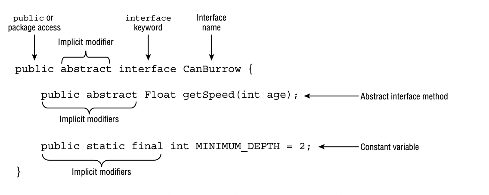
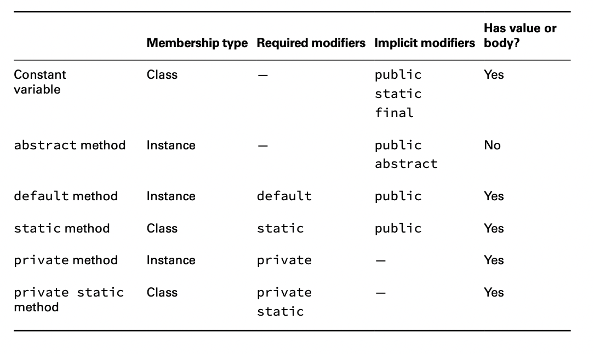

# Implementing Interfaces

An interface is an abstract data type that declares a list of abstract methods that any class implementing the interface
must provide.

Over time, the precise definition of an interface has changed, as new method types are now supported.

## Declaring and Using an Interface

In Java, an interface is defined with the interface keyword, analogous to the class keyword used when defining a class.



Our interface declaration includes an abstract method and a constant variable. Interface variables are referred to as
constants because they are assumed to be public, static, and final. They are initialized with a constant value when they
are declared.

One aspect of an interface declaration that differs from an abstract class is that it contains implicit modifiers. An
implicit modifier is a modifier that the compiler automatically inserts into the code.
For example, an interface is always considered to be abstract, even if it is not marked so.

    public abstract interface WalksOnTwoLegs {}

    var e = new WalksOnTwoLegs(); // DOES NOT COMPILE

    public final interface WalksOnEightLegs {} // DOES NOT COMPILE

## Extending an Interface

Like a class, an interface can extend another interface using the extends keyword.

    public interface Nocturnal {}

    public interface HasBigEyes extends Nocturnal {}

Unlike a class, which can extend only one class, an interface can extend multiple interfaces.

    public interface Nocturnal {
        public int hunt();
    }

    public interface CanFly {
        public void flap();
    }

    public interface HasBigEyes extends Nocturnal, CanFly {}

    public class Owl implements HasBigEyes {
        public int hunt() { return 5; }
        public void flap() { System.out.println("Flap!"); }
    }

Extending two interfaces is permitted because interfaces are not initialized as part of a class hierarchy. Unlike
abstract classes, they do not contain constructors and are not part of instance initialization. Interfaces simply define
a set of rules and methods that a class implementing them must follow.

## Inheriting an Interface

Like an abstract class, when a concrete class inherits an interface, all of the inherited abstract methods must be
implemented.


The concrete Swan class inherits four abstract methods that it must imple- ment: getType(), canSwoop(), fly(), and
swim().

### Mixing Class and Interface Keywords

The exam creators are fond of questions that mix class and interface terminology. Although a class can implement an
interface, a class cannot extend an interface. Likewise, while an interface can extend another interface, an interface
cannot implement another interface.

    public interface CanRun {}
    public class Cheetah extends CanRun {} // DOES NOT COMPILE

    public class Hyena {}
    public interface HasFur extends Hyena {} // DOES NOT COMPILE

### Inheriting Duplicate Abstract Methods

Java supports inheriting two abstract methods that have compatible method declarations.

    public interface Herbivore { public void eatPlants(); }

    public interface Omnivore { public void eatPlants(); }

    public class Bear implements Herbivore, Omnivore {
        public void eatPlants() { 
            System.out.println("Eating plants");
        }
    }

The following is an example of an incompatible declaration:

    public interface Herbivore { public void eatPlants(); }
    
    public interface Omnivore { public int eatPlants(); }

    public class Tiger implements Herbivore, Omnivore { // DOES NOT COMPILE.. 
    ..
    }

It’s impossible to write a version of Tiger that satisfies both inherited abstract methods. The code does not compile,
regardless of what is declared inside the Tiger class.

### Inserting Implicit Modifiers

An implicit modifier is one that the compiler will automatically insert.

The following list includes the implicit modifiers for interfaces that you need to know for the exam:

- Interfaces are implicitly abstract.
- Interface variables are implicitly public, static, and final.
- Interface methods without a body are implicitly abstract.
- Interface methods without the private modifier are implicitly public.

The following two interface definitions are equivalent, as the compiler will convert them both to the second
declaration:

    public interface Soar {

        int MAX_HEIGHT = 10;
        final static boolean UNDERWATER = true;
    
        void fly(int speed);
    
        abstract void takeoff();
    
        public abstract double dive();
    
    }

    public abstract interface Soar {
        public static final int MAX_HEIGHT = 10;
        public final static boolean UNDERWATER = true;
    
        public abstract void fly(int speed);
    
        public abstract void takeoff();
    
        public abstract double dive();
    }

### Conflicting Modifiers

What happens if a developer marks a method or variable with a modifier that conflicts with an implicit modifier? For
example, if an abstract method is implicitly public, can it be explicitly marked protected or private?

    public interface Dance {
        private int count = 4; // DOES NOT COMPILE 
        protected void step(); // DOES NOT COMPILE
    }

### Differences between Interfaces and Abstract Classes

Even though abstract classes and interfaces are both considered abstract types, only inter- faces make use of implicit
modifiers.

    abstract class Husky { // abstract required in class declaration
        abstract void play(); // abstract required in method declaration
    }

    interface Poodle { // abstract optional in interface declaration
        void play(); // abstract optional in method declaration
    }

The Husky class will not compile if the play() method is not marked abstract, whereas the method in the Poodle interface
will compile with or without the abstract modifier.

What about the access level of the play() method?

    public class Webby extends Husky {
        void play() {} // OK - play() is declared with package access in Husky
    }
    
    public class Georgette implements Poodle {
        void play() {} // DOES NOT COMPILE - play() is public in Poodle
    }

The method in the Georgette class reduces the access modifier on the method from public to package access.

## Declaring Concrete Interface Methods

While interfaces started with abstract methods and constants, they’ve grown to include a lot more.



The membership type determines how it is able to be accessed. A method with a membership type of class is shared among
all instances of the interface, whereas a method with a membership type of instance is associated with a particular
instance of the interface.

**What About protected or Package Interface Members?**

Alongside public methods, interfaces now support private methods.They do not support protected access, though, as a
class cannot extend an interface.They also do not support package access, although more likely for syntax reasons and
backward compatibility. Since interface methods without an access modifier have been considered implicitly public,
changing this behavior to package access would break many existing programs!

### Writing a default Interface Method

A default method is a method defined in an interface with the default keyword and includes a method body. It may be
optionally overridden by a class implementing the interface.

One use of default methods is for backward compatibility. You can add a new default method to an interface without the
need to modify all of the existing classes that implement the interface. The older classes will just use the default
implementation of the method defined in the interface.

    public interface IsColdBlooded {
        boolean hasScales();
    
        default double getTemperature() {
            return 10.0;
        }
    }

    public class Snake implements IsColdBlooded {
        public boolean hasScales() { // Required override
            return true;
        }
    
        public double getTemperature() { // Optional override 
            return 12;
        }
    }

**Default Interface Method Definition Rules**

- A default method may be declared only within an interface.
- A default method must be marked with the default keyword and include a method body.
- A default method is implicitly public.
- A default method cannot be marked abstract, final, or static.
- A default method may be overridden by a class that implements the interface.
- If a class inherits two or more default methods with the same method signature, then the class must override the
  method.

 ````
    public interface Carnivore {
        public default void eatMeat(); // DOES NOT COMPILE 
        public int getRequiredFoodAmount() { // DOES NOT COMPILE
          return 13; 
        }
    }
 ```` 

**Inheriting Duplicate default Methods**

The last rule for creating a default interface method requires some explanation.

    public interface Walk {
        public default int getSpeed() {
            return 5;
        }
    }

    public interface Run {
        public default int getSpeed() {
           return 10;
        }
    } 

    public class Cat implements Walk, Run {} // DOES NOT COMPILE

In this example, Cat inherits the two default methods for getSpeed(), so which does it use? Since Walk and Run are
considered siblings in terms of how they are used in the Cat class, it is not clear whether the code should output 5 or
10 .In this case, the compiler throws up its hands and says, “Too hard, I give up!” and fails.

    public class Cat implements Walk, Run {
        public int getSpeed() {
           return 1;
        }
    }

**Calling a Hidden default Method**

    public int getWalkSpeed() { 
        return Walk.super.getSpeed();
    }

This is an area where a default method exhibits properties of both a static and instance method. We use the interface
name to indicate which method we want to call, but we use the super keyword to show that we are following instance
inheritance, not class inheritance.
Note that calling Walk.getSpeed() or Walk.this.getSpeed() would not have worked.

### Declaring static Interface Methods

Interfaces are also declared with static methods. These methods are defined explicitly with the static keyword and, for
the most part, behave just like static methods defined in classes.

- A static method must be marked with the static keyword and include a method body.
- A static method without an access modifier is implicitly public.
- A static method cannot be marked abstract or final.
- A static method is not inherited and cannot be accessed in a class implementing the interface without a reference to
  the interface name.

 ````
    public interface Hop {
   
        static int getJumpHeight() {
            return 8;
        }
    }
 ````

Since the method is defined without an access modifier, the compiler will automatically insert the public access
modifier. The method getJumpHeight() works just like a static method as defined in a class. In other words, it can be
accessed without an instance of a class.

    public class Skip {
        public int skip() {
            return Hop.getJumpHeight();
        }
    }

The last rule about inheritance might be a little confusing, so let’s look at an example. The following is an example of
a class Bunny that implements Hop and does not compile:

    public class Bunny implements Hop {
        public void printDetails() {
            System.out.println(getJumpHeight()); // DOES NOT COMPILE 
        }
    }

Without an explicit reference to the name of the interface, the code will not compile, even though Bunny implements Hop.

    System.out.println(Hop.getJumpHeight());

### Reusing Code with private Interface Methods

The last two types of concrete methods that can be added to interfaces are private and private static interface methods.
Because both types of methods are private, they can only be used in the interface declaration in which they are
declared. For this reason, they were added primarily to reduce code duplication.

    public interface Schedule {

        default void wakeUp() {
            checkTime(7);
        }
    
        private void haveBreakfast() {
            checkTime(9);
        }
    
        static void workOut() {
            checkTime(18);
        }
    
        private static void checkTime(int hour) {
            if (hour > 17) {
                System.out.println("You're late!");
            } else {
                System.out.println("You have " + (17 - hour) + " hours left "
                        + "to make the appointment");
            }
        }
    }

The difference between a non-static private method and a static one is analogous to the difference between an instance
and static method declared within a class. In particular, it’s all about what methods each can be called from.

**Private Interface Method Definition Rules**

- A private interface method must be marked with the private modifier and include a method body.
- A private static interface method may be called by any method within the interface definition.
- A private interface method may only be called by default and other private nonstatic methods within the interface
  definition.

Another way to think of it is that a private interface method is only accessible to non-static methods defined within
the interface. A private static interface method, on the other hand, can be accessed by any method in the interface. For
both types of private methods, a class inheriting the interface cannot directly invoke them.

### Calling Abstract Methods

Default and private non-static methods can access abstract methods declared in the interface.

    public interface ZooRenovation {
       public String projectName();
      
        abstract String status();
    
        default void printStatus() {
            System.out.print("The " + projectName() + " project " + status());
        }
    }

### Reviewing Interface Members


Here are some quick tips for the exam:

- Treat abstract, default, and non-static private methods as belonging to an instance of the interface.
- Treat static methods and variables as belonging to the interface class object.
- All private interface method types are only accessible within the interface declaration.

````
    public interface ZooTrainTour {
    
        abstract int getTrainName();
    
        private static void ride() {
        }
    
        default void playHorn() {
            getTrainName();
            ride();
        }
    
        public static void slowDown() {
            playHorn(); // DOES NOT COMPILE
        }
    
        static void speedUp() {
            ride();
        }
    }
````
