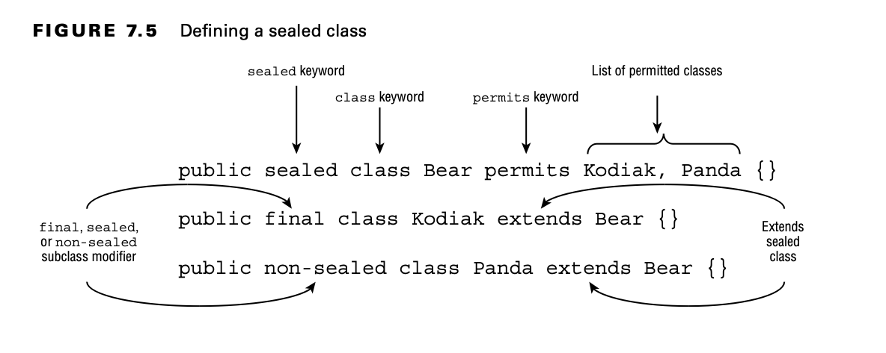
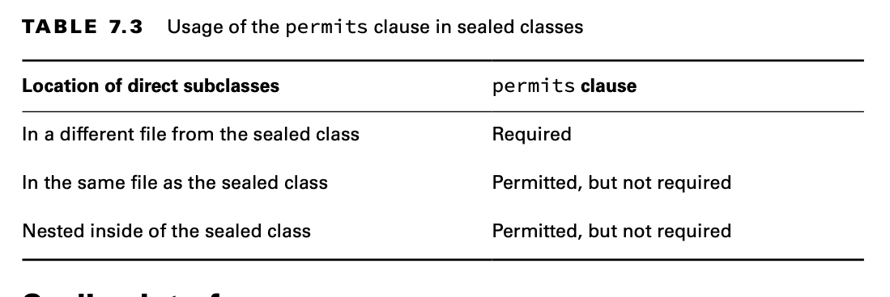

# Sealing Classes

A sealed class is a class that restricts which other classes may directly extend it. These are brand new to Java 17.

Did you happen to notice that we said directly extend in the definition of a sealed class? As you see shortly, there is
a way for a class not named in the sealed class declaration to extend it indirectly. Unless we say oth- erwise, though,
assume that we’re referring to subclasses that directly extend the sealed class.

## Declaring a Sealed Class

A sealed class declares a list of classes that can extend it, while the subclasses declare that they extend the sealed
class.

    public sealed class Bear permits Kodiak, Panda {}

    public final class Kodiak extends Bear {}

    public non-sealed class Panda extends Bear {}

Java 17 includes three new keywords that you should be familiar with for the exam.

Sealed Class Keywords

- sealed: Indicates that a class or interface may only be extended/implemented by named classes or interfaces.
- permits: Used with the sealed keyword to list the classes and interfaces allowed.
- non-sealed: Applied to a class or interface that extends a sealed class, indicating that it can be extended by
  unspecified classes.

Pretty easy so far, right? The exam is just as likely to test you on what sealed classes cannot be used for. For
example, can you see why each of these sets of declarations does not compile?

    public class sealed Frog permits GlassFrog {} // DOES NOT COMPILE
    public final class GlassFrog extends Frog {}

    public abstract sealed class Wolf permits Timber {}
    public final class Timber extends Wolf {}
    public final class MyWolf extends Wolf {} // DOES NOT COMPILE

The first example does not compile because the class and sealed modifiers are in the wrong order.
The modifier has to be before the class type.
The second example does not compile because MyWolf isn’t listed in the declaration of Wolf.

Sealed classes are commonly declared with the abstract modifier, although this is certainly not required.

## Compiling Sealed Classes

Let’s say we create a Penguin class and compile it in a new package without any other source code. With that in mind,
does the following compile?

    package zoo;
    public sealed class Penguin permits Emperor {} // DOES NOT COMPILE

    package zoo;
    public final class Emperor {}

Even though the Emperor class is declared, it does not extend the Penguin class.

## Specifying the Subclass Modifier

Next, let’s look at an example using the sealed modifier:

    public sealed class Mammal permits Equine {}

    public sealed class Equine extends Mammal permits Zebra {}

    public final class Zebra extends Equine {}

The sealed modifier applied to the subclass Equine means the same kind of rules that we applied to the parent class
Mammal must be present. Namely, Equine defines its own list of permitted subclasses. Notice in this example that Zebra
is an indirect subclass of Mammal but is not named in the Mammal class.

### A non-sealed Subclass

The non-sealed modifier is used to open a sealed parent class to potentially unknown subclasses.

    public sealed class Wolf permits Timber{
    }

    public non-sealed class Timber extends Wolf {
    }

    public class MyWolf extends Timber {
    }

In this example, we are able to create an indirect subclass of Wolf, called MyWolf, not named in the declaration of
Wolf. Also notice that MyWolf is not final, so it may be extended by any subclass, such as MyFurryWolf.

    public class MyFurryWolf extends MyWolf {
    }

If you’re still worried about opening a sealed class too much with a non-sealed subclass, remember that the person
writing the sealed class can see the declaration of all direct subclasses at compile time. They can decide whether to
allow the non-sealed subclass to be supported.

## Omitting the permits Clause

Up until now, all of the examples you’ve seen have required a permits clause when declaring a sealed class, but this is
not always the case. Imagine that you have a Snake.java file with two top-level classes defined inside it:

    public sealed class Snake permits Cobra {} 
    final class Cobra extends Snake {}

In this case, the permits clause is optional and can be omitted. The extends keyword is still required in the subclass,
though:

    public sealed class Snake {}
    final class Cobra extends Snake {}

If these classes were in separate files, this code would not compile! This rule also applies to sealed classes with
nested subclasses.

    public sealed class Snake {
      final class Cobra extends Snake {} 
    }

**Referencing Nested Subclasses**

While it makes the code easier to read if you omit the permits clause for nested sub- classes, you are welcome to name
them. However, the syntax might be different than you expect.

    public sealed class Snake permits Cobra { // DOES NOT COMPILE 
        final class Cobra extends Snake {}
    }

This code does not compile because Cobra requires a reference to the Snake namespace.
The following fixes this issue:

    public sealed class Snake permits Snake.Cobra { 
        final class Cobra extends Snake {}
    }

When all of your subclasses are nested, we strongly recommend omitting the permits class.

## Sealing Interfaces

Besides classes, interfaces can also be sealed. The idea is analogous to classes, and many of the same rules apply. For
example, the sealed interface must appear in the same package or named module as the classes or interfaces that directly
extend or implement it.

    public sealed interface Swims permits Duck, Swan, Floats {
    }

    public final class Duck implements Swims {}

    public final class Swan implements Swims { }

    public non-sealed interface Floats extends Swims {}

What about the modifier applied to interfaces that extend the sealed interface? Well, remember that interfaces are
implicitly abstract and cannot be marked final. For this reason, interfaces that extend a sealed interface can only be
marked sealed or non-sealed. They cannot be marked final.

## Reviewing Sealed Class Rules

Any time you see a sealed class on the exam, pay close attention to the subclass declaration and modifiers.

Sealed Class Rules :

- Sealed classes are declared with the sealed and permits modifiers.
- Sealed classes must be declared in the same package or named module as their direct subclasses.
- Direct subclasses of sealed classes must be marked final, sealed, or non-sealed.
- The permits clause is optional if the sealed class and its direct subclasses are declared within the same file or the
  subclasses are nested within the sealed class.
- Interfaces can be sealed to limit the classes that implement them or the interfaces that extend them.
- 