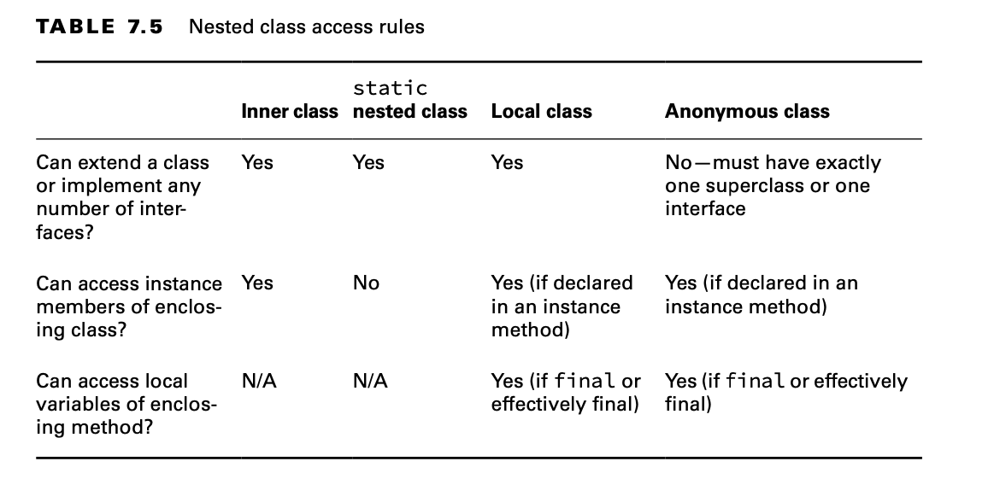

# Creating Nested Classes

A nested class is a class that is defined within another class. A nested class can come in one of four flavors.

- Inner class: A non-static type defined at the member level of a class
- Static nested class: A static type defined at the member level of a class
- Local class: A class defined within a method body
- Anonymous class: A special case of a local class that does not have a name

They can define helper classes and restrict them to the containing class, thereby improving encapsulation. They can make
it easy to create a class that will be used in only one place. They can even make the code cleaner and easier to read.

When used improperly, though, nested classes can sometimes make the code harder to read. They also tend to tightly
couple the enclosing and inner class, but there may be cases where you want to use the inner class by itself. In this
case, you should move the inner class out into a separate top-level class.

## Declaring an Inner Class

An inner class, also called a member inner class, is a non-static type defined at the member level of a class (the same
level as the methods, instance variables, and constructors). Because they are not top-level types, they can use any of
the four access levels, not just public and package access.

Inner classes have the following properties:

- Can be declared public, protected, package, or private
- Can extend a class and implement interfaces
- Can be marked abstract or final
- Can access members of the outer class, including private members

````
    public class Home {
    
        private String greeting = "Hi"; // Outer class instance variable
    
        protected class Room { // Inner class declaration
            public int repeat = 3;
    
            public void enter() {
                for (int i = 0; i < repeat; i++) greet(greeting);
            }
    
            private static void greet(String message) {
                System.out.println(message);
            }
        }
    
        public void enterRoom() { // Instance method in outer class
            var room = new Room();  // Create the inner class instance
            room.enter();
        }
    
        public static void main(String[] args) {
            var home = new Home(); // Create the outer class instance
            home.enterRoom();
        }
    }
````

**Nested Classes Can Now Have static Members**

Eagle-eyed readers may have noticed that we included a static method in our inner Room class on line 9. In Java 11, this
would have resulted in a compiler error. Previously, only static nested classes were allowed to include static methods.
With the introduction of records in Java 16, the existing rule that prevented an inner class from having any static
members (other than static constants) was removed. All four types of nested classes can now define static variables and
methods!

### Instantiating an Instance of an Inner Class

There is another way to instantiate Room that looks odd at first. Okay, well, maybe not just at first. This syntax isn’t
used often enough to get used to it:

    public static void main(String[] args) {
        var home = new Home();
        Room room = home.new Room(); // Create the inner class instance room.enter();
    }

    new Home().new Room().enter(); // Sorry, it looks ugly to us too!

**Creating .class Files for Inner Classes**

Compiling the Home.java class with which we have been working creates two class files. You should be expecting the
Home.class file. For the inner class, the compiler creates Home$Room.class. You don’t need to know this syntax for the
exam. We mention it so that you aren’t surprised to see files with $ appearing in your directories.You do need to
understand that multiple class files are created from a single .java file.

### Referencing Members of an Inner Class

Inner classes can have the same variable names as outer classes, making scope a little tricky. There is a special way of
calling this to say which variable you want to access. This is something you might see on the exam but, ideally, not in
the real world.

    public class A {
        private int x = 10;
    
        class B {
            private int x = 20;
    
            class C {
                private int x = 30;
    
                public void allTheX() {
                    System.out.println(x);
                    System.out.println(this.x);
                    System.out.println(B.this.x);
                    System.out.println(A.this.x);
                }
            }
        }
    
        public static void main(String[] args) {
    
            A a = new A();
            A.B b = a.new B();
            A.B.C c = b.new C();
            c.allTheX();
        }
    }

**Inner Classes Require an Instance**

    public class Fox {

        private class Den {
        }
    
        public void goHome() {
            new Den();
        }
    
        public static void visitFriend() {
            new Den(); // DOES NOT COMPILE
        }

    }

The first constructor call compiles because goHome() is an instance method, and therefore the call is associated with
the this instance.The second call does not compile because it is called inside a static method.

## Creating a static Nested Class

A static nested class is a static type defined at the member level. Unlike an inner class, a static nested class can be
instantiated without an instance of the enclosing class. The trade-off, though, is that it can’t access instance
variables or methods declared in the outer class.

- The nesting creates a namespace because the enclosing class name must be used to refer to it.
- It can additionally be marked private or protected.
- The enclosing class can refer to the fields and methods of the static nested class.

````

    public class Park {
    
        static class Ride {
            private int price = 6;
        }
    
        public static void main(String[] args) {
    
            var ride = new Ride();
            System.out.println(ride.price);
        }
    }
````

## Writing a Local Class

A local class is a nested class defined within a method. Like local variables, a local class declaration does not exist
until the method is invoked, and it goes out of scope when the method returns. This means you can create instances only
from within the method. Those instances can still be returned from the method. This is just how local variables work.

Local classes are not limited to being declared only inside methods. For example, they can be declared inside
constructors and initializers. For simplicity, we limit our discussion to methods in this chapter.

Local classes have the following properties:

- They do not have an access modifier
- They can be declared final or abstract.
- They have access to all fields and methods of the enclosing class (when defined in an instance method).
- They can access final and effectively final local variables.

````
    public class PrintNumbers {
    
        private int length = 5;
    
        public void calculate() {
            final int width = 20;
            class Calculator {
                public void multiply() {
                    System.out.print(length * width);
                }
            }
            var calculator = new Calculator();
            calculator.multiply();
        }
    
        public static void main(String[] args) {
            var printer = new PrintNumbers();
            printer.calculate(); // 100
        }
    }
````

Earlier, we made the statement that local variable references are allowed if they are final or effectively final.

````
    public void processData() {
        final int length = 5;
        int width = 10;
        int height = 2;
        class VolumeCalculator {
            public int multiply() {
                return length * width * height; // DOES NOT COMPILE
            }
        }
        width = 2;
    }
````

The length and height variables are final and effectively final, respectively, so neither causes a compilation issue.
On the other hand, the width variable is reassigned during the method, so it cannot be effectively final. For this
reason, the local class declaration does not compile.

**Why Can Local Classes Only Access final or Effectively Final Variables?**

Earlier, we mentioned that the compiler generates a separate .class file for each inner class. A separate class has no
way to refer to a local variable. However, if the local variable is final or effectively final, Java can handle it by
passing a copy of the value or reference variable to the constructor of the local class. If it weren’t final or
effectively final, these tricks wouldn’t work because the value could change after the copy was made.

## Defining an Anonymous Class

An anonymous class is a specialized form of a local class that does not have a name. It is declared and instantiated all
in one statement using the new keyword, a type name with parentheses, and a set of braces {}. Anonymous classes must
extend an existing class or implement an existing interface. They are useful when you have a short implementation that
will not be used anywhere else.

    public class ZooGiftShop {

        abstract class SaleTodayOnly {
            abstract int dollarsOff();
        }
    
        public int admission(int basePrice) {
            SaleTodayOnly sale = new SaleTodayOnly() {
                int dollarsOff() {
                    return 3;
                }
            }; // Don't forget the semicolon! r
            return basePrice - sale.dollarsOff();
        }
    }

Now we convert this same example to implement an interface instead of extending an abstract class:

    public class ZooGiftShop2 {

        interface SaleTodayOnly {
            abstract int dollarsOff();
        }
    
        public int admission(int basePrice) {
            SaleTodayOnly sale = new SaleTodayOnly() {
                public int dollarsOff() {
                    return 3;
                }
            }; // Don't forget the semicolon! r
            return basePrice - sale.dollarsOff();
        }
    }

You can even define anonymous classes outside a method body.

    public class Gorilla {
        interface Climb {}
        Climb climbing = new Climb() {};
    }

**Anonymous Classes and Lambda Expressions**

Prior to Java 8, anonymous classes were frequently used for asynchronous tasks and event handlers. For example, the
following shows an anonymous class used as an event handler in a JavaFX application:

    var redButton = new Button();
    redButton.setOnAction(new EventHandler<ActionEvent>() {
        public void handle(ActionEvent e) { 
            System.out.println("Red button pressed!");
        } 
    });

Since the introduction of lambda expressions, anonymous classes are now often replaced with much shorter
implementations:

    Button redButton = new Button();
    redButton.setOnAction(e -> System.out.println("Red button pressed!"));

## Reviewing Nested Classes

Make sure that you know the information in Table


You should also know the information in Table

