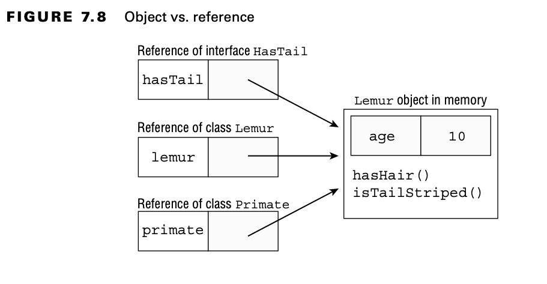

# Understanding Polymorphism

A Java object may be accessed using:

- A reference with the same type as the object
- A reference that is a superclass of the object
- A reference that defines an interface the object implements or inherits

````
    public class Primate {
        public boolean hasHair() {
            return true;
        }
    }
    
    public interface HasTail {
        public abstract boolean isTailStriped();
    }
    
    public class Lemur extends Primate implements HasTail {
        public boolean isTailStriped() {
            return false;
        }
    
        public int age = 10;
    
        public static void main(String[] args) {
            Lemur lemur = new Lemur();
            System.out.println(lemur.age);
            HasTail hasTail = lemur;
            System.out.println(hasTail.isTailStriped());
            Primate primate = lemur;
            System.out.println(primate.hasHair());
        }
}
        
````

The most important thing to note about this example is that only one object, Lemur, is created.

Once the object has been assigned to a new reference type, only the methods and vari- ables available to that reference
type are callable on the object without an explicit cast.

    HasTail hasTail = new Lemur();
    System.out.println(hasTail.age); // DOES NOT COMPILE

    Primate primate = new Lemur(); 
    System.out.println(primate.isTailStriped()); // DOES NOT COMPILE

## Object vs. Reference

In Java, all objects are accessed by reference, so as a developer you never have direct access to the object itself.
Conceptually, though, you should consider the object as the entity that exists in memory, allocated by the Java Runtime
Environment.

We can summarize this principle with the following two rules:

- The type of the object determines which properties exist within the object in memory.
- The type of the reference to the object determines which methods and variables are accessible to the Java program.



As you can see in the figure, the same object exists in memory regardless of which reference is pointing to it.
Depending on the type of the reference, we may only have access to certain methods.

## Casting Objects

Once we changed the reference type, though, we lost access to more specific members defined in the subclass that still
exists within the object. We can reclaim those references by casting the object back to the specific subclass it came
from:

    Lemur lemur = new Lemur();
    Primate primate = lemur; // Implicit Cast to supertype
    Lemur lemur2 = (Lemur) primate; // Explicit Cast to subtype
    Lemur lemur3 = primate; // DOES NOT COMPILE (missing cast)

When casting objects, you do not need a cast operator if casting to an inherited supertype. This is referred to as an
implicit cast and applies to classes or interfaces the object inherits.

Alternatively, if you want to access a subtype of the current reference, you need to perform an explicit cast with a
compatible type. If the underlying object is not compatible with the type, then a ClassCastException will be thrown at
runtime.

We summarize these concepts into a set of rules for you to memorize for the exam:

- Casting a reference from a subtype to a supertype doesn’t require an explicit cast.
- Casting a reference from a supertype to a subtype requires an explicit cast.
- At runtime, an invalid cast of a reference to an incompatible type results in a ClassCastException being thrown.
- The compiler disallows casts to unrelated types.

### Disallowed Casts

The exam may try to trick you with a cast that the compiler knows is not permitted (aka impossible).

    public class Bird {}

    public class Fish {
        public static void main(String[] args) {
            Fish fish = new Fish();
            Bird bird = (Bird) fish; // DOES NOT COMPILE }
        }
    }

The classes Fish and Bird are not related through any class hierarchy that the compiler is aware of; therefore, the code
will not compile.

### Casting Interfaces

While the compiler can enforce rules about casting to unrelated types for classes, it cannot always do the same for
interfaces.

    interface Canine {}
    interface Dog {}
    class Wolf implements Canine {}

    public class BadCasts {
        public static void main(String[] args) {
            Wolf wolfy = new Wolf();
            Dog badWolf = (Dog) wolfy; // ClassCastException
        }
    }

Even though the code compiles, it still throws a ClassCastException at runtime.

## The instanceof Operator

The instanceof operator can be used to check whether an object belongs to a particular class or interface and to prevent
a ClassCastException at runtime.

    class Rodent {}

    public class Capybara extends Rodent {
        public static void main(String[] args) {
            Rodent rodent = new Rodent();
            // var capybara = (Capybara) rodent; // ClassCastException
    
            if (rodent instanceof Capybara) {
                // Do stuff
            }
        }
    }

Just as the compiler does not allow casting an object to unrelated types, it also does not allow instanceof to be used
with unrelated types.

    public class Fish {
        public static void main(String[] args) {
            Fish fish = new Fish();
            if (fish instanceof Bird b) { // DOES NOT COMPILE
                // Do stuff 
            }
        }
    }

## Polymorphism and Method Overriding

In Java, polymorphism states that when you override a method, you replace all calls to it, even those defined in the
parent class.

    public class Penguin {
        public int getHeight() {
            return 3;
        }
    
        public void printInfo() {
            System.out.print(this.getHeight());
        }
    }

    public class EmperorPenguin extends Penguin {

        public int getHeight() {
            return 8;
        }
    
        public static void main(String[] fish) {
            new EmperorPenguin().printInfo();
        }
    }

Polymorphism’s ability to replace methods at runtime via overriding is one of the most important properties of Java.

**Calling the Parent Version of an Overridden Method**

    public class EmperorPenguin2 extends Penguin {

        @Override
        public int getHeight() {
            return 8;
        }
    
        @Override
        public void printInfo() {
            System.out.print(super.getHeight());
        }
    
        public static void main(String[] fish) {
            new EmperorPenguin2().printInfo();
        }
    }

## Overriding vs. Hiding Members

While method overriding replaces the method everywhere it is called, static method and variable hiding do not. Strictly
speaking, hiding members is not a form of polymorphism since the methods and variables maintain their individual
properties. Unlike method overriding, hiding members is very sensitive to the reference type and location where the
member is being used.

    public class Penguin3 {
        public static int getHeight() {
            return 3;
        }
    
        public void printInfo() {
            System.out.println(this.getHeight());
        }
    }

    public class CrestedPenguin extends Penguin3 {
        public static int getHeight() {
            return 8;
        }
    
        public static void main(String... fish) {
            new CrestedPenguin().printInfo();
        }
    }

The getHeight() method is static and is therefore hidden, not overridden.

    public class Marsupial {
        protected int age = 2;
    
        public static boolean isBiped() {
            return false;
        }
    }

    public class Kangaroo extends Marsupial {
        protected int age = 6;
    
        public static boolean isBiped() {
            return true;
        }
    
        public static void main(String[] args) {
            Kangaroo joey = new Kangaroo();
            Marsupial moey = joey;
            System.out.println(joey.isBiped());
            System.out.println(moey.isBiped());
            System.out.println(joey.age);
            System.out.println(moey.age);
        }
    }

The program prints the following:

    true 
    false 
    6
    2

In this example, only one object (of type Kangaroo) is created and stored in memory! Since static methods can only be
hidden, not overridden, Java uses the reference type to determine which version of isBiped() should be called, resulting
in joey.isBiped() printing true and moey.isBiped() printing false.

**Don’t Hide Members in Practice**

Although Java allows you to hide variables and static methods, it is considered an extremely poor coding practice. As
you saw in the previous example, the value of the variable or method can change depending on what reference is used,
making your code very confusing, difficult to follow, and challenging for others to maintain.This is further compounded
when you start modifying the value of the variable in both the parent and child methods, since it may not be
clear which variable you’re updating.

When you’re defining a new variable or static method in a child class, it is considered good coding practice to select a
name that is not already used by an inherited member. Redeclaring private methods and variables is considered less
problematic, though, because the child class does not have access to the variable in the parent class to begin with.