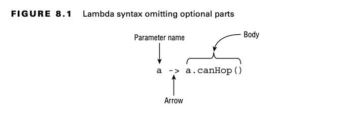
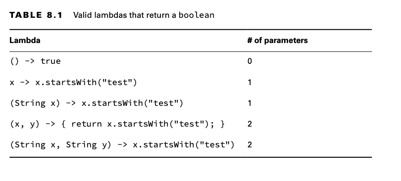
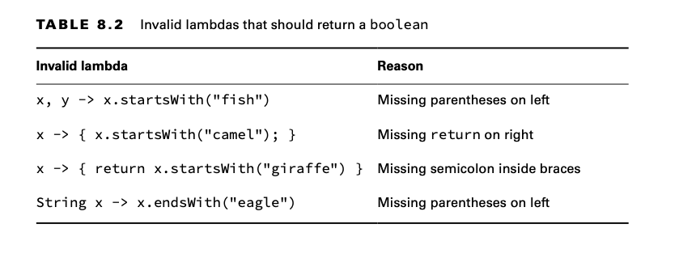

# Lambdas and Functional Interfaces

Lambdas allow you to specify code that will be run later in the program.

# Writing Simple Lambdas

Functional programming is a way of writing code more declaratively. You specify what you want to do rather than dealing
with the state of objects. You focus more on expressions than loops.

Functional programming uses lambda expressions to write code. A lambda expression is a block of code that gets passed
around. You can think of a lambda expression as an unnamed method existing inside an anonymous class.

## Looking at a Lambda Example

    public record Animal(String species, boolean canHop, boolean canSwim) { }

The Animal record has three fields. Let’s say we have a list of animals, and we want to process the data based on a
particular attribute. For example, we want to print all animals that can hop. We can define an interface to generalize
this concept and support a large variety of checks:

    public interface CheckTrait { 
        boolean test(Animal a);
    }

    public class CheckIfHopper implements CheckTrait {
        public boolean test(Animal a) {
            return a.canHop();
        }
    }

    import java.util.*;
    
    public class TraditionalSearch {
        public static void main(String[] args) {
    // list of animals
            var animals = new ArrayList<Animal>();
            animals.add(new Animal("fish", false, true));
            animals.add(new Animal("kangaroo", true, false));
            animals.add(new Animal("rabbit", true, false));
            animals.add(new Animal("turtle", false, true));
    // pass class that does check
            print(animals, new CheckIfHopper());
        }
    
        private static void print(List<Animal> animals, CheckTrait checker) {
            for (Animal animal : animals) {
    // General check
                if (checker.test(animal))
                    System.out.print(animal + " ");
            }
            System.out.println();
        }
    }

Let’s replace with the following, which uses a lambda:

    print(animals, a -> a.canHop());

We only have to add one line of code—no need for an extra class to do something simple. Here’s that other line:

    print(animals, a -> a.canSwim());

    print(animals, a -> !a.canSwim());

The point is that it is really easy to write code that uses lambdas once you get the basics in place. This code uses a
concept called deferred execution. Deferred execution means that code is specified now but will run later. In this case,
"later" is inside the print() method body, as opposed to when it is passed to the method.

## Learning Lambda Syntax

One of the simplest lambda expressions you can write is the one you just saw:

    a -> a.canHop()

Lambdas work with interfaces that have exactly one abstract method.

Java relies on context when figuring out what lambda expressions mean. Context refers to where and how the lambda is
interpreted.

The syntax of lambdas is tricky because many parts are optional. These two lines do the exact same thing:

    a -> a.canHop()

    (Animal a) -> { return a.canHop(); }

Let’s look at what is going on here.

- A single parameter specified with the name a
- The arrow operator (->) to separate the parameter and body
- A body that calls a single method and returns the result of that method

The second example shows the most verbose form of a lambda that returns a boolean;

- A single parameter specified with the name a and stating that the type is Animal
- The arrow operator (->) to separate the parameter and body
- A body that has one or more lines of code, including a semicolon and a return statement

The parentheses around the lambda parameters can be omitted only if there is a single parameter and its type is not
explicitly stated.
ava does this because developers commonly use lambda expressions this way and can do as little typing as possible.

It shouldn’t be news to you that we can omit braces when we have only a single statement. We did this with if statements
and loops already. Java allows you to omit a return statement and semicolon (;) when no braces are used. This special
shortcut doesn’t work when you have two or more statements. At least this is consistent with using {} to create blocks
of code elsewhere.

    a -> { return a.canHop(); }
    (Animal a) -> a.canHop()

Here’s a fun fact: s -> {} is a valid lambda.If there is no code on the right side of the expression, you don’t need the
semicolon or return statement.

Now let’s make sure you can identify invalid syntax for each row.

Remember that the parentheses are optional only when there is one parameter and it doesn’t have a type declared.

**Assigning Lambdas to var**

Why do you think this line of code doesn’t compile?

    var invalid = (Animal a) -> a.canHop(); // DOES NOT COMPILE

Remember when we talked about Java inferring information about the lambda from the context? Well, var assumes the type
based on the context as well. There’s not enough context here! Neither the lambda nor var have enough information to
determine what type of functional interface should be used.