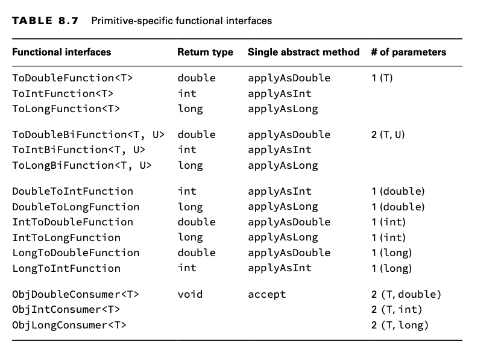

# Working with Variables in Lambdas

They can appear in three places with respect to lambdas: the parameter list, local variables declared inside the lambda
body, and variables referenced from the lambda body. All three of these are opportunities for the exam to trick you.

## Listing Parameters

var can be used in place of the specific type. That means that all three of these statements are interchangeable:

    Predicate<String> p = x -> true;
    Predicate<String> p = (var x) -> true;
    Predicate<String> p = (String x) -> true;

In this case, the lambda is being assigned to a Predicate that takes a String.

Can you figure out the type of x?

    public void whatAmI() {
        consume((var x) -> System.out.print(x), 123);
    }

    public void consume(Consumer<Integer> c, int num){ 
        c.accept(num);
    }

Since the consume() method expects an Integer as the generic, we know that is what the inferred type of x will be.

What do you think the type of x is here?

    public void counts(List<Integer> list) {
        list.sort((var x, var y) -> x.compareTo(y));
    }

The answer is again Integer. Since we are sorting a list, we can use the type of the list to determine the type of the
lambda parameter.

Since lambda parameters are just like method parameters, you can add modifiers to them. Specifically, you can add the
final modifier or an annotation, as shown in this example:

    public void counts(List<Integer> list) {
        list.sort((final var x, @Deprecated var y) -> x.compareTo(y));
    }

**Parameter List Formats**

You have three formats for specifying parameter types within a lambda: without types, with types, and with var.
The compiler requires all parameters in the lambda to use the same format. Can you see why the following are not valid?

    (var x, y) -> "Hello"                           DOES NOT COMPILE
    (var x, Integer y) -> true                      DOES NOT COMPILE
    (String x, var y, Integer z) -> true            DOES NOT COMPILE
    (Integer x, y) -> "goodbye"                     DOES NOT COMPILE

- Needs to remove var from x or add it to y.
- Next , need to use the type or var consistently.
- Finally, needs to remove Integer from x or add a type to y.

## Using Local Variables Inside a Lambda Body

While it is most common for a lambda body to be a single expression, it is legal to define a block. That block can have
anything that is valid in a normal Java block, including local variable declarations.

    (a, b) -> { int c = 0; return 5; }
    (a, b) -> { int a = 0; return 5; } // DOES NOT COMPILE

We tried to redeclare a, which is not allowed. Java doesn’t let you create a local variable with the same name as one
already declared in that scope.

    public void variables(int a){ 
        int b = 1;
        Predicate<Integer> p1 = a -> { int b = 0;
        int c = 0;
        return b == c; } 
    }

There are three syntax errors.

- The variable a was already used in this scope as a method parameter, so it cannot be reused.
- The code attempts to redeclare local variable b.
- The variable p1 is missing a semicolon at the end. There is a semicolon before the }, but that is inside the block.

**KeepYour Lambdas Short**

Having a lambda with multiple lines and a return statement is often a clue that you should refactor and put that code in
a method. For example, the previous example could be rewritten as;

    Predicate<Integer> p1 = a -> returnSame(a);

This simpler form can be further refactored to use a method reference:

    Predicate<Integer> p1 = this::returnSame;

## Referencing Variables from the Lambda Body

Lambda bodies are allowed to reference some variables from the surrounding code. The following code is legal:

    public class Crow {
    private String color;

    public void caw(String name) {
        String volume = "loudly";
        Consumer<String> consumer = s ->
                System.out.println(name + " says "
                        + volume + " that she is " + color);
        }
    }

This shows that a lambda can access an instance variable, method parameter, or local variable under certain
conditions.

- Instance variables (and class variables) are always allowed.
- The only thing lambdas cannot access are variables that are not final or effectively final.

The compiler errors occur when the variables are not effectively final.

    private String color;

    public void caw(String name) {
        String volume = "loudly";
        name = "Caty";
        color = "black";
        Consumer<String> consumer = s ->
                System.out.println(name + " says " // DOES NOT COMPILE
                + volume + " that she is " + color); // DOES NOT COMPILE
        volume = "softly";
    }

In this example, the method parameter 'name' is not effectively final.
The variable volume is not effectively final either since it is updated.

