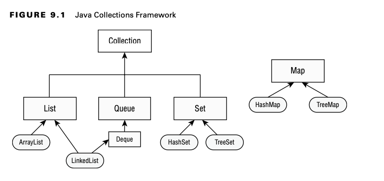

# Using Common Collection API

A collection is a group of objects contained in a single object. The Java Collections Framework is a set of classes
in java.util for storing collections. There are four main interfaces in the Java Collections Framework.

**List**

A list is an ordered collection of elements that allows duplicate entries. Elements in a list can be accessed by an int
index.

**Set**

A set is a collection that does not allow duplicate entries.

**Queue**

A queue is a collection that orders its elements in a specific order for processing.
A Deque is a subinterface of Queue that allows access at both ends.

**Map**

A map is a collection that maps keys to values, with no duplicate keys allowed. The
elements in a map are key/value pairs.

## Using the Diamond Operator

When constructing a Java Collections Framework, you need to specify the type that will go inside. We could write code
using generics like the following:

    List<Integer> list = new ArrayList<Integer>();

You might even have generics that contain other generics, such as this:

    Map<Long,List<Integer>> mapLists = new HashMap<Long,List<Integer>>();

That’s a lot of duplicate code to write! Luckily, the diamond operator (<>) is a shorthand notation that allows you to
omit the generic type from the right side of a statement when the type can be inferred

    List<Integer> list = new ArrayList<>();
    Map<Long,List<Integer>> mapOfLists = new HashMap<>();

The diamond operator cannot be used as the type in a variable declaration. It can be used only on the right side of an
assignment operation. For example, neither of the following compiles:

    List<> list = new ArrayList<Integer>(); // DOES NOT COMPILE

    class InvalidUse {
        void use(List<> data) {} // DOES NOT COMPILE
    }

## Adding Data

The add() method inserts a new element into the Collection and returns whether it was suc- cessful. The method signature
is as follows:

    public boolean add(E element)

Remember that the Collections Framework uses generics. You will see E appear frequently. It means the generic type that
was used to create the collection. For some Collection types, add() always returns true.

    Collection<String> list = new ArrayList<>();
    System.out.println(list.add("Sparrow")); // true
    System.out.println(list.add("Sparrow")); // true

    Collection<String> set = new HashSet<>();
    System.out.println(set.add("Sparrow")); // true
    System.out.println(set.add("Sparrow")); // false

A List allows duplicates, making the return value true each time. A Set does not allow duplicates.

## Removing Data

The remove() method removes a single matching value in the Collection and returns whether it was successful. The method
signature is as follows:

    public boolean remove(Object object)

    Collection<String> birds = new ArrayList<>();
    birds.add("hawk"); // [hawk]
    birds.add("hawk"); // [hawk, hawk]
    System.out.println(birds.remove("hawk")); // true
    System.out.println(birds); // [hawk]

## Counting Elements

The isEmpty() and size() methods look at how many elements are in the Collection. The method signatures are as follows:

    public boolean isEmpty() 
    public int size()

    
    Collection<String> birds = new ArrayList<>();

    System.out.println(birds.isEmpty());    // true
    System.out.println(birds.size());       // 0
    birds.add("hawk");                      // [hawk]
    birds.add("hawk");                      // [hawk, hawk]
    System.out.println(birds.isEmpty());    // false
    System.out.println(birds.size());       // 2

## Clearing the Collection

The clear() method provides an easy way to discard all elements of the Collection. The method signature is as follows:

    public void clear()

    Collection<String> birds = new ArrayList<>();

    birds.add("hawk");                      // [hawk]
    birds.add("hawk");                      // [hawk, hawk]
    System.out.println(birds.isEmpty());    // false
    System.out.println(birds.size());       // 2
    birds.clear();                          // []
    System.out.println(birds.isEmpty());    // true
    System.out.println(birds.size());       // 0

## Check Contents

The contains() method checks whether a certain value is in the Collection. The method signature is as follows:

    public boolean contains(Object object)

    
    Collection<String> birds = new ArrayList<>();
    birds.add("hawk"); // [hawk]
    System.out.println(birds.contains("hawk")); // true
    System.out.println(birds.contains("robin")); // false

The contains() method calls equals() on elements of the ArrayList to see whether there are any matches.

## Removing with Conditions

The removeIf() method removes all elements that match a condition. We can specify what should be deleted using a block
of code or even a method reference.

The method signature looks like the following.

    public boolean removeIf(Predicate<? super E> filter)

It uses a Predicate, which takes one parameter and returns a boolean.

    Collection<String> list = new ArrayList<>();
    list.add("Magician");
    list.add("Assistant");
    System.out.println(list); // [Magician, Assistant]
    list.removeIf(s -> s.startsWith("A"));
    System.out.println(list); // [Magician]

Let’s try an example with a method reference:

    Collection<String> set = new HashSet<>();
    set.add("Wand");
    set.add("");
    set.removeIf(String::isEmpty); // s -> s.isEmpty()
    System.out.println(set); // [Wand]

## Iterating

There’s a forEach() method that you can call on a Collection instead of writing a loop. It uses a Consumer that takes a
single parameter and doesn’t return anything. The method signature is as follows:

    public void forEach(Consumer<? super T> action)

    Collection<String> cats = List.of("Annie", "Ripley"); 
    cats.forEach(System.out::println);
    cats.forEach(c -> System.out.println(c));

**Other Iteration Approaches**

There are other ways to iterate through a Collection.

    for (String element: coll) 
        System.out.println(element);

You may see another older approach used.

    Iterator<String> iter = coll.iterator(); 
    while(iter.hasNext()) {
        String string = iter.next();
        System.out.println(string); 
    }

Pay attention to the difference between these techniques.The hasNext() method checks whether there is a next value. In
other words, it tells you whether next() will execute without throwing an exception.The next() method actually moves the
Iterator to the next element.

## Determining Equality

There is a custom implementation of equals() so you can compare two Collections to compare the type and contents. The
implementation will vary. For example, ArrayList checks order, while HashSet does not.

    boolean equals(Object object)

The following shows an example:

    var list1 = List.of(1, 2);
    var list2 = List.of(2, 1);

    var set1 = Set.of(1, 2);
    var set2 = Set.of(2, 1);

    System.out.println(list1.equals(list2)); // false , because the elements are in a different order, and a List cares about order.
    System.out.println(set1.equals(set2)); // true , because a Set is not sensitive to order
    System.out.println(list1.equals(set1)); // false , because the types are different.

**Unboxing nulls**

Java protects us from many problems with Collections. However, it is still possible to write a NullPointerException:

    var heights = new ArrayList<Integer>();
    heights.add(null);
    int h = heights.get(0); // NullPointerException

We add a null to the list.This is legal because a null reference can be assigned to any reference variable.
We try to unbox that null to an int primitive.This is a problem. Java tries to get the int value of null.
Since calling any method on null gives a NullPointerException, that is just what we get. Be careful when you see null in
relation to autoboxing.

