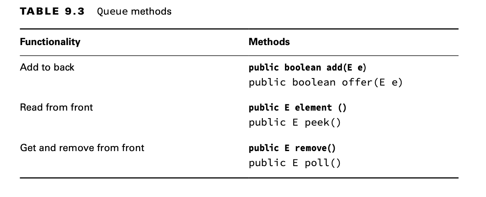
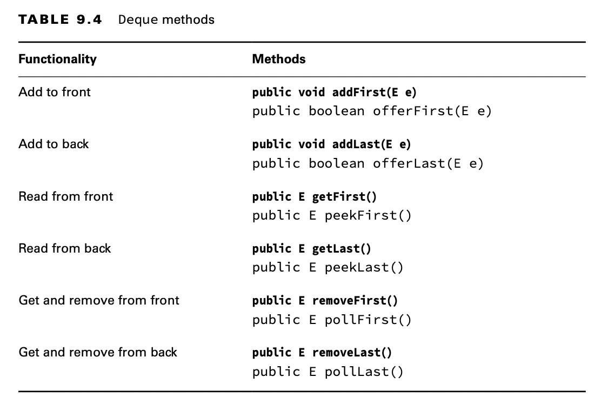

# Using the Queue and Deque Interfaces

You use a Queue when elements are added and removed in a specific order. You can think of a queue as a line. For
example, when you want to enter a stadium and someone is waiting in line, you get in line behind that person.

## Comparing Deque Implementations

You saw LinkedList earlier in the List section. In addition to being a list, it is a Deque. The main benefit of a
LinkedList is that it implements both the List and Deque interfaces. The trade-off is that it isn’t as efficient as a
"pure" queue. You can use the ArrayDeque class if you don’t need the List methods.

## Working with Queue and Deque Methods

The Queue interface contains six methods. We’ve bolded the ones that throw an exception when something goes wrong, like
trying to read from an empty Queue.

    Queue<Integer> queue = new LinkedList<>();
    queue.add(10);
    queue.add(4);

    System.out.println(queue.remove()); // 10
    System.out.println(queue.peek()); //4
    System.out.println(queue.peek()); //4

Next, we move on to the Deque interface. Since the Deque interface supports double-ended queues, it inherits all Queue
methods and adds more so that it is clear if we are working with the front or back of the queue.

    Deque<Integer> deque = new LinkedList<>();
    deque.offerFirst(10);   //true
    deque.offerLast(4);     //true
    deque.peekFirst();          //10
    deque.pollFirst();          //10
    deque.pollLast();           //4
    deque.pollFirst();          //null
    deque.peekFirst();          //null

In addition to FIFO queues, there are LIFO (last-in, first-out) queues, which are commonly referred to as stacks.
Picture a stack of plates. You always add to or remove from the top of the stack to avoid a mess. Luckily, we can use
the same double-ended queue implementations.

When using a Deque, it is really important to determine if it is being used as a FIFO queue, a LIFO stack, or a
double-ended queue. To review, a FIFO queue is like a line of people. You get on in the back and off in the front. A
LIFO stack is like a stack of plates. You put the plate on the top and take it off the top. A double-ended queue uses
both ends.

    Deque<Integer> stack = new ArrayDeque<>();
    stack.push(10);
    stack.push(4);
    stack.peek(); //4
    stack.poll(); //4
    stack.poll(); //10
    stack.poll(); // null
