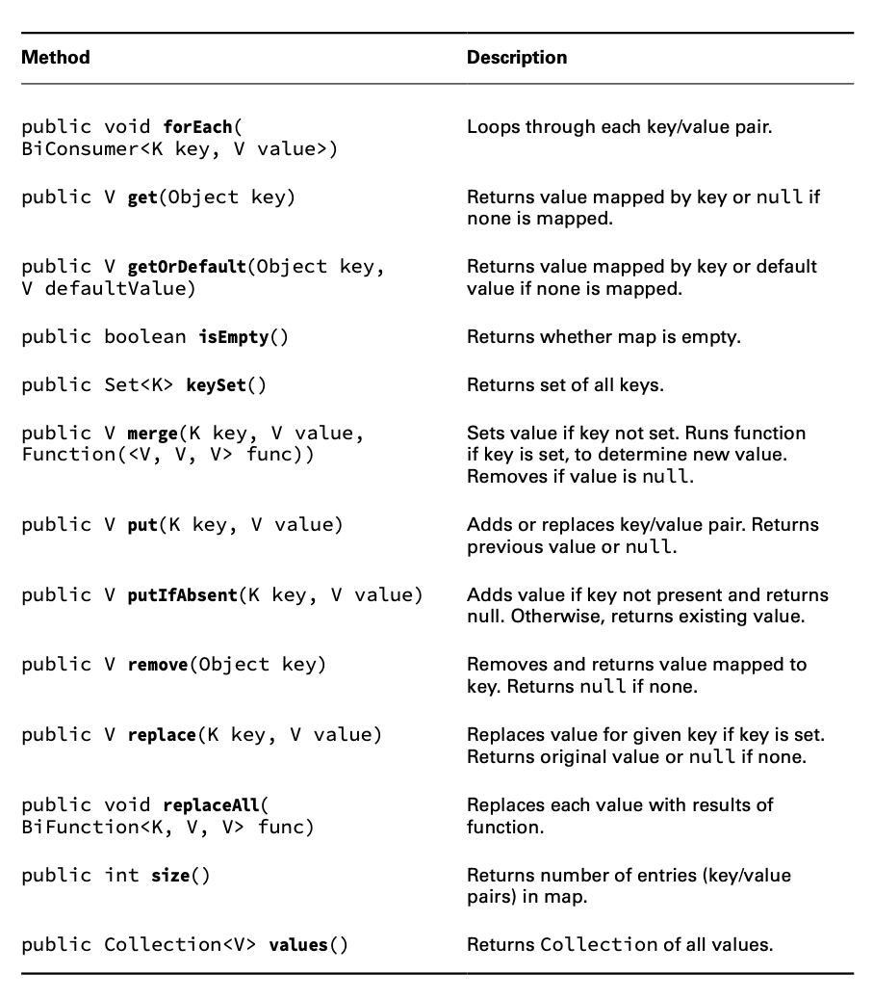
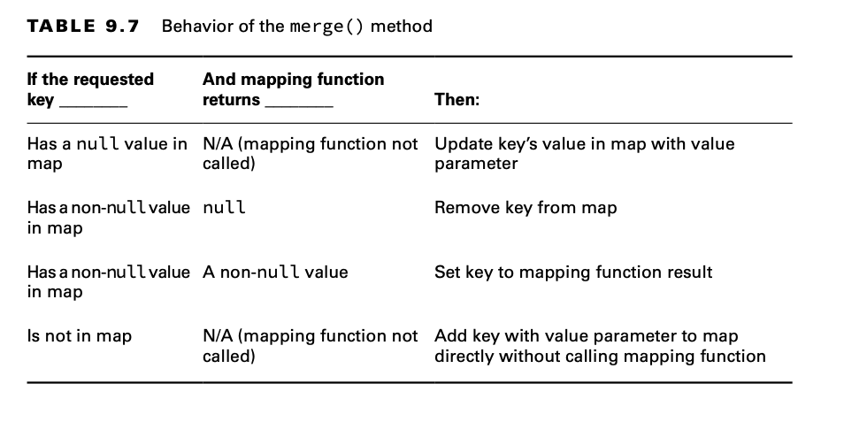

# Using the Map Interface

You use a Map when you want to identify values by a key.
The main thing that all Map classes have in common is that they have keys and values.

**Map.of() and Map.copyOf()**

Just like List and Set, there is a factory method to create a Map.You pass any number of pairs of keys and values.

    Map.of("key1", "value1", "key2", "value2");

Unlike List and Set, this is less than ideal. Passing keys and values is harder to read because you have to keep track
of which parameter is which. Luckily, there is a better way. Map also provides a method that lets you supply key/value
pairs.

    Map.ofEntries(
        Map.entry("key1", "value1"), 
        Map.entry("key2", "value2"));

Now we can’t forget to pass a value. If we leave out a parameter, the entry() method won’t compile. Conveniently,
Map.copyOf(map) works just like the List and Set interface copyOf() methods.

## Comparing Map Implementations

A HashMap stores the keys in a hash table. This means that it uses the hashCode() method of the keys to retrieve their
values more efficiently.

The main benefit is that adding elements and retrieving the element by key both have constant time. The trade-off is
that you lose the order in which you inserted the elements.

A TreeMap stores the keys in a sorted tree structure. The main benefit is that the keys are always in sorted order. Like
a TreeSet, the trade-off is that adding and checking whether a key is present takes longer as the tree grows larger.

## Working with Map Methods

Given that Map doesn’t extend Collection, more methods are specified on the Map interface. Since there are both keys and
values, we need generic type parameters for both.

## Calling Basic Methods

Let’s start out by comparing the same code with two Map types. First up is HashMap:

    Map<String, String> map = new HashMap<>();
    map.put("koala", "bamboo");
    map.put("lion", "meat");
    map.put("giraffe", "leaf");
    String food = map.get("koala"); // bamboo
    for (String key : map.keySet())
        System.out.print(key + ","); // koala,giraffe,lion,

Now let’s look at TreeMap:

    Map<String, String> map = new TreeMap<>();
    map.put("koala", "bamboo");
    map.put("lion", "meat");
    map.put("giraffe", "leaf");
    String food = map.get("koala"); // bamboo
    for (String key : map.keySet())
        System.out.print(key + ","); // giraffe,koala,lion,

With our same map, we can try some boolean checks:

    System.out.println(map.contains("lion")); // DOES NOT COMPILE 
    System.out.println(map.containsKey("lion")); // true 
    System.out.println(map.containsValue("lion")); // false 
    System.out.println(map.size()); // 3
    map.clear(); System.out.println(map.size()); // 0 
    System.out.println(map.isEmpty()); // true

## Iterating through a Map

You saw the forEach() method earlier in the chapter. Note that it works a little differently on a Map. This time, the
lambda used by the forEach() method has two parameters: the key and the value. Let’s look at an example, shown here:

    Map<Integer, Character> map = new HashMap<>();
    map.put(1, 'a');
    map.put(2, 'b');
    map.put(3, 'c');
    map.forEach((k, v) -> System.out.println(v));

The lambda has both the key and value as the parameters.

    map.values().forEach(System.out::println);

Another way of going through all the data in a map is to get the key/value pairs in a Set. Java has a static interface
inside Map called Entry. It provides methods to get the key and value of each pair.

    map.entrySet().forEach(e -> System.out.println(e.getKey() + " " + e.getValue()));

## Getting Values Safely

The get() method returns null if the requested key is not in the map. Sometimes you prefer to have a different value
returned. Luckily, the getOrDefault() method makes this easy.

    Map<Character, String> map = new HashMap<>();
    map.put('x', "spot");
    System.out.println("X marks the " + map.get('x'));
    System.out.println("X marks the " + map.getOrDefault('x', "")); 
    System.out.println("Y marks the " + map.get('y'));
    System.out.println("Y marks the " + map.getOrDefault('y', ""));

## Replacing Values

These methods are similar to the List version, except a key is involved:

    Map<Integer, Integer> map = new HashMap<>();
    map.put(1, 2);
    map.put(2, 4);
    Integer original = map.replace(2, 10); // 4
    System.out.println(map); // {1=2, 2=10}
    map.replaceAll((k, v) -> k + v);
    System.out.println(map); // {1=3, 2=12}

## Putting if Absent

The putIfAbsent() method sets a value in the map but skips it if the value is already set to a non-null value.

    Map<String, String> favorites = new HashMap<>();
    favorites.put("Jenny", "Bus Tour");
    favorites.put("Tom", null);
    favorites.putIfAbsent("Jenny", "Tram");
    favorites.putIfAbsent("Sam", "Tram");
    favorites.putIfAbsent("Tom", "Tram");
    System.out.println(favorites); // {Tom=Tram, Jenny=Bus Tour, Sam=Tram}

As you can see, Jenny’s value is not updated because one was already present. Sam wasn’t there at all, so he was added.
Tom was present as a key but had a null value. Therefore, he was added as well.

## Merging Data

The merge() method adds logic of what to choose. Suppose we want to choose the ride with the longest name. We can write
code to express this by passing a mapping function to the merge() method:

    BiFunction<String, String, String> mapper = (v1, v2) -> v1.length() > v2.length() ? v1 : v2;

    Map<String, String> favorites = new HashMap<>();
    favorites.put("Jenny", "Bus Tour");
    favorites.put("Tom", "Tram");

    String jenny = favorites.merge("Jenny", "Skyride", mapper);
    String tom = favorites.merge("Tom", "Skyride", mapper);
    System.out.println(favorites); // {Tom=Skyride, Jenny=Bus Tour}
    System.out.println(jenny); // Bus Tour
    System.out.println(tom); // Skyride

Our implementation returns the one with the longest name. It sees that Bus Tour is longer than Skyride, so it leaves the
value as Bus Tour. This time, Tram is shorter than Skyride, so the map is updated.

The merge() method also has logic for what happens if null values or missing keys are involved. In this case, it doesn’t
call the BiFunction at all, and it simply uses the new value.

The merge() method also has logic for what happens if null values or missing keys are involved.

    BiFunction<String, String, String> mapper = (v1, v2) -> v1.length() > v2.length() ? v1 : v2;    
    
    Map<String, String> favorites = new HashMap<>();
    favorites.put("Sam", null);
    favorites.merge("Tom", "Skyride", mapper);
    favorites.merge("Sam", "Skyride", mapper);
    System.out.println(favorites); // {Tom=Skyride, Sam=Skyride}

Notice that the mapping function isn’t called. If it were, we’d have a NullPointerException. The mapping function is
used only when there are two actual values to decide between.

The final thing to know about merge() is what happens when the mapping function is called and returns null. The key is
removed from the map when this happens:

Tom was left alone since there was no merge() call for that key. Sam was added since that key was not in the original
list. Jenny was removed because the mapping function returned null.

    BiFunction<String, String, String> mapper = (v1, v2) -> null;

    Map<String, String> favorites = new HashMap<>();
    favorites.put("Jenny", "Bus Tour");
    favorites.put("Tom", "Bus Tour");
    favorites.merge("Jenny", "Skyride", mapper);
    favorites.merge("Sam", "Skyride", mapper);
    System.out.println(favorites); // {Tom=Bus Tour, Sam=Skyride}

