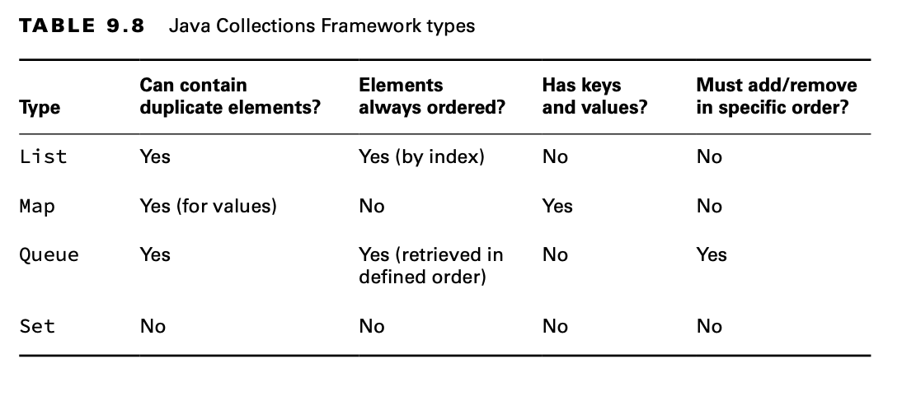
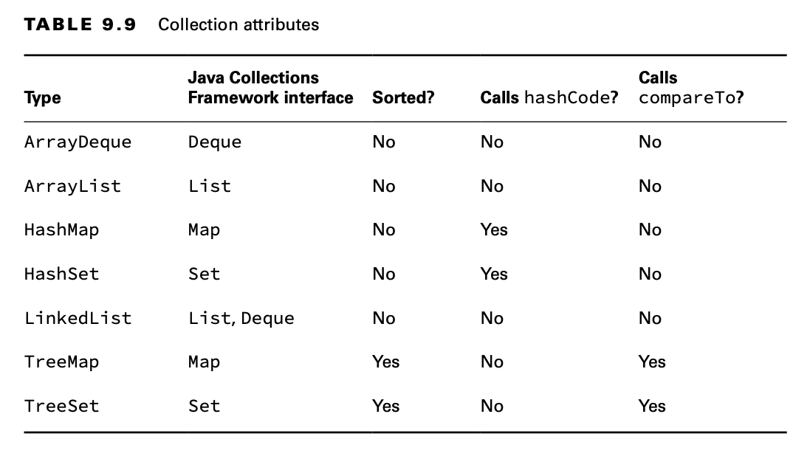

# Comparing Collection Types

We conclude this section with a review of all the collection classes. Make sure that you can fill in Table 9.8 to
compare the four collection types from memory.

Additionally, make sure you can fill in Table 9.9 to describe the types on the exam.

Next, the exam expects you to know which data structures allow null values. The data structures that involve sorting do
not allow null values.

Finally, the exam expects you to be able to choose the right collection type given a description of a problem. We
recommend first identifying which type of collection the question is asking about. Figure out whether you are looking
for a list, map, queue, or set.

**Older Collections**

There are a few collections that are no longer on the exam but that you might come across in older code. All three were
early Java data structures you could use with threads:

- Vector: Implements List.
- Hashtable: Implements Map.
- Stack: Implements Queue.

These classes are rarely used anymore, as there are much better concurrent alternatives that we cover in Chapter 13. 
