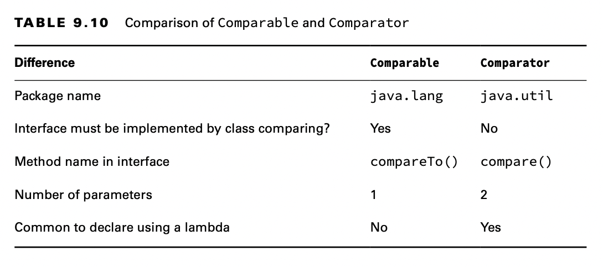
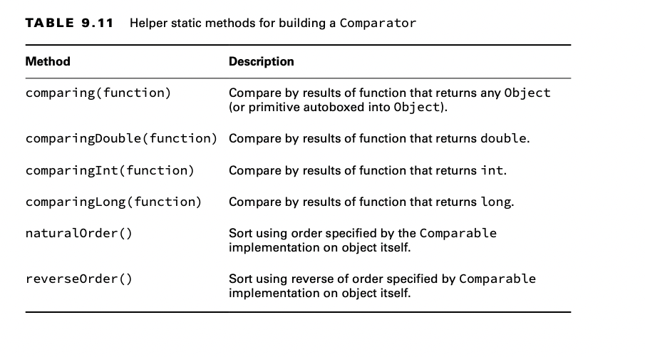

# Sorting Data

We discussed "order" for the TreeSet and TreeMap classes. For numbers, order is obvious—it is numerical order. For
String objects, order is defined according to the Unicode character mapping.

When working with a String, remember that numbers sort before letters, and uppercase letters sort before lowercase
letters.

We use Collections.sort() in many of these examples.
You can also sort objects that you create yourself. Java provides an interface called Comparable. If your class
implements Comparable, it can be used in data structures that require comparison. There is also a class called
Comparator, which is used to specify that you want to use a different order than the object itself provides.

## Creating a Comparable Class

The Comparable interface has only one method.

    public interface Comparable<T>{
        int compareTo(T o);
    }

The generic T lets you implement this method and specify the type of your object. This lets you avoid a cast when
implementing compareTo().

    import java.util.ArrayList;
    import java.util.Collections;

    public class Duck implements Comparable<Duck> {
    
        private String name;
    
        public Duck(String name) {
            this.name = name;
        }
    
        @Override
        public int compareTo(Duck d) {
            return name.compareTo(d.name); // sorts ascendingly by name
        }
    
        public String toString() {
            return name;
        }
    
        public static void main(String[] args) {
            var ducks = new ArrayList<Duck>();
            ducks.add(new Duck("Quack"));
            ducks.add(new Duck("Puddles"));
            Collections.sort(ducks); // sort by name
    
            System.out.println(ducks); // [Puddles, Quack]
        }
    }

Finally, the Duck class implements compareTo(). Since Duck is comparing objects of type String and the String class
already has a compareTo() method, it can just delegate. We still need to know what the compareTo() method returns so
that we can write our own.

There are three rules to know:

- The number 0 is returned when the current object is equivalent to the argument to compareTo().
- A negative number (less than 0) is returned when the current object is smaller than the argument to compareTo().
- A positive number (greater than 0) is returned when the current object is larger than the argument to compareTo().

Let’s look at an implementation of compareTo() that compares numbers instead of String objects:

    public class Animal implements Comparable<Animal> {
        private int id;
    
        public int compareTo(Animal a) {
            return id - a.id;
        }
    
        public static void main(String[] args) {
            var a1 = new Animal();
            var a2 = new Animal();
    
            a1.id = 5;
            a2.id = 7;
    
            System.out.println(a1.compareTo(a2)); // -2
            System.out.println(a1.compareTo(a1)); // 0
            System.out.println(a2.compareTo(a1)); // 2
        }
    }

Remember that id - a.id sorts in ascending order,and a.id - id sorts in descending order.

### Casting the compareTo() Argument

When dealing with legacy code or code that does not use generics, the compareTo() method requires a cast since it is
passed an Object.

    public class LegacyDuck implements Comparable {
        private String name;
    
        public int compareTo(Object obj) {
            LegacyDuck d = (LegacyDuck) obj; // cast because no generics
            return name.compareTo(d.name);
        }
    }

### Checking for null

When writing your own compare methods, you should check the data before comparing it if it is not validated ahead of
time.

    public class MissingDuck implements Comparable<MissingDuck> {
        private String name;

        public int compareTo(MissingDuck quack) {
            if (quack == null)
                throw new IllegalArgumentException("Poorly formed duck!");
            if (this.name == null && quack.name == null)
                return 0;
            else if (this.name == null) return -1;
            else if (quack.name == null) return 1;
            else return name.compareTo(quack.name);
        }
    }

This method throws an exception if it is passed a null MissingDuck object. What about the ordering? If the name of a
duck is null, it’s sorted first.

### Keeping compareTo() and equals() Consistent

If you write a class that implements Comparable, you introduce new business logic for deter- mining equality. The
compareTo() method returns 0 if two objects are equal, while your equals() method returns true if two objects are equal.
A natural ordering that uses compareTo() is said to be consistent with equals if, and only if, x.equals(y) is true
whenever x.compareTo(y) equals 0.

Similarly, x.equals(y) must be false whenever x.compareTo(y) is not 0. You are strongly encouraged to make your
Comparable classes consistent with equals because not all collection classes behave predictably if the compareTo() and
equals() methods are not consistent.

For example, the following Product class defines a compareTo() method that is not consistent with equals:

    public class Product implements Comparable<Product> {
        private int id;
        private String name;
    
        public int hashCode() {
            return id;
        }
    
        public boolean equals(Object obj) {
            if (!(obj instanceof Product)) return false;
            var other = (Product) obj;
            return this.id == other.id;
        }
        
        public int compareTo(Product obj) {
            return this.name.compareTo(obj.name);
        }
    }

You might be sorting Product objects by name, but names are not unique. The compareTo() method does not have to be
consistent with equals.

## Comparing Data with a Comparator

Sometimes you want to sort an object that did not implement Comparable, or you want to sort objects in different ways at
different times.

    public class Duck implements Comparable<Duck> {

        private String name;
        private int weight;
        //constructor and getters
            
        @Override
        public int compareTo(Duck d) {
            return name.compareTo(d.name); // sorts ascendingly by name
        }

        public static void main(String[] args) {
    
            Comparator<Duck> byWeight = new Comparator<Duck>() {
    
                public int compare(Duck d1, Duck d2) {
                    return d1.getWeight() - d2.getWeight();
                }
            };
    
            var ducks = new ArrayList<Duck>();
            ducks.add(new Duck("Quack", 7));
            ducks.add(new Duck("Puddles", 10));
            Collections.sort(ducks); // sort by name
    
            System.out.println(ducks); // [Puddles, Quack]
    
            Collections.sort(ducks, byWeight);
    
            System.out.println(ducks); // [Quack, Puddles]
        }
    }

t Comparable and Comparator are in different packages: java.lang and java.util, respectively. That means Comparable can
be used without an import statement, while Comparator cannot.

Comparator is a functional interface since there is only one abstract method to implement.

    Comparator<Duck> byWeight = (d1, d2) -> d1.getWeight()-d2.getWeight();

Alternatively, we can use a method reference and a helper method to specify that we want to sort by weight.

    Comparator<Duck> byWeight = Comparator.comparing(Duck::getWeight);

**Is Comparable a Functional Interface?**

We said that Comparator is a functional interface because it has a single abstract method. Comparable is also a
functional interface since it also has a single abstract method. However, using a lambda for Comparable would be
silly.The point of Comparable is to implement it inside the object being compared.

## Comparing Comparable and Comparator

There are several differences between Comparable and Comparator. We’ve listed them for you in Table 9.10.

Memorize this table—really. The exam will try to trick you by mixing up the two and see- ing if you can catch it. Do you
see why this doesn’t compile?

    var byWeight = new Comparator<Duck>() { // DOES NOT COMPILE 
    
        public int compareTo(Duck d1, Duck d2) {
            return d1.getWeight()-d2.getWeight(); 
        }
    };

The method name is wrong. A Comparator must implement a method named compare(). Pay special attention to method names
and the number of parameters when you see Comparator and Comparable in questions.

## Comparing Multiple Fields

When writing a Comparator that compares multiple instance variables, the code gets a little messy.

    public class Squirrel {
        private int weight;
        private String species;
        // Assume getters/setters/constructors provided
    }

We want to write a Comparator to sort by species name. If two squirrels are from the same species, we want to sort the
one that weighs the least first. We could do this with code that looks like this:

    public class MultiFieldComparator implements Comparator<Squirrel> {
        public int compare(Squirrel s1, Squirrel s2) {
            int result = s1.getSpecies().compareTo(s2.getSpecies());
            if (result != 0) return result;
            return s1.getWeight() - s2.getWeight();
        }
    }

Alternatively, we can use method references and build the Comparator. This code represents logic for the same
comparison:

    Comparator<Squirrel> c = Comparator.comparing(Squirrel::getSpecies) .thenComparingInt(Squirrel::getWeight);

Suppose we want to sort in descending order by species.

    var c = Comparator.comparing(Squirrel::getSpecies).reversed();

You’ve probably noticed by now that we often ignore null values in checking equality and comparing objects. This works
fine for the exam. In the real world, though, things aren’t so neat. You will have to decide how to handle null values
or prevent them from being in your object.

## Sorting and Searching

Now that you’ve learned all about Comparable and Comparator, we can finally do something useful with them, like sorting.
The Collections.sort() method uses the compareTo() method to sort. It expects the objects to be sorted to be Comparable.

    import java.util.ArrayList;
    import java.util.Collections;
    import java.util.List;
    
    public class SortRabbits {
        static record Rabbit(int id) {
        }

        public static void main(String[] args) {
        List<Rabbit> rabbits = new ArrayList<>();
        rabbits.add(new Rabbit(3));
        rabbits.add(new Rabbit(1));
        // Collections.sort(rabbits); // DOES NOT COMPILE
        }
    }

Java knows that the Rabbit record is not Comparable. It knows sorting will fail, so it doesn’t even let the code
compile. You can fix this by passing a Comparator to sort().

    Comparator<Rabbit> c = (r1, r2) -> r1.id - r2.id;
    Collections.sort(rabbits, c);
    System.out.println(rabbits); // [Rabbit[id=1], Rabbit[id=3]]

Suppose you want to sort the rabbits in descending order. You could change the Comparator to r2.id - r1.id.
Alternatively, you could reverse the contents of the list afterward:

    Comparator<Rabbit> c = (r1, r2) -> r1.id - r2.id;
    Collections.sort(rabbits, c);
    Collections.reverse(rabbits);
    System.out.println(rabbits); // [Rabbit[id=3], Rabbit[id=1]]

The sort() and binarySearch() methods allow you to pass in a Comparator object when you don’t want to use the natural
order.

****Reviewing binarySearch()**

The binarySearch() method requires a sorted List.

    List<Integer> list = Arrays.asList(6,9,1,8);
    Collections.sort(list); // [1, 6, 8, 9]
    System.out.println(Collections.binarySearch(list, 6)); // 1 
    System.out.println(Collections.binarySearch(list, 3)); // -2

The number 3 would need to be inserted at index 1 (after the number 1 but before the number 6). Negating that gives us
−1, and subtracting 1 gives us −2.

There is a trick in working with binarySearch(). What do you think the following outputs?

    var names = Arrays.asList("Fluffy", "Hoppy");
    Comparator<String> c = Comparator.reverseOrder();
    var index = Collections.binarySearch(names, "Hoppy", c); 
    System.out.println(index);

The answer happens to be -1. Before you panic, you don’t need to know that the answer is -1. You do need to know that
the answer is not defined.

This list happens to be sorted in ascending order. Line 2 creates a Comparator that reverses the natural order. Line 3
requests a binary search in descending order. Since the list is not in that order, we don’t meet the precondition for
doing a search.

While the result of calling binarySearch() on an improperly sorted list is undefined, sometimes you can get lucky. For
example, search starts in the middle of an odd-numbered list. If you happen to ask for the middle element, the index
returned will be what you expect.

    public class UseTreeSet {

        static class Rabbit {
            int id;
        }
    
        public static void main(String[] args) {
            Set<Duck> ducks = new TreeSet<>();
            ducks.add(new Duck("Puddles"));
            Set<Rabbit> rabbits = new TreeSet<>();
            rabbits.add(new Rabbit()); // ClassCastException
        }
    }

When TreeSet tries to sort it, Java discovers the fact that Rabbit does not implement Comparable. Java throws an
exception that looks like this:

    Exception in thread "main" java.lang.ClassCastException: class Rabbit cannot be cast to class java.lang.Comparable

Just like searching and sorting, you can tell collections that require sorting that you want to use a specific
Comparator. For example:

     Set<Rabbit> rabbits = new TreeSet<>((r1, r2) -> r1.id - r2.id); 
     rabbits.add(new Rabbit());

Now Java knows that you want to sort by id, and all is well. A Comparator is a helpful object. It lets you separate
sort order from the object to be sorted.

## Sorting a List

While you can call Collections.sort(list), you can also sort directly on the list object.

    List<String> bunnies = new ArrayList<>(); 
    bunnies.add("long ear");
    bunnies.add("floppy");
    bunnies.add("hoppy");
    System.out.println(bunnies); // [long ear, floppy, hoppy] 
    bunnies.sort((b1, b2) -> b1.compareTo(b2));
    System.out.println(bunnies); // [floppy, hoppy, long ear]

There is not a sort method on Set or Map. Both of those types are unordered, so it wouldn’t make sense to sort them.