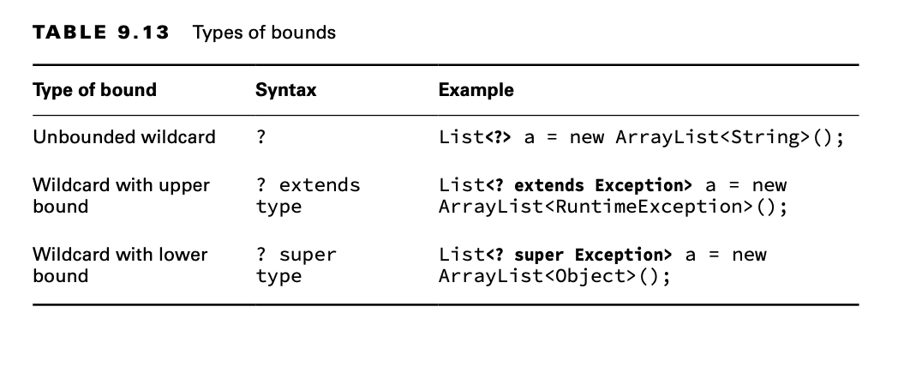
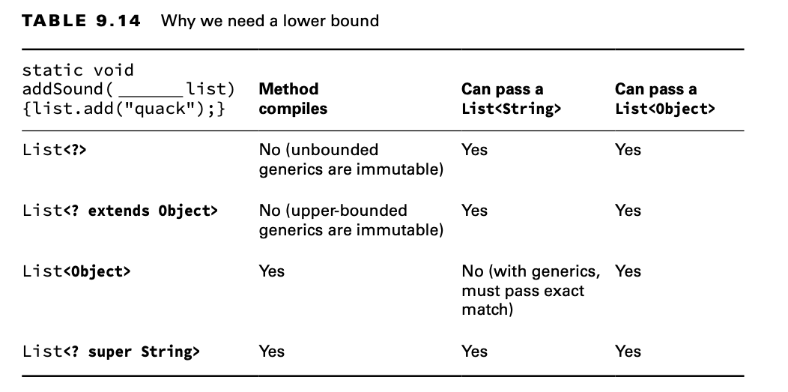

# Working with Generics

Why do we need generics? Imagine if we weren’t specifying the type of our lists and merely hoped the caller didn’t put
in something that we didn’t expect. The following does just that:

    public class WorkingWithGenericsExample1 {
        static void printNames(List list) {
            for (int i = 0; i < list.size(); i++) {
                String name = (String) list.get(i); // ClassCastException
                System.out.println(name);
            }
        }
    
        public static void main(String[] args) {
            List names = new ArrayList();
            names.add(new StringBuilder("Webby"));
             printNames(names);
        }
    }

Generics fix this by allowing you to write and use parameterized types. Since we specify that we want an ArrayList of
String objects, the compiler has enough information to prevent this problem in the first place.

    List<String> names = new ArrayList<String>(); 
    names.add(new StringBuilder("Webby")); // DOES NOT COMPILE

## Creating Generic Classes

You can introduce generics into your own classes. The syntax for introducing a generic is to declare a formal type
parameter in angle brackets. For example, the following class named Crate has a generic type variable declared after the
name of the class:

    public class Crate<T> {
        private T contents;
    
        public T lookInCrate() {
            return contents;
        }
    
        public void packCrate(T contents) {
            this.contents = contents;
        }
    }

**Naming Conventions for Generics**

A type parameter can be named anything you want.The convention is to use single upper- case letters to make it obvious
that they aren’t real class names.The following are common letters to use:

- E for an element
- K for a map key
- V for a map value
- N for a number
- T for a generic data type
- S,U,V, and so forth for multiple generic types

````
    Elephant elephant = new Elephant();
    Crate<Elephant> crateForElephant = new Crate<>(); 
    crateForElephant.packCrate(elephant);
    Elephant inNewHome = crateForElephant.lookInCrate();

    Robot joeBot = new Robot();
    Crate<Robot> robotCrate = new Crate<>(); 
    robotCrate.packCrate(joeBot);
````

Generic classes aren’t limited to having a single type parameter. This class shows two generic parameters:

    public class SizeLimitedCrate<T, U> {
        private T contents;
        private U sizeLimit;
    
        public SizeLimitedCrate(T contents, U sizeLimit) {
            this.contents = contents;
            this.sizeLimit = sizeLimit;
        }
    }

T represents the type that we are putting in the crate. U represents the unit that we are using to measure the maximum
size for the crate. To use this generic class, we can write the following:

    Elephant elephant = new Elephant();
    Integer numPounds = 15_000;
    SizeLimitedCrate<Elephant, Integer> c1 = new SizeLimitedCrate<>(elephant, numPounds);

## Understanding Type Erasure

Behind the scenes, the compiler replaces all references to T in Crate with Object. In other words, after the code
compiles, your generics are just Object types. The Crate class looks like the following at runtime:

    public class Crate {
        private Object contents; 
        
        public Object lookInCrate() {
            return contents; 
        }
        
        public void packCrate(Object contents) { 
            this.contents = contents;
        } 
    }

This means there is only one class file. There aren’t different copies for different parameterized types. (Some other
languages work that way.) This process of removing the generics syntax from your code is referred to as type erasure.
Type erasure allows your code to be compatible with older versions of Java that do not contain generics.

The compiler adds the relevant casts for your code to work with this type of erased class. For example, you type the
following:

    Robot r = crate.lookInCrate();

The compiler turns it into the following:

    Robot r = (Robot) crate.lookInCrate();

### Overloading a Generic Method

Only one of these two methods is allowed in a class because type erasure will reduce both sets of arguments to (List
input):

    public class LongTailAnimal {
        protected void chew(List<Object> input) {}
        protected void chew(List<Double> input) {} // DOES NOT COMPILE
    }

For the same reason, you also can’t overload a generic method from a parent class.

    public class Anteater extends LongTailAnimal {
        protected void chew(List<Double> input) {} // DOES NOT COMPILE
    }

Both of these examples fail to compile because of type erasure. In the compiled form, the generic type is dropped, and
it appears as an invalid overloaded method. Now, let’s look at a subclass:

    public class Anteater extends LongTailAnimal { 
        protected void chew(List<Object> input) {} 
        protected void chew(ArrayList<Double> input) {}
    }

The first chew() method compiles because it uses the same generic type in the overridden method as the one defined in
the parent class. The second chew() method compiles as well.

However, it is an overloaded method because one of the method arguments is a List and the other is an ArrayList. When
working with generic methods, it’s important to consider the underlying type.

### Returning Generic Types

When you’re working with overridden methods that return generics, the return values must be covariant. In terms of
generics, this means that the return type of the class or interface declared in the overriding method must be a subtype
of the class defined in the parent class. The generic parameter type must match its parent’s type exactly.

    public class Mammal {
        public List<CharSequence> play() {...}
        public CharSequence sleep() {...}
    }

    public class Monkey extends Mammal {
        public ArrayList<CharSequence> play() {...}
    }


    public class Goat extends Mammal {
        public List<String> play() { ... } // DOES NOT COMPILE 
        public String sleep() { ... }
    }

The Monkey class compiles because ArrayList is a subtype of List. The play() method in the Goat class does not compile,
though. For the return types to be covariant, the generic type parameter must match. Even though String is a subtype of
CharSequence, it does not exactly match the generic type defined in the Mammal class. Therefore, this is considered an
invalid override.

Notice that the sleep() method in the Goat class does compile since String is a subtype of CharSequence. This example
shows that covariance applies to the return type, just not the generic parameter type.

For the exam, it might be helpful for you to apply type erasure to questions involving generics to ensure that they
compile properly. Once you’ve determined which methods are overridden and which are being overloaded, work backward,
making sure the generic types match for overridden methods. And remember, generic methods cannot be overloaded by
changing the generic parameter type only.

## Implementing Generic Interfaces

Just like a class, an interface can declare a formal type parameter. For example, the following Shippable interface uses
a generic type as the argument to its ship() method:

    public interface Shippable<T> { 
        void ship(T t);
    }

There are three ways a class can approach implementing this interface.

    class ShippableRobotCrate implements Shippable<Robot> { 
        public void ship(Robot t) { }
    }

    class ShippableAbstractCrate<U> implements Shippable<U> { 
        public void ship(U t) { }
    }

    class ShippableCrate implements Shippable { 
        public void ship(Object t) { }
    }

**WhatYou Can’t Do with GenericTypes**

There are some limitations on what you can do with a generic type.These aren’t on the exam, but it will be helpful to
refer to this scenario when you are writing practice programs and run into one of these situations.

Most of the limitations are due to type erasure. Oracle refers to types whose information is fully available at runtime
as reifiable. Reifiable types can do anything that Java allows. Non-reifiable types have some limitations.

Here are the things that you can’t do with generics (and by “can’t,” we mean without resorting to contortions like
passing in a class object):

**Call a constructor:** Writing new T() is not allowed because at runtime, it would be new Object().

**Create an array of that generic type:** This one is the most annoying, but it makes sense because you’d be creating an
array of Object values.

**Call instanceof:** This is not allowed because at runtime List<Integer> and List<String> look the same to Java, thanks
to
type erasure.

**Use a primitive type as a generic type parameter:** This isn’t a big deal because you can use the wrapper class
instead. If
you want a type of int, just use Integer.

## Writing Generic Methods

Up until this point, you’ve seen formal type parameters declared on the class or interface level. It is also possible to
declare them on the method level. This is often useful for static methods since they aren’t part of an instance that can
declare the type. However, it is also allowed on non-static methods.

    public class Handler {

    public static <T> void prepare(T t) {
        System.out.println("Preparing " + t);
    }

    public static <T> Crate<T> ship(T t) {
        System.out.println("Shipping " + t);
        return new Crate<T>();
    }

}

The method parameter is the generic type T. Before the return type, we declare the formal type parameter of <T>. In the
ship() method, we show how you can use the generic parameter in the return type, Crate<T>, for the method.

    public class More {

    public static <T> void sink(T t) {
    }

    public static <T> T identity(T t) {
        return t;
    }

    public static T noGood(T t) { return t; } // DOES NOT COMPILE
    // Omits the formal parameter type and therefore does not compile.
    }

**Optional Syntax for Invoking a Generic Method**

You can call a generic method normally, and the compiler will try to figure out which one you want. Alternatively, you
can specify the type explicitly to make it obvious what the type is.

    Box.<String>ship("package"); 
    Box.<String[]>ship(args);

When you have a method declare a generic parameter type, it is independent of the class generics. Take a look at this
class that declares a generic T at both levels:

    public class TrickyCrate<T> {

        public <T> T tricky(T t) {
            return t;
        }
    
        public T tricky2(T t) {
            return t;
        }
        
        public <U> U tricky3(U u) {
            return u;
        }
    }

## Creating a Generic Record

Generics can also be used with records. This record takes a single generic type parameter:

    public record CrateRecord<T>(T contents) {
        @Override
        public T contents() {
            if (contents == null)
                throw new IllegalStateException("missing contents");
            return contents;
        }
    }

This works the same way as classes. You can create a record of the robot!

    Robot robot = new Robot();
    CrateRecord<Robot> record = new CrateRecord<>(robot);

## Bounding Generic Types

A bounded parameter type is a generic type that specifies a bound for the generic.

A wildcard generic type is an unknown generic type represented with a question mark (?). You can use generic wildcards
in three ways.



### Creating Unbounded Wildcards

An unbounded wildcard represents any data type. You use ? when you want to specify that any type is okay with you. Let’s
suppose that we want to write a method that looks through a list of any type.

    public static void printList(List<Object> list) { 
        for (Object x: list)
            System.out.println(x); 
    }

    public static void main(String[] args) { 
        List<String> keywords = new ArrayList<>(); 
        keywords.add("java");
        printList(keywords); // DOES NOT COMPILE
    }

A String is a subclass of an Object. This is true. However, List<String> cannot be assigned to List<Object>.

Imagine if we could write code like this:

    List<Integer> numbers = new ArrayList<>();
    numbers.add(Integer.valueOf(42));
    List<Object> objects = numbers; // DOES NOT COMPILE 
    objects.add("forty two");
    System.out.println(numbers.get(1));

That’s what List<?> is. The following code does what we expect:

    public static void printList(List<?> list) {
        for (Object x : list)
            System.out.println(x);
    }

    public static void main(String[] args) {
        List<String> keywords = new ArrayList<>();
        keywords.add("java");
        printList(keywords);

    }

Let’s look at the impact of var. Do you think these two statements are equivalent?

    List<?> x1 = new ArrayList<>(); 
    var x2 = new ArrayList<>();

First, x1 is of type List, while x2 is of type ArrayList. Additionally, we can only assign x2 to a List<Object>.

### Creating Upper-Bounded Wildcards

Let’s try to write a method that adds up the total of a list of numbers. We’ve established that a generic type can’t
just use a subclass.

    ArrayList<Number> list = new ArrayList<Integer>(); // DOES NOT COMPILE

Instead, we need to use a wildcard:

    List<? extends Number> list = new ArrayList<Integer>();

The upper-bounded wildcard says that any class that extends Number or Number itself can be used as the formal parameter
type:

    public static long total(List<? extends Number> list) { 
        long count = 0;
        for (Number number: list)
            count += number.longValue(); 
        return count;
    }  

Remember how we kept saying that type erasure makes Java think that a generic type is an Object? That is still happening
here. Java converts the previous code to something equivalent to the following:

    public static long total(List list) { 
        long count = 0;
        for (Object obj: list) {
            Number number = (Number) obj;
            count += number.longValue(); 
        }
        return count; 
    }

Something interesting happens when we work with upper bounds or unbounded wild- cards. The list becomes logically
immutable and therefore cannot be modified.

    static class Sparrow extends Bird { }
    static class Bird { }
    
    public static void main(String[] args) {
        List<? extends Bird> birds = new ArrayList<Bird>(); 
        birds.add(new Sparrow()); // DOES NOT COMPILE 
        birds.add(new Bird()); // DOES NOT COMPILE
    }

The problem stems from the fact that Java doesn’t know what type List<? extends Bird> really is. It could be List<Bird>
or List<Sparrow> or some other generic type that hasn’t even been written yet.

Now let’s try an example with an interface. We have an interface and two classes that implement it.

    interface Flyer { void fly(); }
    class HangGlider implements Flyer { public void fly() {} } 
    class Goose implements Flyer { public void fly() {} }

    private void anyFlyer(List<Flyer> flyer) {}
    private void groupOfFlyers(List<? extends Flyer> flyer) {}

Note that we used the keyword extends rather than implements. Upper bounds are like anonymous classes in that they use
extends regardless of whether we are working with a class or an interface.

### Creating Lower-Bounded Wildcards

Let’s try to write a method that adds a string "quack" to two lists:

    List<String> strings = new ArrayList<String>();
    strings.add("tweet");

    List<Object> objects = new ArrayList<Object>(strings); 
    addSound(strings);
    addSound(objects);



To solve this problem, we need to use a lower bound.

    public static void addSound(List<? super String> list) {
        list.add("quack");
    }

With a lower bound, we are telling Java that the list will be a list of String objects or a list of some objects that
are a superclass of String. Either way, it is safe to add a String to that list.

**Understanding Generic Supertypes**

When you have subclasses and superclasses, lower bounds can get tricky.

    List<? super IOException> exceptions = new ArrayList<Exception>(); 
    exceptions.add(new Exception()); // DOES NOT COMPILE
    exceptions.add(new IOException());
    exceptions.add(new FileNotFoundException());

## Putting It All Together

### Combining Generic Declarations

Let’s try an example. First, we declare three classes that the example will use:

    class A {}
    class B extends A {} 
    class C extends B {}

    List<?> list1 = new ArrayList<A>();
    List<? extends A> list2 = new ArrayList<A>();
    List<? super A> list3 = new ArrayList<A>();

Let’s try a few more.

    List<? extends B> list4 = new ArrayList<A>(); // DOES NOT COMPILE 
    List<? super B> list5 = new ArrayList<A>();
    List<?> list6 = new ArrayList<? extends A>(); // DOES NOT COMPILE

### Passing Generic Arguments

Now on to the methods. Same question: try to figure out why they don’t compile or what they do. We will present the
methods one at a time because there is more to think about.

    <T> T first(List<? extends T> list) { 
        return list.get(0);
    }

The first method, first(), is a perfectly normal use of generics. It uses a method-specific type parameter, T. It takes
a parameter of List<T>, or some subclass of T, and it returns a single object of that T type. For example, you could
call it with a List<String> parameter and have it return a String. Or you could call it with a List<Number> parameter
and have it return a Number.

    <T> <? extends T> second(List<? extends T> list) { // DOES NOT COMPILE 
        return list.get(0);
    }

The next method, second(), does not compile because the return type isn’t actually a type. You are writing the method.
You know what type it is supposed to return. You don’t get to specify this as a wildcard.

Now be careful—this one is extra tricky:

    <B extends A> B third(List<B> list) { 
        return new B(); // DOES NOT COMPILE
    }

This method, third(), does not compile. <B extends A> says that you want to use B as a type parameter just for this
method and that it needs to extend the A class. Coincidentally, B is also the name of a class. Well, it isn’t a
coincidence. It’s an evil trick. Within the scope of the method, B can represent class A, B, or C, because all extend
the A class. Since B no longer refers to the B class in the method, you can’t instantiate it.

After that, it would be nice to get something straightforward.

    void fourth(List<? super B> list) {}

We finally get a method, fourth(), that is a normal use of generics. You can pass the type List<B>, List<A>, or
List<Object>.
Finally, can you figure out why this example does not compile?

    <X> void fifth(List<X super B> list) { // DOES NOT COMPILE }

This last method, fifth(), does not compile because it tries to mix a method-specific type parameter with a wildcard. A
wildcard must have a ? in it.