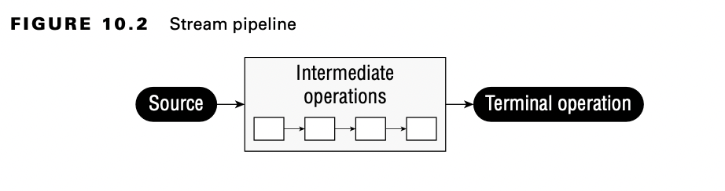
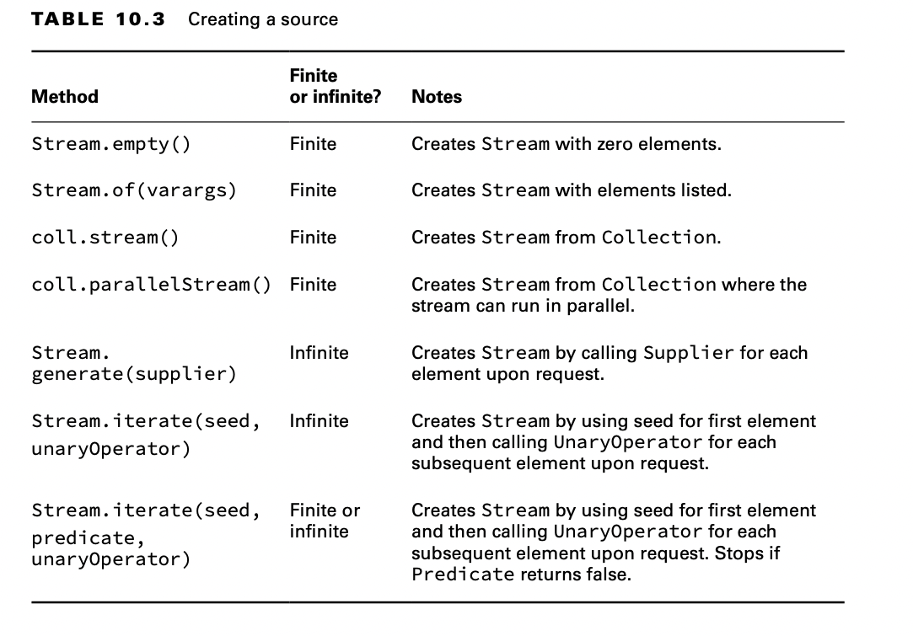

# Using Streams

A stream in Java is a sequence of data. A stream pipeline consists of the operations that run on a stream to produce a
result.

## Understanding the Pipeline Flow

Many things can happen in the assembly line stations along the way. In functional programming, these are called stream
operations.There are three parts to a stream pipeline ;

- Source : Where the stream comes from.
- Intermediate operations : Transforms the stream into another one. There can be as few or as many intermediate
  operations as you’d like. Since streams use lazy evaluation, the intermediate operations do not run until the terminal
  operation runs.
- Terminal operation : Produces a result. Since streams can be used only once, the stream is no longer valid after a
  terminal operation completes.

You will need to know the differences between intermediate and terminal operations well.

## Creating Stream Sources

In Java, the streams we have been talking about are represented by the Stream<T> interface, defined in the
java.util.stream package.

### Creating Finite Streams

There are a few ways to create them.

    Stream<String> empty = Stream.empty();          // count = 0 
    Stream<Integer> singleElement = Stream.of(1);   // count = 1 
    Stream<Integer> fromArray = Stream.of(1, 2, 3); // count = 3

Java also provides a convenient way of converting a Collection to a stream.

    var list = List.of("a", "b", "c");
    Stream<String> fromList = list.stream();

**Creating a Parallel Stream**

It is just as easy to create a parallel stream from a list.

    var list = List.of("a", "b", "c");
    Stream<String> fromListParallel = list.parallelStream();

This is a great feature because you can write code that uses concurrency before even learning what a thread is. Using
parallel streams is like setting up multiple tables of workers who can do the same task. Painting would be a lot faster
if we could have five painters painting signs instead of just one. Just keep in mind some tasks cannot be done in
parallel, such as putting the signs away in the order that they were created in the stream. Also be aware that there is
a cost in coordinating the work, so for smaller streams, it might be faster to do it sequentially.

## Creating Infinite Streams

We can’t create an infinite list, though, which makes streams more powerful.

    Stream<Double> randoms = Stream.generate(Math::random);
    Stream<Integer> oddNumbers = Stream.iterate(1, n -> n + 2);

**Printing a Stream Reference**

If you try to call System.out.print(stream), you’ll get something like the following:

    java.util.stream.ReferencePipeline$Head@4617c264

What if you wanted just odd numbers less than 100? There’s an overloaded version of iterate() that helps:

    Stream<Integer> oddNumberUnder100 = Stream.iterate(
      1, // seed
      n -> n < 100, // Predicate to specify when done
      n -> n + 2); // UnaryOperator to get next value

### Reviewing Stream Creation Methods

## Using CommonTerminal Operations

You can perform a terminal operation without any intermediate operations but not the other way around.

Reductions are a special type of terminal operation where all of the contents of the stream are combined into a single
primitive or Object.

### Counting

The count() method determines the number of elements in a finite stream. For an infinite stream, it never terminates.
Why? Count from 1 to infinity, and let us know when you are finished.

    public long count()

The count() method is a reduction because it looks at each element in the stream and returns a single value.

    Stream<String> s = Stream.of("monkey", "gorilla", "bonobo");
    System.out.println(s.count()); // 3

### Finding the Minimum and Maximum

The min() and max() methods allow you to pass a custom comparator and find the smallest or largest value in a finite
stream according to that sort order.

Like the count() method,min() and max() hang on an infinite stream because they cannot be sure that a smaller or larger
value isn’t coming later in the stream.

Both methods are reductions because they return a single value after looking at the entire stream.

    public Optional<T> min(Comparator<? super T> comparator) 
    public Optional<T> max(Comparator<? super T> comparator)

This example finds the animal with the fewest letters in its name:

    Stream<String> s = Stream.of("monkey", "ape", "bonobo");
    Optional<String> min = s.min((s1, s2) -> s1.length() - s2.length());
    min.ifPresent(System.out::println); // ape

Notice that the code returns an Optional rather than the value. This allows the method to specify that no minimum or
maximum was found.

Let’s look at an empty stream:

    Optional<?> minEmpty = Stream.empty().min((s1, s2) -> 0); 
    System.out.println(minEmpty.isPresent()); // false

Since the stream is empty, the comparator is never called, and no value is present in the Optional.

What if you need both the min() and max() values of the same stream? For now, you can’t have both, at least not using
these methods. Remember, a stream can have only one terminal operation. Once a terminal operation has been run, the
stream cannot be used again. As you see later in this chapter, there are built-in summary methods for some numeric
streams that will calculate a set of values for you.

### Finding a Value

The findAny() and findFirst() methods return an element of the stream unless the stream is empty. If the stream is
empty, they return an empty Optional.

This is the first method you’ve seen that can terminate with an infinite stream.

As its name implies, the findAny() method can return any element of the stream.
When called on the streams you’ve seen up until now, it commonly returns the first element, although this behavior is
not guaranteed. The findAny() method is more likely to return a random element when working with parallel streams.

These methods are terminal operations but not reductions. The reason is that they sometimes return without processing
all of the elements. This means that they return a value based on the stream but do not reduce the entire stream into
one value.

The method signatures are as follows:

    public Optional<T> findAny() 
    public Optional<T> findFirst()

This example finds an animal:

    Stream<String> s = Stream.of("monkey", "gorilla", "bonobo");
    Stream<String> infinite = Stream.generate(() -> "chimp");

    s.findAny().ifPresent(System.out::println); // monkey (usually)
    infinite.findAny().ifPresent(System.out::println); // chimp

### Matching

The allMatch(), anyMatch(), and noneMatch() methods search a stream and return information about how the stream pertains
to the predicate.

These may or may not terminate for infinite streams.

Like the find methods, they are not reductions because they do not necessarily look at all of the elements.

    public boolean anyMatch(Predicate <? super T> predicate) 
    public boolean allMatch(Predicate <? super T> predicate) 
    public boolean noneMatch(Predicate <? super T> predicate)

This example checks whether animal names begin with letters:

    var list = List.of("monkey", "2", "chimp");
    Stream<String> infinite = Stream.generate(() -> "chimp");
    Predicate<String> pred = x -> Character.isLetter(x.charAt(0));

    System.out.println(list.stream().anyMatch(pred)); // true 
    System.out.println(list.stream().allMatch(pred)); // false 
    System.out.println(list.stream().noneMatch(pred)); // false 
    System.out.println(infinite.anyMatch(pred)); // true

Remember that allMatch(), anyMatch(), and noneMatch() return a boolean. By contrast, the find methods return an Optional
because they return an element of the stream.

### Iterating

As in the Java Collections Framework, it is common to iterate over the elements of a stream. As expected, calling
forEach() on an infinite stream does not terminate. Since there is no return value, it is not a reduction.

    public void forEach(Consumer<? super T> action)

    Stream<String> s = Stream.of("Monkey", "Gorilla", "Bonobo"); 
    s.forEach(System.out::print); // MonkeyGorillaBonobo

Remember that you can call forEach() directly on a Collection or on a Stream. Don’t get confused on the exam when you
see both approaches.

Notice that you can’t use a traditional for loop on a stream.

    Stream<Integer> s = Stream.of(1);
    for (Integer i : s) {} // DOES NOT COMPILE

### Reducing

The reduce() method combines a stream into a single object. It is a reduction, which means it processes all elements.
The three method signatures are these:

    public T reduce(T identity, BinaryOperator<T> accumulator)

    public Optional<T> reduce(BinaryOperator<T> accumulator)

    public <U> U reduce(U identity, BiFunction<U,? super T,U> accumulator, BinaryOperator<U> combiner)

The most common way of doing a reduction is to start with an initial value and keep merging it with the next value.

The identity is the initial value of the reduction, in this case an empty String. The accumulator combines the current
result with the current value in the stream. With lambdas, we can do the same thing with a stream and reduction:

    Stream<String> stream = Stream.of("w", "o", "l", "f"); 
    String word = stream.reduce("", (s, c) -> s + c); 
    System.out.println(word); // wolf

Notice how we still have the empty String as the identity. We also still concatenate the String objects to get the next
value. We can even rewrite this with a method reference:

    Stream<String> stream = Stream.of("w", "o", "l", "f"); 
    String word = stream.reduce("", String::concat); 
    System.out.println(word); // wolf

Let’s try another one. Can you write a reduction to multiply all of the Integer objects in a stream? Try it. Our
solution is shown here:

    Stream<Integer> stream = Stream.of(3, 5, 6); 
    System.out.println(stream.reduce(1, (a, b) -> a*b)); // 90

We set the identity to 1 and the accumulator to multiplication. In many cases, the iden- tity isn’t really necessary, so
Java lets us omit it. When you don’t specify an identity, an Optional is returned because there might not be any data.
There are three choices for what is in the Optional:

- If the stream is empty, an empty Optional is returned.
- If the stream has one element, it is returned.
- If the stream has multiple elements, the accumulator is applied to combine them.

The following illustrates each of these scenarios:

    BinaryOperator<Integer> op = (a, b) -> a * b; 
    Stream<Integer> empty = Stream.empty(); 
    Stream<Integer> oneElement = Stream.of(3); 
    Stream<Integer> threeElements = Stream.of(3, 5, 6);

    empty.reduce(op).ifPresent(System.out::println);
    oneElement.reduce(op).ifPresent(System.out::println);
    threeElements.reduce(op).ifPresent(System.out::println);

Let’s take a look at an example that counts the number of characters in each String:

      Stream<String> stream = Stream.of("w", "o", "l", "f!");
      int length = stream.reduce(0, (i, s) -> i + s.length(), (a, b) -> a + b);
      System.out.println(length); // 5

The first parameter (0) is the value for the initializer. If we had an empty stream, this would be the answer. The
second parameter is the accumulator. Unlike the accumulators you saw previously, this one handles mixed data types. In
this example, the first argument, i, is an Integer, while the second argument, s, is a String. It adds the length of the
current String to our running total. The third parameter is called the combiner, which combines any intermediate totals.
In this case, a and b are both Integer values.

The three-argument reduce() operation is useful when working with parallel streams because it allows the stream to be
decomposed and reassembled by separate threads. For example, if we needed to count the length of four 100-character
strings, the first two values and the last two values could be computed independently. The intermediate result (200
+200)would then be combined into the final value.

### Collecting

The collect() method is a special type of reduction called a mutable reduction. It is more efficient than a regular
reduction because we use the same mutable object while accumulating.
Common mutable objects include StringBuilder and ArrayList.

    public <R> R collect(Supplier<R> supplier, BiConsumer<R, ? super T> accumulator, BiConsumer<R, R> combiner)

    public <R,A> R collect(Collector<? super T, A,R> collector)

Let’s start with the first signature, which is used when we want to code specifically how collecting should work. Our
wolf example from reduce can be converted to use collect():

    Stream<String> stream = Stream.of("w", "o", "l", "f");

    StringBuilder word = stream.collect( StringBuilder::new, 
      StringBuilder::append, 
      StringBuilder::append);

    System.out.println(word); // wolf

The first parameter is the supplier, which creates the object that will store the results as we collect data. Remember
that a Supplier doesn’t take any parameters and returns a value. In this case, it constructs a new StringBuilder.

The second parameter is the accumulator, which is a BiConsumer that takes two parameters and doesn’t return anything.
It is responsible for adding one more element to the data collection. In this example, it appends the next String to the
StringBuilder.

The final parameter is the combiner, which is another BiConsumer. It is responsible for taking two data collections and
merging them. This is useful when we are processing in parallel. Two smaller collections are formed and then merged into
one. This would work with StringBuilder only if we didn’t care about the order of the letters. In this case, the
accumulator and combiner have similar logic.

    Stream<String> stream = Stream.of("w", "o", "l", "f");

    TreeSet<String> set = stream.collect( TreeSet::new,
    TreeSet::add,
    TreeSet::addAll);

    System.out.println(set); // [f, l, o, w]

The collector has three parts as before. The supplier creates an empty TreeSet. The accumulator adds a single String
from the Stream to the TreeSet. The combiner adds all of the elements of one TreeSet to another in case the operations
were done in parallel and need to be merged.

We started with the long signature because that’s how you implement your own collector. It is important to know how to
do this for the exam and understand how collectors work. In practice, many common collectors come up over and over.
Rather than making developers keep reimplementing the same ones, Java provides a class with common collectors cleverly
named Collectors. This approach also makes the code easier to read because it is more expressive. For example, we could
rewrite the previous example as follows:

    Stream<String> stream = Stream.of("w", "o", "l", "f");
    TreeSet<String> set =
            stream.collect(Collectors.toCollection(TreeSet::new));
    System.out.println(set); // [f, l, o, w]

If we didn’t need the set to be sorted, we could make the code even shorter:

    Stream<String> stream = Stream.of("w", "o", "l", "f"); 
    Set<String> set = stream.collect(Collectors.toSet()); 
    System.out.println(set); // [f, w, l, o]

You might get different output for this last one since toSet() makes no guarantees as to which implementation of Set
you’ll get. It is likely to be a HashSet, but you shouldn’t expect or rely on that.

The exam expects you to know about common predefined collectors in addition to being able to write your own by passing a
supplier, accumulator, and combiner.