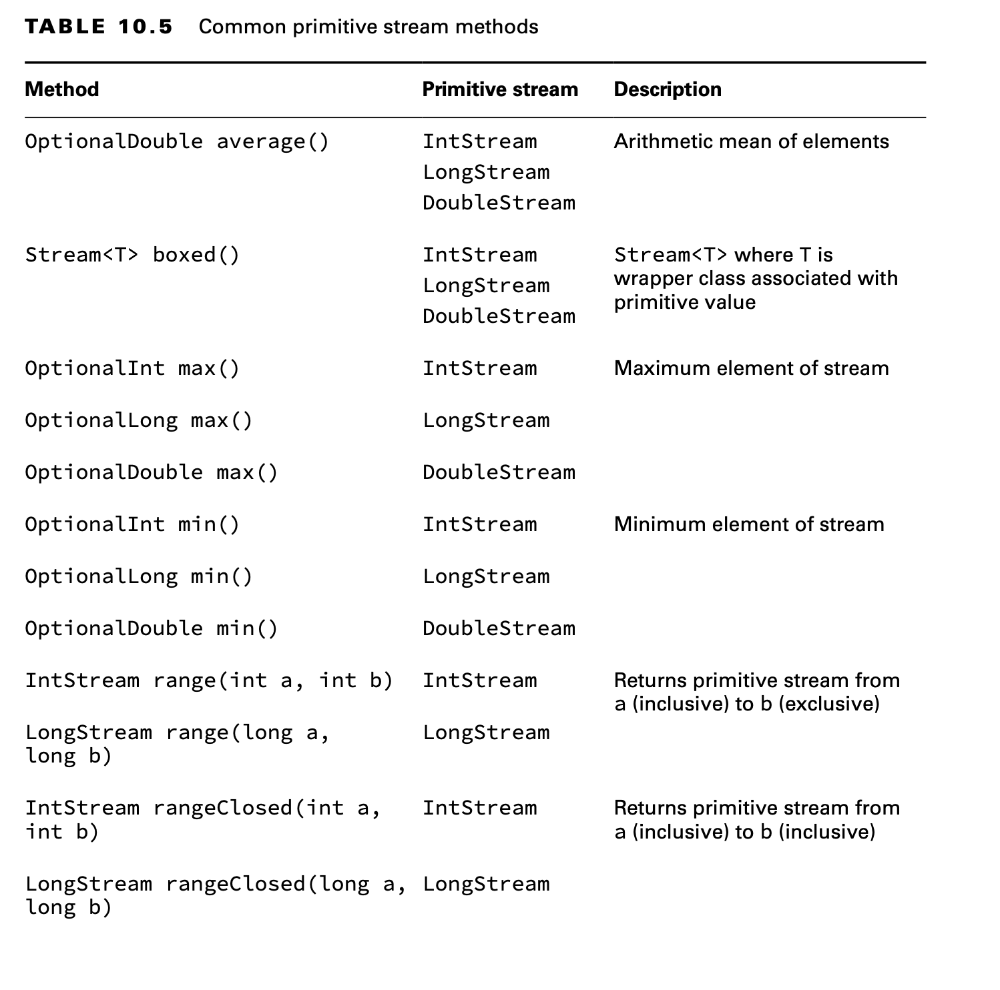
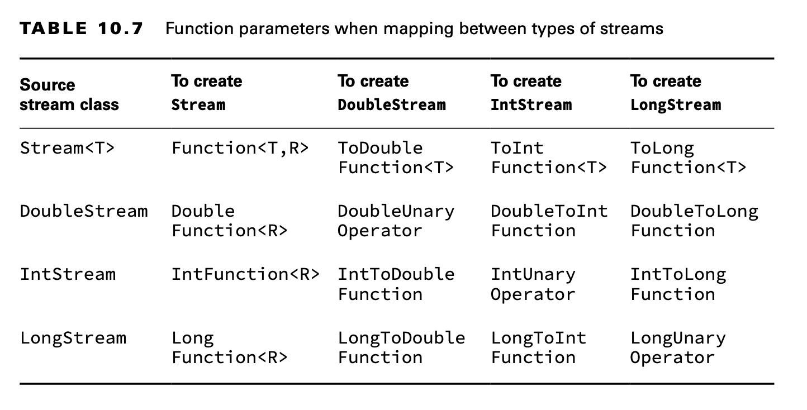

# Working with Primitive Streams

Up until now, all of the streams we’ve created used the Stream interface with a generic type, like Stream<String>,
Stream<Integer>, and so on.

Suppose that we want to calculate the sum of numbers in a finite stream:

    Stream<Integer> stream = Stream.of(1, 2, 3); 
    System.out.println(stream.reduce(0, (s, n) -> s + n)); // 6

There is another way of doing that, shown here:

    Stream<Integer> stream = Stream.of(1, 2, 3); 
    System.out.println(stream.mapToInt(x -> x).sum()); // 6

So far, this seems like a nice convenience but not terribly important.

    IntStream intStream = IntStream.of(1, 2, 3); 
    OptionalDouble avg = intStream.average(); 
    System.out.println(avg.getAsDouble()); // 2.0

## Creating Primitive Streams

Here are the three types of primitive streams:

- IntStream : Used for the primitive types int, short, byte, and char
- LongStream: Used for the primitive type long
- DoubleStream: Used for the primitive types double and float

You can create an empty stream with this:

    DoubleStream empty = DoubleStream.empty();

Another way is to use the of() factory method from a single value or by using the
varargs overload.

    DoubleStream oneValue = DoubleStream.of(3.14); 
    oneValue.forEach(System.out::println);

    DoubleStream varargs = DoubleStream.of(1.0, 1.1, 1.2); 
    varargs.forEach(System.out::println);

You can also use the two methods for creating infinite streams, just like we did with Stream.

    var random = DoubleStream.generate(Math::random);
    var fractions = DoubleStream.iterate(.5, d -> d / 2); 
    random.limit(3).forEach(System.out::println); 
    fractions.limit(3).forEach(System.out::println);

Suppose that we wanted a stream with the numbers from 1 through 5. We could write this using what we’ve explained so
far:

    IntStream count = IntStream.iterate(1, n -> n+1).limit(5); 
    count.forEach(System.out::print); // 12345

Java provides a method that can generate a range of numbers.

    IntStream range = IntStream.range(1, 6); 
    range.forEach(System.out::print); // 12345

    IntStream rangeClosed = IntStream.rangeClosed(1, 5); 
    rangeClosed.forEach(System.out::print); // 12345

## Mapping Streams

Another way to create a primitive stream is by mapping from another stream type.

Java requires a mapping function to be provided as a parameter, for example:

    Stream<String> objStream = Stream.of("penguin", "fish"); 
    IntStream intStream = objStream.mapToInt(s -> s.length()); 

**Using flatMap()**

We can use this approach on primitive streams as well. It works the same way as on a reg- ular Stream, except the method
name is different. Here’s an example:

    var integerList = new ArrayList<Integer>(); 
    IntStream ints = integerList.stream().flatMapToInt(x -> IntStream.of(x)); 
    
    DoubleStream doubles = integerList.stream().flatMapToDouble(x -> DoubleStream.of(x)); 

    LongStream longs = integerList.stream().flatMapToLong(x -> LongStream.of(x));

Additionally, you can create a Stream from a primitive stream. These methods show two ways of accomplishing this:

    private static Stream<Integer> mapping(IntStream stream) { 
        return stream.mapToObj(x -> x);
    }
    
    private static Stream<Integer> boxing(IntStream stream) { 
        return stream.boxed();
    }

## Using Optional with Primitive Streams

Now that you know about primitive streams, you can calculate the average in one line.

    var stream = IntStream.rangeClosed(1,10); 
    OptionalDouble optional = stream.average();

The difference is that OptionalDouble is for a primitive and Optional<Double> is for the Double wrapper class. Working
with the primitive optional class looks similar to working with the Optional class itself.

    optional.ifPresent(System.out::println); // 5.5 
    System.out.println(optional.getAsDouble()); // 5.5 
    System.out.println(optional.orElseGet(() -> Double.NaN)); // 5.5

The only noticeable difference is that we called getAsDouble() rather than get(). This makes it clear that we are
working with a primitive. Also, orElseGet() takes a DoubleSupplier instead of a Supplier.

    LongStream longs = LongStream.of(5, 10);
    long sum = longs.sum();
    System.out.println(sum); // 15
    DoubleStream doubles = DoubleStream.generate(() -> Math.PI);
    OptionalDouble min = doubles.min(); // runs infinitely

## Summarizing Statistics

Statistic is just a big word for a number that was calculated from data.

    private static int range(IntStream ints) {
        IntSummaryStatistics stats = ints.summaryStatistics();
        if (stats.getCount() == 0) throw new RuntimeException();
        return stats.getMax() - stats.getMin();
    }

Summary statistics include the following:

- getCount(): Returns a long representing the number of values.
- getAverage(): Returns a double representing the average. If the stream is empty, returns 0.
- getSum(): Returns the sum as a double for DoubleSummaryStream and long for IntSummaryStream and LongSummaryStream.
- getMin(): Returns the smallest number (minimum) as a double, int, or long, depending on the type of the stream. If the
  stream is empty, returns the largest numeric value based on the type.
- getMax(): Returns the largest number (maximum) as a double, int, or long depending on the type of the stream. If the
  stream is empty, returns the smallest numeric value based on the type.