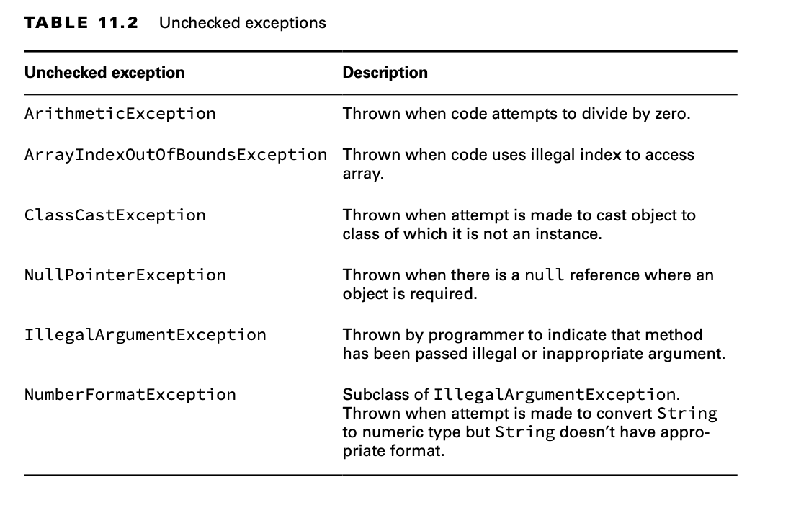
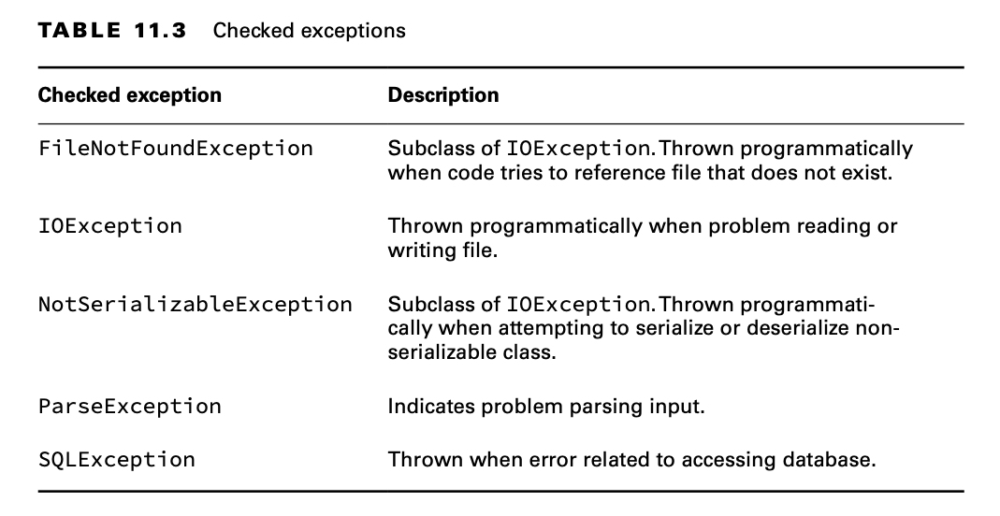

# Recognizing Exception Classes

You need to recognize three groups of exception classes for the exam: RuntimeException, checked Exception, and Error.

For the exam, you’ll need to recognize which type of an exception it is and whether it’s thrown by the Java Virtual
Machine (JVM) or by a programmer.

## RuntimeException Classes

RuntimeException and its subclasses are unchecked exceptions that don’t have to be handled or declared. They can be
thrown by the programmer or the JVM.

### ArithmeticException

Trying to divide an int by zero gives an undefined result. When this occurs, the JVM will throw an ArithmeticException:

    int answer = 11 / 0;

Running this code results in the following output:

    Exception in thread "main" java.lang.ArithmeticException: / by zero

### ArrayIndexOutOfBoundsException

You know by now that array indexes start with 0 and go up to 1 less than the length of the array—which means this code
will throw an ArrayIndexOutOfBoundsException:

    int[] countsOfMoose = new int[3]; 
    System.out.println(countsOfMoose[-1]);

This is a problem because there’s no such thing as a negative array index.

    Exception in thread "main" java.lang.ArrayIndexOutOfBoundsException: Index -1 out of bounds for length 3

### ClassCastException

Java tries to protect you from impossible casts. This code doesn’t compile because Integer is not a subclass of String:

    String type = "moose";
    Integer number = (Integer) type; // DOES NOT COMPILE

When the cast fails at runtime, Java will throw a ClassCastException:

    String type = "moose";
    Object obj = type;
    Integer number = (Integer) obj; // ClassCastException

When the code runs, it yields the following output:

    Exception in thread "main" java.lang.ClassCastException: class java.lang.String cannot be cast to class java.lang.Integer

### NullPointerException

Instance variables and methods must be called on a non-null reference. If the reference is null, the JVM will throw a
NullPointerException.

    public static void hop(String name, Integer jump) {
        System.out.println(name.toLowerCase() + " " + jump.intValue());
    }

    public static void main(String[] args) {
        hop(null, 1);
    }

Running this code results in the following output:

    Exception in thread "main" java.lang.NullPointerException: Cannot invoke "String.toLowerCase()" because "name" is null

The JVM now tells you the object reference that triggered the NullPointerException! This new feature is called Helpful
NullPointerExceptions.

**Enabling/Disabling Helpful NullPointerExceptions**

When helpful NullPointerExceptions were added in Java 14, the feature was disabled by default and had to be enabled via
a command-line argument ShowCodeDetailsInExceptionMessages to the JVM:

    java -XX:+ShowCodeDetailsInExceptionMessages Frog

In Java 15 and above, the default behavior was changed so that it is enabled by default, although it can still be
disabled via the command-line argument.

    java -XX:-ShowCodeDetailsInExceptionMessages Frog

### IllegalArgumentException

IllegalArgumentException is a way for your program to protect itself. You want to tell the caller that something is
wrong—preferably in an obvious way that the caller can’t ignore so the programmer will fix the problem.

    public void setNumberEggs(int numberEggs) {
        if (numberEggs < 0)
            throw new IllegalArgumentException("# eggs must not be negative");
        this.numberEggs = numberEggs;
    }

Consider this example when called as setNumberEggs(-2):

    Exception in thread "main" java.lang.IllegalArgumentException: # eggs must not be negative

### NumberFormatException

Java provides methods to convert strings to numbers. When these are passed an invalid value, they throw a
NumberFormatException. The idea is similar to IllegalArgumentException.

NumberFormatException is a subclass of IllegalArgumentException.

    Integer.parseInt("abc");

The output looks like this:

    Exception in thread "main" java.lang.NumberFormatException: For input string: "abc"

For the exam, you need to know that NumberFormatException is a subclass of IllegalArgumentException.

## Checked Exception Classes

Checked exceptions have Exception in their hierarchy but not RuntimeException. They must be handled or declared.

- For the exam, you need to know that these are all checked exceptions that must be handled or declared.
- You also need to know that FileNotFoundException and NotSerializableException are subclasses of IOException.

## Error Classes

Errors are unchecked exceptions that extend the Error class. They are thrown by the JVM and should not be handled or
declared. Errors are rare.

For the exam, you just need to know that these errors are unchecked and the code is often unable to recover from them.
