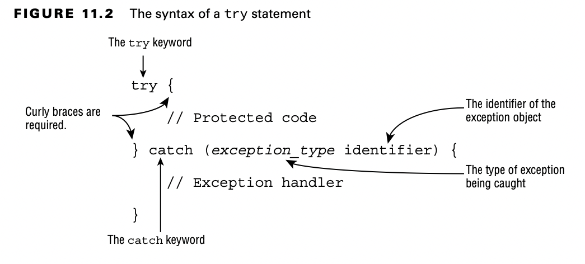

# Handling Exceptions

## Using try and catch Statements

Java uses a try statement to separate the logic that might throw an exception from the logic to handle that exception.

The code in the try block is run normally. If any of the statements throws an exception that can be caught by the
exception type listed in the catch block, the try block stops running, and execution goes to the catch statement. If
none of the statements in the try block throws an exception that can be caught, the catch clause is not run.

The curly braces are required for try and catch blocks.

    void explore() {
        try {
            fall();
            System.out.println("never get here");
        } catch (RuntimeException e) {
            getUp();
        }
    }

    void fall() {
        throw new RuntimeException();
    }

Now let’s look at some invalid try statements that the exam might try to trick you with. Do you see what’s wrong with
this one?

    try // DOES NOT COMPILE 
        fall();
    catch (Exception e) 
        System.out.println("get up");

The problem is that the braces {} are missing. The try statements are like methods in that the curly braces are required
even if there is only one statement inside the code blocks, while if statements and loops are special and allow you to
omit the curly braces.

    try { // DOES NOT COMPILE 
        fall();
    }

This code doesn’t compile because the try block doesn’t have anything after it.

## Chaining catch Blocks

For the exam, you may be given exception classes and need to understand how they function. Here’s how to tackle them.
First, you must be able to recognize if the exception is a checked or an unchecked exception. Second, you need to
determine whether any of the exceptions are subclasses of the others.

    class AnimalsOutForAWalk extends RuntimeException {}
    class ExhibitClosed extends RuntimeException {}
    class ExhibitClosedForLunch extends ExhibitClosed {}

    public void visitPorcupine() {
        try {
            seeAnimal();
        } catch (AnimalsOutForAWalk e) { // first catch block
            System.out.print("try back later");
        } catch (ExhibitClosed e) { // second catch block System.out.print("not today");
        }
    }

The following example shows exception types that do inherit from each other:

    public void visitMonkeys() {
        try {
            seeAnimal();
        } catch (ExhibitClosedForLunch e) { // Subclass exception
            System.out.print("try back later");
        } catch (ExhibitClosed e) { // Superclass exception
            System.out.print("not today");
        }
    }

If the more specific ExhibitClosedForLunch exception is thrown, the first catch block runs. If not, Java checks whether
the superclass ExhibitClosed exception is thrown and catches it. This time, the order of the catch blocks does matter.
The reverse does not work.

        public void visitMonkeys() {
            try {
                seeAnimal();
            } catch (ExhibitClosed e) {
                System.out.print("not today");
            }
            catch (ExhibitClosedForLunch e) { // DOES NOT COMPILE
                System.out.print("try back later");
            }
        }

If the more specific ExhibitClosedForLunch exception is thrown, the catch block for ExhibitClosed runs—which means there
is no way for the second catch block to ever run. Java correctly tells you there is an unreachable catch block.

Let’s try this one more time. Do you see why this code doesn’t compile?

    public void visitSnakes() { 
        try {
        } catch (IllegalArgumentException e) {
        } catch (NumberFormatException e) { // DOES NOT COMPILE 
        }
    }

Remember we said earlier that you needed to know that NumberFormatException is
a subclass of IllegalArgumentException? This example is the reason why. Since NumberFormatException is a subclass, it
will always be caught by the first catch block, making the second catch block unreachable code that does not compile.
Likewise, for the exam, you need to know that FileNotFoundException is a subclass of IOException and cannot be used in a
similar manner.

Also, remember that an exception defined by the catch statement is only in scope for that catch block. For example, the
following causes a compiler error since it tries to use the exception object outside the block for which it was defined:

    public void visitManatees() {
        try {
        } catch (NumberFormatException e1) {
            System.out.println(e1);
        } catch (IllegalArgumentException e2) {
            System.out.println(e1); // DOES NOT COMPILE
        }
    }

## Applying a Multi-catch Block

Often, we want the result of an exception that is thrown to be the same, regardless of which particular exception is
thrown. For example, take a look at this method:

      try {
            System.out.println(Integer.parseInt(args[1]));
        } catch (ArrayIndexOutOfBoundsException e) {
            System.out.println("Missing or invalid input");
        } catch (NumberFormatException e) {
            System.out.println("Missing or invalid input");
      }

Notice that we have the same println() statement for two different catch blocks. We can handle this more gracefully
using a multi-catch block.

    try {
        System.out.println(Integer.parseInt(args[1]));
    } catch (ArrayIndexOutOfBoundsException | NumberFormatException e) {
        System.out.println("Missing or invalid input");
    }

This is much better. There’s no duplicate code, the common logic is all in one place, and the logic is exactly where you
would expect to find it. If you wanted, you could still have a second catch block for Exception in case you want to
handle other types of exceptions differently.

The pipe (|) is also used as the “or” operator, making it easy to remember that you can use either/or of the exception
types.

The exam might try to trick you with invalid syntax. Remember that the exceptions can be listed in any order within the
catch clause. However, the variable name must appear only once and at the end. Do you see why these are valid or
invalid?

    catch(Exception1 e | Exception2 e | Exception3 e) // DOES NOT COMPILE
    catch(Exception1 e1 | Exception2 e2 | Exception3 e3) // DOES NOT COMPILE
    catch(Exception1 | Exception2 | Exception3 e)

- The first line is incorrect because the variable name appears three times. Just because it happens to be the same
  variable name doesn’t make it okay.
- The second line is incorrect because the variable name again appears three times.
- The third line does compile. It shows the correct syntax for specifying three exceptions.

Java intends multi-catch to be used for exceptions that aren’t related, and it prevents you from specifying redundant
types in a multi-catch. Do you see what is wrong here?

    try {
      throw new IOException();
    } catch (FileNotFoundException | IOException p) {} // DOES NOT COMPILE

Specifying related exceptions in the multi-catch is redundant, and the compiler gives a
message such as this:

    The exception FileNotFoundException is already caught by the alternative IOException

Since FileNotFoundException is a subclass of IOException, this code will not com- pile. A multi-catch block follows
rules similar to chaining catch blocks together, which you saw in the previous section. For example, both trigger
compiler errors when they encounter unreachable code or duplicate exceptions being caught. The one difference between
multicatch blocks and chaining catch blocks is that order does not matter for a multi-catch block within a single
catch expression.

    try {
      throw new IOException();
    } catch (IOException e) {}