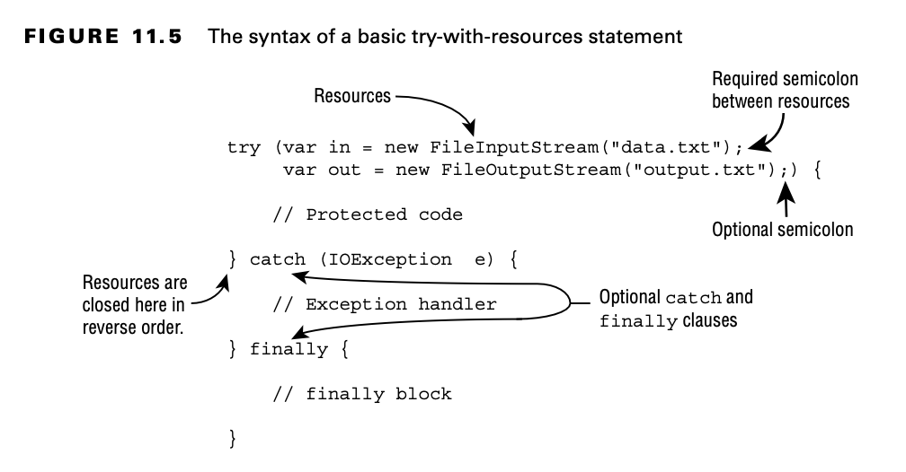

# Automating Resource Management

## Introducing Try-with-Resources

Let’s take a look at a method that opens a file, reads the data, and closes it:

    public void readFile(String file) {
        FileInputStream is = null;
        try {
            is = new FileInputStream("myfile.txt");
            // Read file data
        } catch (IOException e) {
            e.printStackTrace();
        } finally {
            if (is != null) {
                try {
                    is.close();
                } catch (IOException e2) {
                    e2.printStackTrace();
                }
            }
        }
    }

Half the lines of code in this method are just closing a resource. And the more resources you have, the longer code
like this becomes.

To solve this, Java includes the try-with-resources statement to automatically close all resources opened in a try
clause. This feature is also known as automatic resource management, because Java automatically takes care of the
closing.

Let’s take a look at our same example using a try-with-resources statement:

    public void readFileV2(String file) {

        try (FileInputStream is = new FileInputStream(file)) {
            // Read file data
        } catch (IOException e) {
            e.printStackTrace();
        }

    }

Functionally, they are similar, but our new version has half as many lines. More importantly, though, by using a
try-with-resources statement, we guarantee that as soon as a connection passes out of scope, Java will attempt to
close it within the same method.

Behind the scenes, the compiler replaces a try-with-resources block with a try and finally block. We refer to this
“hidden” finally block as an implicit finally block since it is created and used by the compiler automatically. You can
still create a programmer-defined finally block when using a try-with-resources statement; just be aware that the
implicit one will be called first.

Unlike garbage collection, resources are not automatically closed when they go out of scope. Therefore, it is
recommended that you close resources in the same block of code that opens them. By using a try-with- resources statement
to open all your resources, this happens automatically.

## Basics of Try-with-Resources

Notice that one or more resources can be opened in the try clause. When multiple resources are opened, they are closed
in the reverse of the order in which they were created.

Also, notice that parentheses are used to list those resources, and semicolons are used to separate the declarations.

Earlier in the chapter, you learned that a try statement must have one or more catch blocks or a finally block. A
try-with-resources statement differs from a try statement in that neither of these is required, although a developer may
add both. For the exam, you need to know that the implicit finally block runs before any programmer-coded ones.

## ConstructingTry-with-Resources Statements

Only classes that implement the AutoCloseable interface can be used in a try-with-resources statement. For example, the
following does not compile as String does not implement the AutoCloseable interface:

    try (String reptile = "lizard") {}

Inheriting AutoCloseable requires implementing a compatible close() method.

    interface AutoCloseable {
    public void close() throws Exception;
    }

    public class MyFileClass implements AutoCloseable {
        private final int num;
    
        public MyFileClass(int num) {
            this.num = num;
        }
    
        @Override
        public void close() {
            System.out.println("Closing: " + num);
        }
    }

In Chapter 14, you encounter resources that implement Closeable rather than AutoCloseable. Since Closeable extends
AutoCloseable, they are both supported in try-with-resources statements. The only difference between the two is that
Closeable’s close() method declares IOException, while AutoCloseable’s close() method declares Exception.

## Declaring Resources

While try-with-resources does support declaring multiple variables, each variable must be declared in a separate
statement. For example, the following do not compile:

    try (MyFileClass is = new MyFileClass(1),os=new MyFileClass(2)){
    }

    try (MyFileClass ab = new MyFileClass(1), MyFileClass cd = new MyFileClass(2)) {
    }

- The first example does not compile because it is missing the data type, and it uses a comma (,) instead of a
  semicolon (;).
- The second example does not compile because it also uses a comma (,) instead of a semicolon (;).
- Each resource must include the data type and be separated by a semicolon (;).

You can declare a resource using var as the data type in a try-with-resources statement, since resources are local
variables.

    try (var f = new BufferedInputStream(new FileInputStream("it.txt"))) { // Process file
    }

## Scope of Try-with-Resources

The resources created in the try clause are in scope only within the try block. This is another way to remember that the
implicit finally runs before any catch/finally blocks that you code yourself.

    try (Scanner s = new Scanner(System.in)) {
        s.nextLine();
    } catch (Exception e) {
        s.nextInt(); // DOES NOT COMPILE
    } finally {
        s.nextInt(); // DOES NOT COMPILE
    }

The problem is that Scanner has gone out of scope at the end of the try clause.
This is a nice feature. You can’t accidentally use an object that has been closed

## Following Order of Operations

When working with try-with-resources statements, it is important to know that resources are closed in the reverse of the
order in which they are created.

    try (MyFileClass bookReader = new MyFileClass(1);
         MyFileClass movieReader = new MyFileClass(2)) {
        System.out.println("Try Block");
        throw new RuntimeException();
    } catch (Exception e) {
        System.out.println("Catch Block");
    } finally {
        System.out.println("Finally Block");
    }

The output is as follows:

    Try Block 
    Closing: 2 
    Closing: 1 
    Catch Block 
    Finally Block

For the exam, make sure you understand why the method prints the statements in this order. Remember, the resources are
closed in the reverse of the order in which they are declared, and the implicit finally is executed before the
programmer-defined finally.

## Applying Effectively Final

While resources are often created in the try-with-resources statement, it is possible to declare them ahead of time,
provided they are marked final or effectively final. The syntax uses the resource name in place of the resource
declaration, separated by a semicolon (;). Let’s try another example:

    public static void main(String[] args) {

        final var bookReader = new MyFileClass(4);
        MyFileClass movieReader = new MyFileClass(5);
        try (bookReader;
             var tvReader = new MyFileClass(6);
             movieReader) {
            System.out.println("Try Block");
        } finally {
            System.out.println("Finally Block");
        }
    }

We know movieReader is effectively final because it is a local variable that is assigned a value only once.
Remember, the test for effectively final is that if we insert the final keyword when the variable is declared, the code
still compiles.

If you come across a question on the exam that uses a try-with-resources statement with a variable not declared in the
try clause, make sure it is effectively final. For example, the following does not compile:

    var writer = Files.newBufferedWriter(Path.of("test.txt"));
        try (writer) { // DOES NOT COMPILE
            writer.append("Welcome to the zoo!");
        }
        writer = null;

Since it is not an effectively final variable, it cannot be used in a try-with- resources statement.

The other place the exam might try to trick you is accessing a resource after it has been closed. Consider the
following:

    var writer = Files.newBufferedWriter(Path.of("test.txt"));
    writer.append("This write is permitted but a really bad idea!");
        try (writer) {
            writer.append("Welcome to the zoo!");
        }
    writer.append("This write will fail!"); // IOException

This code compiles but throws an exception on line 46 with the message Stream closed. While it is possible to write to
the resource before the try-with-resources statement, it is not afterward.

# Understanding Suppressed Exceptions

What happens if the close() method throws an exception? Let’s try an illustrative example:

    public class TurkeyCage implements AutoCloseable {
        public void close() {
            System.out.println("Close gate");
        }
    
        public static void main(String[] args) {
            try (var t = new TurkeyCage()) {
                System.out.println("Put turkeys in");
            }
        }
    }

Let’s expand our example with a new JammedTurkeyCage implementation, shown here:

    public class JammedTurkeyCage implements AutoCloseable {
    
        public void close() throws IllegalStateException {
            throw new IllegalStateException("Cage door does not close");
        }
    
        public static void main(String[] args) {
            try (JammedTurkeyCage t = new JammedTurkeyCage()) {
                System.out.println("Put turkeys in");
            } catch (IllegalStateException e) {
                System.out.println("Caught: " + e.getMessage());
            }
        }
    }

The close() method is automatically called by try-with-resources. It throws an exception, which is caught by our catch
block and prints the following:

    Caught: Cage door does not close

This seems reasonable enough. What happens if the try block also throws an exception? When multiple exceptions are
thrown, all but the first are called suppressed exceptions. The idea is that Java treats the first exception as the
primary one and tacks on any that come up while automatically closing.

    public static void main(String[] args) {
        try (JammedTurkeyCage t = new JammedTurkeyCage()) {
            throw new IllegalStateException("Turkeys ran off");
        } catch (IllegalStateException e) {
            System.out.println("Caught: " + e.getMessage());
            for (Throwable t : e.getSuppressed())
                System.out.println("Suppressed: " + t.getMessage());
        }
    }

"throw new IllegalStateException" throws the primary exception. At this point, the try clause ends, and
Java automatically calls the close() method. JammedTurkeyCage throws an IllegalStateException, which is added as a
suppressed exception.

Keep in mind that the catch block looks for matches on the primary exception.

    public static void main(String[] args) {
        try (JammedTurkeyCage t = new JammedTurkeyCage()) {
            throw new RuntimeException("Turkeys ran off");
        } catch (IllegalStateException e) {
            System.out.println("caught: " + e.getMessage());
        }
    }

throw new RuntimeException("Turkeys ran off") throws the primary exception.Java calls the close() method and adds a
suppressed exception.
The primary exception is a RuntimeException. Since this does not match the catch clause, the exception is thrown to the
caller

    Exception in thread "main" java.lang.RuntimeException: Turkeys ran off
    at chapter11.automatingresourcemanagement.SuppressedExceptions2.main(SuppressedExceptions2.java:7)
    Suppressed: java.lang.IllegalStateException: Cage door does not close

Java remembers the suppressed exceptions that go with a primary exception even if we don’t handle them in the code.

If more than two resources throw an exception, the first one to be thrown becomes the primary exception, and the rest
are grouped as suppressed exceptions. And since resources are closed in the reverse of the order
in which they are declared, the primary exception will be on the last declared resource that throws an exception.

    try (JammedTurkeyCage t = new JammedTurkeyCage()) {
        throw new IllegalStateException("Turkeys ran off");
    } finally {
        throw new RuntimeException("and we couldn't find them");
    }

Then Java tries to close the resource and adds a suppressed exception to it. Now we have a problem. The finally block
runs after all this. throw new RuntimeException("and we couldn't find them") also throws an exception, the previous
exception from throw new IllegalStateException("Turkeys ran off"); is lost, with the code printing
the following:

    Exception in thread "main" java.lang.RuntimeException: and we couldn't find them
	at chapter11.automatingresourcemanagement.SuppressedExceptions3.main(SuppressedExceptions3.java:10)

This has always been and continues to be bad programming practice. We don’t want to lose exceptions! Although out of
scope for the exam, the reason for this has to do with backward compatibility. This behavior existed before automatic
resource management was added.
