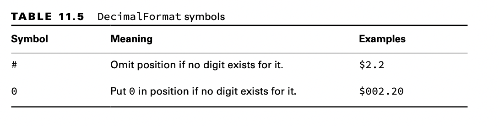
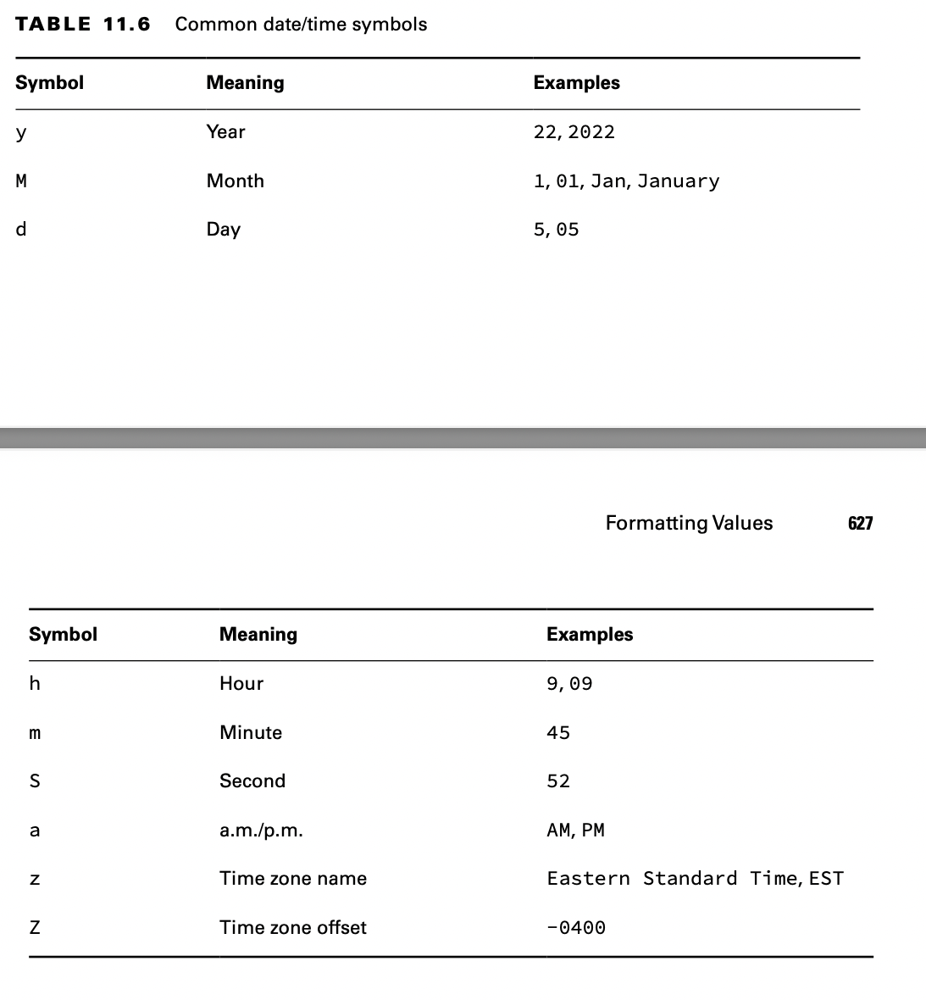

# Formatting Values

## Formatting Numbers

We introduce the NumberFormat interface, which has two commonly used methods:

    public final String format(double number)
    public final String format(long number)

Since NumberFormat is an interface, we need the concrete DecimalFormat class to use it. It includes a constructor that
takes a pattern String:

    public DecimalFormat(String pattern)

    double d = 1234.567;
    NumberFormat f1 = new DecimalFormat("###,###,###.0");
    System.out.println(f1.format(d)); // 1,234.6

    NumberFormat f2 = new DecimalFormat("000,000,000.00000");
    System.out.println(f2.format(d)); // 000,001,234.56700

    NumberFormat f3 = new DecimalFormat("Your Balance $#,###,###.##");
    System.out.println(f3.format(d)); // Your Balance $1,234.57

## Formatting Dates and Times

The date and time classes support many methods to get data out of them.

    LocalDate date = LocalDate.of(2022, Month.OCTOBER, 20); 
    System.out.println(date.getDayOfWeek()); // THURSDAY 
    System.out.println(date.getMonth()); // OCTOBER 
    System.out.println(date.getYear()); // 2022 
    System.out.println(date.getDayOfYear()); // 293

Java provides a class called DateTimeFormatter to display standard formats.

    LocalDate date = LocalDate.of(2022, Month.OCTOBER, 20); 
    LocalTime time = LocalTime.of(11, 12, 34); 
    LocalDateTime dt = LocalDateTime.of(date, time);

    System.out.println(date.format(DateTimeFormatter.ISO_LOCAL_DATE)); 
    System.out.println(time.format(DateTimeFormatter.ISO_LOCAL_TIME)); 
    System.out.println(dt.format(DateTimeFormatter.ISO_LOCAL_DATE_TIME));

The DateTimeFormatter will throw an exception if it encounters an incompatible type. For example, each of the following
will produce an exception at runtime since it attempts to format a date with a time value, and vice versa:

    date.format(DateTimeFormatter.ISO_LOCAL_TIME); // RuntimeException 
    time.format(DateTimeFormatter.ISO_LOCAL_DATE); // RuntimeException

## Customizing the Date/Time Format

If you don’t want to use one of the predefined formats, DateTimeFormatter supports a custom format using a date format
String.

    var f = DateTimeFormatter.ofPattern("MMMM dd, yyyy 'at' hh:mm"); 
    System.out.println(dt.format(f)); // October 20, 2022 at 11:12

### Learning the Standard Date/Time Symbols

For the exam, you should be familiar enough with the various symbols that you can look at a date/time String and have a
good idea of what the output will be.

    var dt = LocalDateTime.of(2022, Month.OCTOBER, 20, 6, 15, 30);

    var formatter1 = DateTimeFormatter.ofPattern("MM/dd/yyyy hh:mm:ss");
    System.out.println(dt.format(formatter1)); // 10/20/2022 06:15:30 

    var formatter2 = DateTimeFormatter.ofPattern("MM_yyyy_-_dd");
    System.out.println(dt.format(formatter2)); // 10_2022_-_20 

    var formatter3 = DateTimeFormatter.ofPattern("h:mm z");
    System.out.println(dt.format(formatter3)); // DateTimeException

The third example throws an exception at runtime because the underlying LocalDateTime does not have a time zone
specified.
Make sure you know which symbols are compatible with which date/time types. For example, trying to format a month for a
LocalTime or an hour for a LocalDate will result in a runtime exception.

### Selecting a format() Method

The date/time classes contain a format() method that will take a formatter, while the for- matter classes contain a
format() method that will take a date/time value. The result is that either of the following is acceptable:

    var dateTime = LocalDateTime.of(2022, Month.OCTOBER, 20, 6, 15, 30); 
    var formatter = DateTimeFormatter.ofPattern("MM/dd/yyyy hh:mm:ss");

    System.out.println(dateTime.format(formatter)); // 10/20/2022 06:15:30 
    System.out.println(formatter.format(dateTime)); // 10/20/2022 06:15:30

These statements print the same value at runtime. Which syntax you use is up to you.

### Adding Custom Text Values

What if you want your format to include some custom text values? If you just type them as part of the format String, the
formatter will interpret each character as a date/time symbol. In the best case, it will display weird data based on
extra symbols you enter. In the worst case, it will throw an exception because the characters contain invalid symbols.
Neither is desirable!

You can escape the text by surrounding it with a pair of single quotes ('). Escaping text instructs the formatter to
ignore the values inside the single quotes and just insert them as part of the final value.

    var f = DateTimeFormatter.ofPattern("MMMM dd, yyyy 'at' hh:mm"); 
    System.out.println(dt.format(f)); // October 20, 2022 at 06:15

But what if you need to display a single quote in the output, too? Welcome to the fun of escaping characters! Java
supports this by putting two single quotes next to each other.

    var g1 = DateTimeFormatter.ofPattern("MMMM dd', Party''s at' hh:mm");
    System.out.println(dt.format(g1)); // October 20, Party's at 06:15

    var g2 = DateTimeFormatter.ofPattern("'System format, hh:mm: 'hh:mm");
    System.out.println(dt.format(g2)); // System format, hh:mm: 06:15

    var g3 = DateTimeFormatter.ofPattern("'NEW! 'yyyy', yay!'");
    System.out.println(dt.format(g3)); // NEW! 2022, yay!

If you don’t escape the text values with single quotes, an exception will be thrown at runtime if the text cannot be
interpreted as a date/time symbol.

    DateTimeFormatter.ofPattern("The time is hh:mm"); // Exception thrown

This line throws an exception since T is an unknown symbol. The exam might also present you with an incomplete escape
sequence.

    DateTimeFormatter.ofPattern("'Time is: hh:mm: "); // Exception thrown

Failure to terminate an escape sequence will trigger an exception at runtime.