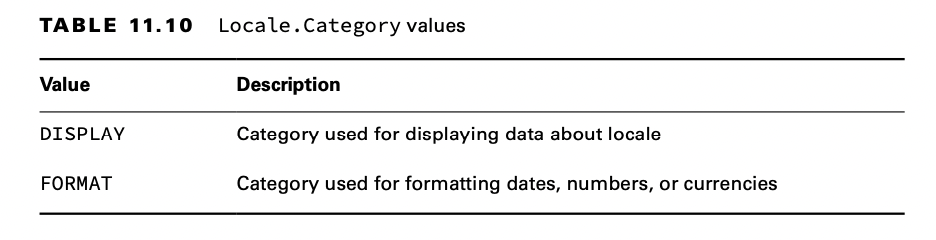

# Supporting Internationalization and Localization

Internationalization is the process of designing your program so it can be adapted. This involves placing strings in a
properties file and ensuring that the proper data formatters are used. Localization means supporting multiple locales or
geographic regions. You can think of a locale as being like a language and country pairing. Localization includes
translating strings to different languages. It also includes outputting dates and numbers in the correct format for that
locale.

## Picking a Locale

The Locale class is in the java.util package. The first useful Locale to find is the user’s current locale. Try running
the following code on your computer:

    Locale locale = Locale.getDefault();
    System.out.println(locale);

Notice the format. First comes the lowercase language code. The language is always required. Then comes an underscore
followed by the uppercase country code. The country is optional.

As practice, make sure that you understand why each of these Locale identifiers is invalid:

    US // Cannot have country without language 
    enUS // Missing underscore
    US_en // The country and language are reversed
    EN
    // Language must be lowercase

Locale class, available for some common locales.

    System.out.println(Locale.GERMAN); // de
    System.out.println(Locale.GERMANY); // de_DE

    System.out.println(Locale.ENGLISH); // en
    System.out.println(Locale.UK); // en_GB
    System.out.println(Locale.US); // en_US

    System.out.println(Locale.ITALIAN); // it
    System.out.println(Locale.ITALY); // it_IT

The second way of selecting a Locale is to use the constructors to create a new object. You can pass just a language, or
both a language and country:

    System.out.println(new Locale("fr")); // fr 
    System.out.println(new Locale("hi", "IN")); // hi_IN

Java will let you create a Locale with an invalid language or country, such as xx_XX. However, it will not match the
Locale that you want to use, and your program will not behave as expected.

There’s a third way to create a Locale that is more flexible.

    Locale l1 = new Locale.Builder()
        .setLanguage("en")
        .setRegion("US")
        .build();

## Localizing Numbers

In the United States, the dollar sign is prepended before the value along with a decimal point for values less than one
dollar, such as $2.15. In Germany, though, the euro symbol is appended to the value along with a comma for values less
than one euro, such as 2,15 €.

Luckily, the java.text package includes classes to save the day. The following sections cover how to format numbers,
currency, and dates based on the locale.

The first step to formatting or parsing data is the same: obtain an instance of a NumberFormat.Once you have the
NumberFormat instance, you can call format() to turn a number into a String, or you can use parse() to turn a String
into a number.

The format classes are not thread-safe. Do not store them in instance variables or static variables.

### Formatting Numbers

When we format data, we convert it from a structured object or primitive value into a String. The NumberFormat.format()
method formats the given number based on the locale associated with the NumberFormat object.

The following shows printing out the same number in three different locales:

    int attendeesPerYear = 3_200_000;
    int attendeesPerMonth = attendeesPerYear / 12;
    
    var us = NumberFormat.getInstance(Locale.US); 
    System.out.println(us.format(attendeesPerMonth)); // 266,666
    
    var gr = NumberFormat.getInstance(Locale.GERMANY); 
    System.out.println(gr.format(attendeesPerMonth)); // 266.666
    
    var ca = NumberFormat.getInstance(Locale.CANADA_FRENCH); 
    System.out.println(ca.format(attendeesPerMonth)); // 266 666

Formatting currency works the same way.

    double price = 48;
    var myLocale = NumberFormat.getCurrencyInstance(); 
    System.out.println(myLocale.format(price));

In the real world, use int or BigDecimal for money and not double. Doing math on amounts with double is dangerous
because the values are stored as floating-point numbers. Your boss won’t appreciate it if you lose pennies or fractions
of pennies during transactions!

Finally, the exam may have examples that show formatting percentages:

    double successRate = 0.802;
    var us = NumberFormat.getPercentInstance(Locale.US); 
    System.out.println(us.format(successRate)); // 80%

    var gr = NumberFormat.getPercentInstance(Locale.GERMANY); 
    System.out.println(gr.format(successRate)); // 80 %

Not much difference, we know, but you should at least be aware that the ability to print a percentage is locale-specific
for the exam!

### Parsing Numbers

When we parse data, we convert it from a String to a structured object or primitive value. The NumberFormat.parse()
method accomplishes this and takes the locale into consideration.

The parse() method, found in various types, declares a checked exception ParseException that must be handled or declared
in the method in which it is called.

    String s = "40.45";
    
    var en = NumberFormat.getInstance(Locale.US);
    System.out.println(en.parse(s)); // 40.45

    var fr = NumberFormat.getInstance(Locale.FRANCE);
    System.out.println(fr.parse(s)); // 40

In the United States, a dot (.) is part of a number, and the number is parsed as you might expect. France does not use a
decimal point to separate numbers. Java parses it as a formatting character, and it stops looking at the rest of the
number. The lesson is to make sure that you parse using the right locale!

The parse() method is also used for parsing currency. For example, we can read in the zoo’s monthly income from ticket
sales:

    String income = "$92,807.99";
    var cf = NumberFormat.getCurrencyInstance(); 
    double value = (Double) cf.parse(income); 
    System.out.println(value); // 92807.99

### Formatting with CompactNumberFormat

The second class that inherits NumberFormat that you need to know for the exam is CompactNumberFormat. It is new to the
Java 17 exam, so you’re likely to see a question on it!

CompactNumberFormat is similar to DecimalFormat, but it is designed to be used in places where print space may be
limited. It is opinionated in the sense that it picks a format for you, and locale-specific in that output can change
depending on your location.

    var formatters = Stream.of(
        NumberFormat.getCompactNumberInstance(),
        NumberFormat.getCompactNumberInstance(Locale.getDefault(), Style.SHORT),
        NumberFormat.getCompactNumberInstance(Locale.getDefault(), Style.LONG),
        NumberFormat.getCompactNumberInstance(Locale.GERMAN, Style.SHORT),
        NumberFormat.getCompactNumberInstance(Locale.GERMAN, Style.LONG),
        NumberFormat.getNumberInstance());

    formatters.map(s -> s.format(7_123_456)).forEach(System.out::println);

If you don’t specify a style, SHORT is used by default.
Next, notice that the values except the last one (which doesn’t use a compact number formatter) are truncated. There’s a
reason it’s called a compact number formatter!

Also, notice that the short form uses common labels for large values, such as K for thousand.

Using the same formatters, let’s try another example:

    formatters.map(s -> s.format(314_900_000)).forEach(System.out::println);

Notice that the third digit is automatically rounded up for the entries that use a CompactNumberFormat. The following
summarizes the rules for CompactNumberFormat:

- First it determines the highest range for the number, such as thousand (K), million (M), billion (B), or trillion (T).
- It then returns up to the first three digits of that range, rounding the last digit as needed.
- Finally, it prints an identifier. If SHORT is used, a symbol is returned. If LONG is used, a space followed by a word
  is returned.

For the exam, make sure you understand the difference between the SHORT and LONG formats and common symbols like M for
million.

## Localizing Dates

Like numbers, date formats can vary by locale.

Each method in the table takes a FormatStyle parameter (or two) with possible values SHORT, MEDIUM, LONG, and FULL. For
the exam, you are not required to know the format of each of these styles.

What if you need a formatter for a specific locale? Easy enough—just append withLocale(locale) to the method call.

    public static void print(DateTimeFormatter dtf, LocalDateTime dateTime, Locale locale) {
        System.out.println(dtf.format(dateTime) + " --- " + dtf.withLocale(locale).format(dateTime));
    }

    public static void main(String[] args) {

        Locale.setDefault(new Locale("en", "US"));
        var italy = new Locale("it", "IT");
        var dt = LocalDateTime.of(2022, Month.OCTOBER, 20, 15, 12, 34);

        print(DateTimeFormatter.ofLocalizedDate(SHORT), dt, italy); // 3:12 PM --- 15:12
        print(DateTimeFormatter.ofLocalizedTime(SHORT), dt, italy); // 10/20/22, 3:12 PM --- 20/10/22, 15:12
        print(DateTimeFormatter.ofLocalizedDateTime(SHORT, SHORT), dt, italy);
    }

## Specifying a Locale Category

When you call Locale.setDefault() with a locale, several display and formatting options are internally selected. If you
require finer-grained control of the default locale, Java subdivides the underlying formatting options into distinct
categories with the Locale.Category enum.

The Locale.Category enum is a nested element in Locale that supports distinct locales for displaying and formatting
data.

    public static void printCurrency(Locale locale, double money) {
        System.out.println(NumberFormat.getCurrencyInstance().format(money) + ", " + locale.getDisplayLanguage());
    }

    public static void main(String[] args) {

        var spain = new Locale("es", "ES");
        var money = 1.23;

        Locale.setDefault(new Locale("en", "US"));
        printCurrency(spain, money); // $1.23, Spanish

        // Print with selected locale display

        Locale.setDefault(Locale.Category.DISPLAY, spain);
        printCurrency(spain, money); // $1.23, español

        // Print with selected locale format
        Locale.setDefault(Locale.Category.FORMAT, spain);
        printCurrency(spain, money); // 1,23 €, español
    }

First it prints the language of the spain and money variables using the locale en_US. Then it prints it using the
DISPLAY category of es_ES, while the FORMAT category remains en_US. Finally, it prints the data using both cate- gories
set to es_ES.

You just need to know that you can set parts of the locale independently. You should also know that calling
Locale.setDefault(us) after the previous code snip- pet will change both locale categories to en_US.