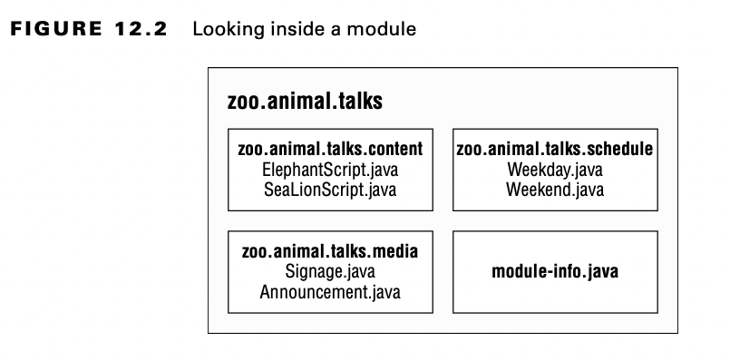

# Introduction Modules

When writing code for the exam, you generally see small classes. After all, exam questions have to fit on a single
screen! When you work on real programs, they are much bigger. A real project will consist of hundreds or thousands of
classes grouped into packages. These packages are grouped into Java archive (JAR) files. A JAR is a ZIP file with some
extra information, and the extension is .jar.

In addition to code written by your team, most applications also use code written by others. Open source is software
with the code supplied and is often free to use. Java has a vibrant open source software (OSS) community, and those
libraries are also supplied as JAR files. For example, there are libraries to read files, connect to a database, and
much more.

Some open source projects even depend on functionality in other open source projects. For example, Spring is a commonly
used framework, and JUnit is a commonly used testing library. To use either, you need to make sure you have compatible
versions of all the relevant JARs available at runtime. This complex chain of dependencies and minimum versions is
often referred to by the community as JAR hell. Hell is an excellent way of describing the wrong version of a class
being loaded or even a ClassNotFoundException at runtime

The Java Platform Module System (JPMS) groups code at a higher level. The main purpose of a module is to provide groups
of related packages that offer developers a particular set of functionality.
It’s like a JAR file, except a developer chooses which packages are accessible outside the module. Let’s look at what
modules are and what problems they are designed to solve.

The Java Platform Module System includes the following:

- A format for module JAR files
- Partitioning of the JDK into modules
- Additional command-line options for Java tools

## Exploring a Module

A module is a group of one or more packages plus a special file called module-info.java. The contents of this file are
the module declaration.

Now let’s drill down into one of these modules.

## Benefits of Modules

Modules look like another layer of things you need to know in order to program. While using modules is optional, it is
important to understand the problems they are designed to solve:

**Better access control**

In addition to the levels of access control covered in Chapter 5, “Methods,” you can have packages that are only
accessible to other packages in the module.

**Clearer dependency management**

Since modules specify what they rely on, Java can complain about a missing JAR when starting up the program rather than
when it is first accessed at runtime.

**Custom Java builds**

You can create a Java runtime that has only the parts of the JDK that your program needs rather than the full one at
over 150 MB.

**Improved security**

Since you can omit parts of the JDK from your custom build, you don’t have to worry about vulnerabilities discovered in
a part you don’t use.

**Improved performance**

Another benefit of a smaller Java package is improved startup time and a lower memory requirement.

**Unique package enforcement**

Since modules specify exposed packages, Java can ensure that each package comes from only one module and avoid confusion
about what is being run.
