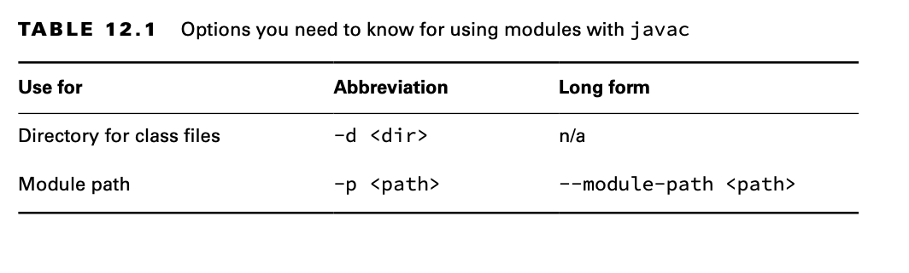

# Creating and Running a Modular Program

## Creating the Files

Let’s create a simple class.

    package zoo.animal.feeding;
    public class Task {
    public static void main(String... args) {
        System.out.println("All fed!"); }
    }

Next comes the module-info.java file. This is the simplest possible one:

    module zoo.animal.feeding {
    }

There are a few key differences between a module declaration and a regular Java class declaration:

- The module-info.java file must be in the root directory of your module. Regular Java classes should be in packages.
- The module declaration must use the keyword module instead of class, interface, or enum.
- The module name follows the naming rules for package names. It often includes periods (.) in its name. Regular class
  and package names are not allowed to have dashes (-). Module names follow the same rule.

The next step is to make sure the files are in the right directory structure. Figure 12.4 shows the expected directory
structure.

In particular, feeding is the module directory, and the module-info.java file is directly under it. Just as with a
regular JAR file, we also have the zoo.animal.feeding package with one subfolder per portion of the name. The Task class
is in the appropriate subfolder for its package.

Also, note that we created a directory called mods at the same level as the module. We use it to store the module
artifacts a little later in the chapter. This directory can be named anything, but mods is a common name.

## Compiling Our First Module

Before we can run modular code, we need to compile it. Other than the module-path option, this code should look familiar
from Chapter 1:

    javac --module-path mods -d feeding feeding/zoo/animal/feeding/*.java feeding/module-info.java

When you’re entering commands at the command line, they should be typed all on one line. We use line breaks in the book
to make the commands easier to read and study. If you want to use multiple lines at the command prompt, the approach
varies by operating system. Linux uses a backslash (\) to escape the line break.

As a review, the -d option specifies the directory to place the class files in. The end of the command is a list of the
.java files to compile. You can list the files individually or use a wildcard for all .java files in a subdirectory.

The new part is module-path. This option indicates the location of any custom module files. In this example, module-path
could have been omitted since there are no dependencies. You can think of module-path as replacing the classpath
option when you are working on a modular program.

**What about the classpath?**
The classpath option has three possible forms: -cp, --class-path, and -classpath. You can still use these options. In
fact, it is common to do so when writing non-modular programs.

Just like classpath, you can use an abbreviation in the command. The syntax --module-path and -p are equivalent. That
means we could have written many other commands in place of the previous command.

    javac -p mods -d feeding feeding/zoo/animal/feeding/*.java feeding/*.java

    javac -p mods -d feeding feeding/zoo/animal/feeding/*.java feeding/module-info.java

    javac -p mods -d feeding feeding/zoo/animal/feeding/Task.java feeding/module-info.java

    javac -p mods -d feeding feeding/zoo/animal/feeding/Task.java feeding/*.java

**Building Modules**

Even without modules, it is rare to run javac and java commands manually on a real project.They get long and complicated
very quickly. Most developers use a build tool such as Maven or Gradle.These build tools suggest directories in which to
place the class files, like target/classes.

It is likely that the only time you need to know the syntax of these commands is when you take the exam.The concepts
themselves are useful, regardless.

Be sure to memorize the module command syntax. You will be tested on it on the exam. We give you lots of practice
questions on the syntax to reinforce it.

## Running Our First Module

Before we package our module, we should make sure it works by running it. To do that, we need to learn the full syntax.
Suppose there is a module named book.module.
Inside that module is a package named com.sybex, which has a class named OCP with a main() method.

Pay special attention to the book.module/com.sybex.OCP part. It is important to remember that you specify the module
name followed by a slash (/) followed by the fully qualified class name.

Now that we’ve seen the syntax, we can write the command to run the Task class in the zoo.animal.feeding package. In the
following example, the package name and module name are the same. It is common for the module name to match either the
full package name or the beginning of it.

    java --module-path feeding  --module zoo.animal.feeding/zoo.animal.feeding.Task

Since you already saw that --module-path uses the short form of -p, we bet you won’t be surprised to learn there is a
short form of --module as well. The short option is -m. That means the following command is equivalent:

    java -p feeding -m zoo.animal.feeding/zoo.animal.feeding.Task

In these examples, we used feeding as the module path because that’s where we com- piled the code. This will change once
we package the module and run tha

## Packaging Our First Module

A module isn’t much use if we can run it only in the folder it was created in. Our next step is to package it. Be sure
to create a mods directory before running this command:

    jar -cvf mods/zoo.animal.feeding.jar -C feeding/ .

There’s nothing module-specific here. We are packaging everything under the feeding directory and storing it in a JAR
file named zoo.animal.feeding.jar under the mods folder. This represents how the module JAR will look to other code that
wants to use it. Now let’s run the program again, but this time using the mods directory instead of the loose classes:

    java -p mods  -m zoo.animal.feeding/zoo.animal.feeding.Task

You might notice that this command looks identical to the one in the previous section except for the directory. In the
previous example, it was feeding. In this one, it is the module path of mods. Since the module path is used, a module
JAR is being run.