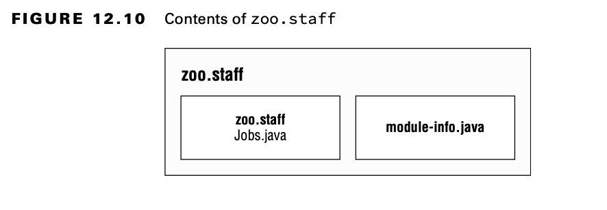

# Updating Our Example for Multiple Modules

## Updating the Feeding Module

Since we will be having our other modules call code in the zoo.animal.feeding package, we need to declare this intent in
the module declaration.

The exports directive is used to indicate that a module intends for those packages to be used by Java code outside the
module. As you might expect, without an exports directive, the module is only available to be run from the command line
on its own. In the following example, we export one package:

    module zoo.animal.feeding { 
        exports zoo.animal.feeding;
    }

Recompiling and repackaging the module will update the module-info.class inside our zoo.animal.feeding.jar file. These
are the same javac and jar commands you ran previously:

    javac -p mods -d feeding feeding/zoo/animal/feeding/*.java feeding/module-info.java
    jar -cvf mods/zoo.animal.feeding.jar -C feeding/ .

## Creating a Care Module

The zoo.animal.care.medical package will have the classes and methods that are intended for use by other modules. The
zoo.animal.care.details package is only going to be used by this module. It will not be exported from the module. Think
of it as healthcare privacy for the animals.

The module contains two basic packages and classes in addition to the module-info.java file:

    package zoo.animal.care.details; 
    import zoo.animal.feeding.*; 
    public class HippoBirthday {
        private Task task; 
    }

    package zoo.animal.care.medical; 
    public class Diet { }

    module zoo.animal.care {
        exports zoo.animal.care.medical; 
        requires zoo.animal.feeding;
    }

The **requires** statement specifies that a module is needed. The zoo.animal.care module depends on the
zoo.animal.feeding
module.

    javac -p mods -d care care/zoo/animal/care/details/*.java care/zoo/animal/care/medical/*.java care/module-info.java

We compile both packages and the module-info.java file. In the real world, you’ll use a build tool rather than doing
this by hand. For the exam, you just list all the packages and/or files you want to compile.

Now that we have compiled code, it’s time to create the module JAR:

## Creating the Talks Module

So far, we’ve used only one exports and requires statement in a module. Now you’ll learn how to handle exporting
multiple packages or requiring multiple modules.

We are going to export all three packages in this module.

First let’s look at the module-info.java file for zoo.animal.talks:

    module zoo.animal.talks {
        exports zoo.animal.talks.content;
        exports zoo.animal.talks.media;
        exports zoo.animal.talks.schedule;
        requires zoo.animal.feeding;
        requires zoo.animal.care;
    }

Then we have the six classes, as shown here:

    package zoo.animal.talks.content;

    public class ElephantScript {
    }

    package zoo.animal.talks.content;

    public class SeaLionScript {
    }

    package zoo.animal.talks.media;

    public class Announcement {
        public static void main(String[] args) {
            System.out.println("We will be having talks");
        }
    }

    package zoo.animal.talks.media;

    public class Signage {
    }

    package zoo.animal.talks.schedule;

    public class Weekday {
    }

    package zoo.animal.talks.schedule;

    public class Weekend {
    }

If you are still following along on your computer, create these classes in the packages. The following are the commands
to compile and build the module:

    javac -p mods -d talks talks/zoo/animal/talks/content/*.java talks/zoo/animal/talks/media/*.java talks/zoo/animal/talks/schedule/*.java talks/module-info.java

    jar -cvf mods/zoo.animal.talks.jar -C talks/ .

## Creating the Staff Module

Our final module is zoo.staff. Figure 12.10 shows that there is only one package inside. We will not be exposing this
package outside the module.

There are three arrows in Figure 12.11 pointing from zoo.staff to other modules. These represent the three modules that
are required. Since no packages are to be exposed from zoo.staff, there are no exports statements. This gives us:

    module zoo.staff {
        requires zoo.animal.feeding; 
        requires zoo.animal.care; 
        requires zoo.animal.talks;
    }

In this module, we have a single class in the Jobs.java file:

    package zoo.staff;
    public class Jobs { }

For those of you following along on your computer, create a class in the package. The following are the commands to
compile and build the module:

    javac -p mods -d staff  staff/zoo/staff/*.java staff/module-info.java

    jar -cvf mods/zoo.staff.jar -C staff/ .