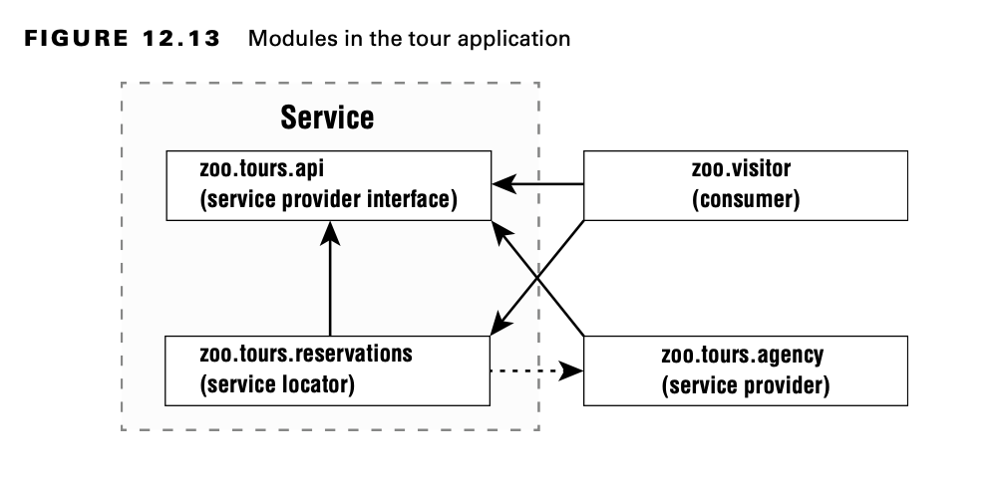

# Creating a Service

A service is composed of an interface, any classes the interface references, and a way of looking up implementations of
the interface. The implementations are not part of the service.

You aren’t required to have four separate modules. We do so to illustrate the concepts. For example, the service
provider interface and service locator could be in the same module.

## Declaring Service Provider Interface

First, the zoo.tours.api module defines a Java object called Souvenir. It is considered part of the service because it
will be referenced by the interface.

    // Souvenir.java
    package zoo.tours.api;

    public record Souvenir(String description) { }

Next, the module contains a Java interface type. This interface is called the service provider interface because it
specifies what behavior our service will have. In this case, it is a simple API with three methods.

    // Tour.java
    package zoo.tours.api;

    public interface Tour { 
        String name();
        int length();
        Souvenir getSouvenir();
    }

All three methods use the implicit public modifier. Since we are working with modules, we also need to create a
module-info.java file so our module definition exports the package containing the interface.

    // module-info.java

    module zoo.tours.api { 
        exports zoo.tours.api;
    }

Now that we have both files, we can compile and package this module.

    javac -d serviceProviderInterfaceModule serviceProviderInterfaceModule/zoo/tours/api/*.java serviceProviderInterfaceModule/module-info.java

    jar -cvf mods/zoo.tours.api.jar -C serviceProviderInterfaceModule/ .

## Creating a Service Locator

To complete our service, we need a service locator. A service locator can find any classes that implement a service
provider interface.

Luckily, Java provides a ServiceLoader class to help with this task. You pass the service provider interface type to its
load() method, and Java will return any implementation services it can find. The following class shows it in action:

    package zoo.tours.reservations;

    import java.util.*;
    
    import zoo.tours.api.*;
    
    public class TourFinder {
        public static Tour findSingleTour() {
        ServiceLoader<Tour> loader = ServiceLoader.load(Tour.class);
        for (Tour tour : loader) return tour;
        return null;
        }
    
        public static List<Tour> findAllTours() {
            List<Tour> tours = new ArrayList<>();
            ServiceLoader<Tour> loader = ServiceLoader.load(Tour.class);
            for (Tour tour : loader)
                tours.add(tour);
            return tours;
        }
    }

The ServiceLoader call is relatively expensive. If you are writing a real application, it is best to cache the result.

Our module definition exports the package with the lookup class TourFinder. It requires the service provider interface
package. It also has the uses directive since it will be looking up a service.

    // module-info.java
    module zoo.tours.reservations { 
        exports zoo.tours.reservations; 
        requires zoo.tours.api;
        uses zoo.tours.api.Tour;
    }

Remember that both requires and uses are needed, one for compilation and one for lookup. Finally, we compile and package
the module.

    javac -p mods -d serviceLocatorModule serviceLocatorModule/zoo/tours/reservations/*.java serviceLocatorModule/module-info.java

    jar -cvf mods/zoo.tours.reservations.jar -C serviceLocatorModule/ .

Now that we have the interface and lookup logic, we have completed our service.

**Using ServiceLoader**

There are two methods in ServiceLoader that you need to know for the exam.The decla- ration is as follows, sans the full
implementation:

    public final class ServiceLoader<S> implements Iterable<S> {
        public static <S> ServiceLoader<S> load(Class<S> service) { ... }
        public Stream<Provider<S>> stream() { ... }
        // Additional methods 
    }

As we already saw, calling ServiceLoader.load() returns an object that you can loop through normally. However,
requesting a Stream gives you a different type.The reason for this is that a Stream controls when elements are
evaluated.Therefore, a ServiceLoader returns a Stream of Provider objects.You have to call get() to retrieve the value
you wanted out of each Provider, such as in this example:

    ServiceLoader.load(Tour.class) 
        .stream()
        .map(Provider::get) 
        .mapToInt(Tour::length)
        .max() 
        .ifPresent(System.out::println);

## Invoking from a Consumer

Next up is to call the service locator by a consumer. A consumer (or client) refers to a module that obtains and uses a
service. Once the consumer has acquired a service via the service locator, it is able to invoke the methods provided
by the service provider interface.

    package zoo.visitor;

    import java.util.*;
    
    import zoo.tours.api.*;
    import zoo.tours.reservations.*;
    
    public class Tourist {
        public static void main(String[] args) {
            Tour tour = TourFinder.findSingleTour();
            System.out.println("Single tour: " + tour);
            List<Tour> tours = TourFinder.findAllTours();
            System.out.println("# tours: " + tours.size());
        }
    }

Our module definition doesn’t need to know anything about the implementations since the zoo.tours.reservations module is
handling the lookup.

    module zoo.visitor {
        requires zoo.tours.api;
        requires zoo.tours.reservations;
    }

This time, we get to run a program after compiling and packaging.

    javac -p mods -d consumerModule consumerModule/zoo/visitor/*.java consumerModule/module-info.java

    jar -cvf mods/zoo.visitor.jar -C consumerModule/ .

    java -p mods -m zoo.visitor/zoo.visitor.Tourist

## Adding a Service Provider

A service provider is the implementation of a service provider interface. As we said earlier, at runtime it is possible
to have multiple implementation classes or modules. We will stick to one here for simplicity.

    package zoo.tours.agency;
    import zoo.tours.api.*;
        
    public class TourImpl implements Tour {
        public String name() {
            return "Behind the Scenes";
        }
    
        public int length() {
            return 120;
        }
    
        public Souvenir getSouvenir() {
            return new Souvenir("stuffed animal");
        }
    }

    module zoo.tours.agency {
        requires zoo.tours.api;
        provides zoo.tours.api.Tour with zoo.tours.agency.TourImpl;
    }

The module declaration requires the module containing the interface as a dependency. We don’t export the package that
implements the interface since we don’t want callers referring to it directly. Instead, we use the provides directive.
This allows us to specify that we provide an implementation of the interface with a specific implementation class. The
syntax looks like this:

    provides interfaceName with className;

We have not exported the package containing the implementation. Instead, we have made the implementation available to a
service provider using the interface.

Finally, we compile it and package it up.

    javac -p mods -d serviceProviderModule serviceProviderModule/zoo/tours/agency/*.java 
    serviceProviderModule/module-info.java
    jar -cvf mods/zoo.tours.agency.jar -C serviceProviderModule/ .

Now comes the cool part. We can run the Java program again.

    java -p mods -m zoo.visitor/zoo.visitor.Tourist

Notice how we didn’t recompile the zoo.tours.reservations or zoo.visitor package. The service locator was able to
observe that there was now a service provider implementation available and find it for us. This is useful when you have
functionality that changes independently of the rest of the code base. For example, you might have custom reports or
logging.

## Reviewing Directives and Services

Table 12.4 summarizes what we’ve covered in the section about services. We recommend learning really well what is needed
when each artifact is in a separate module. That is most likely what you will see on the exam and will ensure that you
understand the concepts. Table 12.5 lists all the directives you need to know for the exam.

