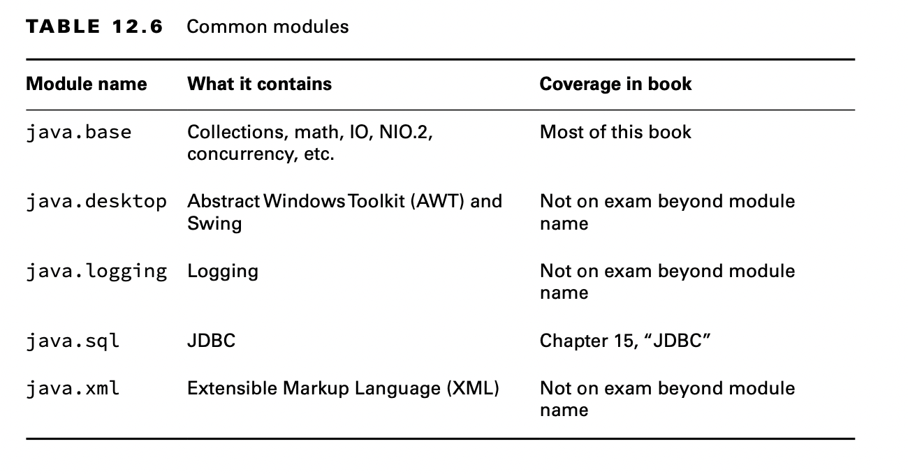
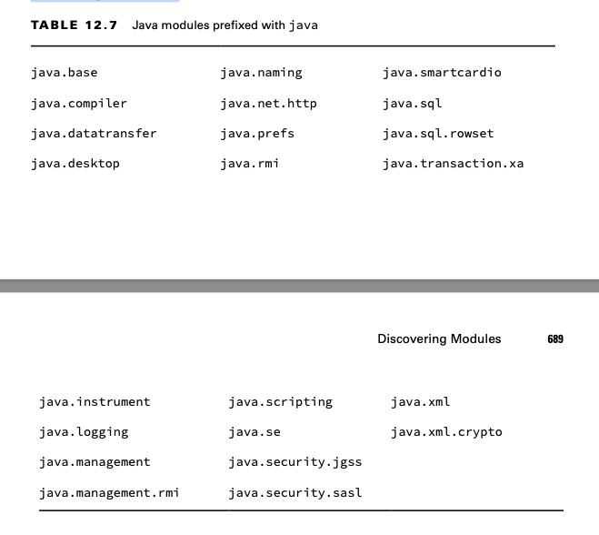
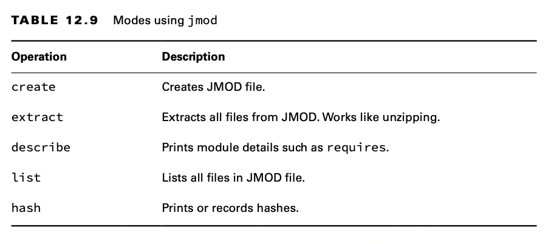
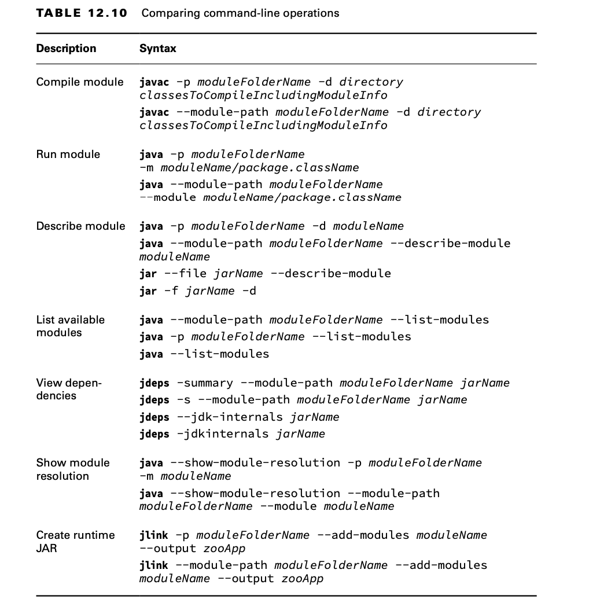
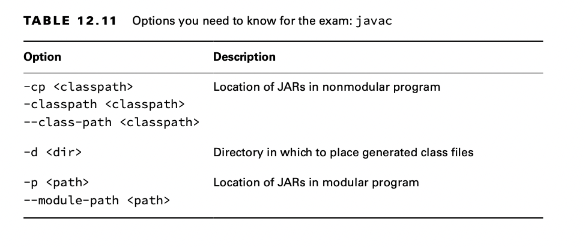

# Discovering Modules

So far, we’ve been working with modules that we wrote. Even the classes built into the JDK are modularized. In this
section, we show you how to use commands to learn about modules.

## Identifying Built-in Modules

The most important module to know is java.base. It contains most of the packages you have been learning about for the
exam. In fact, it is so important that you don’t even have to use the requires directive; it is available to all modular
applications. Your module-info.java file will still compile if you explicitly require java.base. However, it is
redundant, so it’s better to omit it. Table 12.6 lists some common modules and what they contain.

The exam creators feel it is important to recognize the names of modules supplied by the JDK. While you don’t need to
know the names by heart, you do need to be able to pick them out of a lineup.

For the exam, you need to know that module names begin with java for APIs you are likely to use and with jdk for APIs
that are specific to the JDK. Table 12.7 lists all the modules that begin with java.

Table 12.8 lists all the modules that begin with jdk. We recommend reviewing this right before the exam to increase the
chances of them sounding familiar. Remember that you don’t have to memorize them.

## Getting Details with java

The java command has three module-related options. One describes a module, another lists the available modules, and the
third shows the module resolution logic.

It is also possible to add modules, exports, and more at the command line. But please don’t. It’s confusing and hard to
maintain. Note that these flags are available on java but not all commands.

### Describing a Module

Suppose you are given the zoo.animal.feeding module JAR file and want to know about its module structure. You could
“unjar” it and open the module-info.java file. This would show you that the module exports one package and doesn’t
explicitly require any modules.

    module zoo.animal.feeding { 
        exports zoo.animal.feeding;
    }

However, there is an easier way. The java command has an option to describe a module. The following two commands are
equivalent:

    java -p mods -d zoo.animal.feeding

    java -p mods --describe-module zoo.animal.feeding

In classes, the java.lang package is automatically imported whether you type it or not. The java.base module works the
same way. It is automatically available to all other modules.

**More about Describing Modules**

You only need to know how to run --describe-module for the exam rather than interpret the output. However, you might
encounter some surprises when experimenting with this feature, so we describe them in a bit more detail here.

Assume the following are the contents of module-info.java in zoo.animal.care:

    module zoo.animal.care {
        exports zoo.animal.care.medical to zoo.staff; 
        requires transitive zoo.animal.feeding;
    }

Now we have the command to describe the module and the output.

    java -p mods -d zoo.animal.care

    zoo.animal.care file:///absolutePath/mods/zoo.animal.care.jar 
    requires zoo.animal.feeding transitive
    requires java.base mandated
    qualified exports zoo.animal.care.medical to zoo.staff contains zoo.animal.care.details

The first line of the output is the absolute path of the module file.The two requires lines should look familiar as
well.The first is in the module-info, and the other is added to all modules. Next comes something new.The qualified
exports is the full name of the package we are exporting to a specific module.

Finally, the contains means that there is a package in the module that is not exported at all.This is true. Our module
has two packages, and one is available only to code inside the module.

### Listing Available Modules

In addition to describing modules, you can use the java command to list the modules that are available. The simplest
form lists the modules that are part of the JDK.

    java --list-modules

More interestingly, you can use this command with custom code. Let’s try again with the directory containing our zoo
modules.

    java -p mods --list-modules

Note that --list-modules exits as soon as it prints the observable mod- ules. It does not run the program.

### Showing Module Resolution

If listing the modules doesn’t give you enough output, you can also use the --show-module-resolution option. You can
think of it as a way of debugging modules. It spits out a lot of output when the program starts up. Then it runs the
program.

    java --show-module-resolution -p feeding -m zoo.animal.feeding/zoo.animal.feeding.Task

## Describing with jar

Like the java command, the jar command can describe a module. These commands are equivalent:

    jar -f mods/zoo.animal.feeding.jar -d
    jar --file mods/zoo.animal.feeding.jar --describe-module

The output is slightly different from when we used the java command to describe the module. With jar, it outputs the
following:

    zoo.animal.feeding jar:file:///absolutePath/mods/zoo.animal.feeding.jar /!module-info.class
    exports zoo.animal.feeding
    requires java.base mandated

The JAR version includes the module-info.class in the filename, which is not a partic- ularly significant difference in
the scheme of things. You don’t need to know this difference. You do need to know that both commands can describe a
module.

## Learning about Dependencies with jdeps

The jdeps command gives you information about dependencies within a module. Unlike describing a module, it looks at the
code in addition to the module declaration. This tells you what dependencies are actually used rather than simply
declared. Luckily, you are not expected to memorize all the options for the exam.

You are expected to understand how to use jdeps with projects that have not yet been modularized to assist in
identifying dependencies and problems.

    package zoo.dinos;

    import java.time.*;
    import java.util.*;
    
    import sun.misc.Unsafe;
    
    public class Animatronic {
        private List<String> names;
        private LocalDate visitDate;
    
        public Animatronic(List<String> names, LocalDate visitDate) {
            this.names = names;
            this.visitDate = visitDate;
        }
    
        public void unsafeMethod() {
            Unsafe unsafe = Unsafe.getUnsafe();
        }
    }

Now we can compile this file. You might have noticed that there is no module-info.java file. That is because we aren’t
creating a module. We are looking into what dependencies we will need when we do modularize this JAR.

    javac zoo/dinos/*.java

Compiling works, but it gives you some warnings about Unsafe being an internal API.

    Next, we create a JAR file.

    jar -cvf zoo.dino.jar .

We can run the jdeps command against this JAR to learn about its dependencies. First, let’s run the command without any
options. On the first two lines, the command prints the modules that we would need to add with a requires directive to
migrate to the module system. It also prints a table showing what packages are used and what modules they correspond
to.

    jdeps zoo.dino.jar

Note that java.base is always included. It also says which modules contain classes used by the JAR. If we run in summary
mode, we only see just the first part where jdeps lists the modules. There are two formats for the summary flag:

    jdeps -s zoo.dino.jar
    
    jdeps -summary zoo.dino.jar

There is also a --module-path option that you can use if you want to look for modules outside the JDK. Unlike other
commands, there is no short form for this option on jdeps.

You might have noticed that jdk.unsupported is not in the list of modules you saw in Table 12.8. It’s special because it
contains internal libraries that developers in previous versions of Java were discouraged from using, although many
people ignored this warning. You should not reference it, as it may disappear in future versions of Java.

## Using the --jdk-internals Flag

The jdeps command has an option to provide details about these unsupported APIs. The output looks something like this:

    jdeps --jdk-internals zoo.dino.jar

The --jdk-internals option lists any classes you are using that call an internal API along with which API. At the end,
it provides a table suggesting what you should do about it. If you wrote the code calling the internal API, this message
is useful. If not, the message would be useful to the team that did write the code. You, on the other hand, might need
to update or replace that JAR file entirely with one that fixes the issue. Note that -jdkinternals is equivalent to
--jdk-internals.

**About sun.misc.Unsafe**

Prior to the Java Platform Module System, classes had to be public if you wanted them to be used outside the package. It
was reasonable to use the class in JDK code since that is low-level code that is already tightly coupled to the JDK.

Since it was needed in multiple packages, the class was made public. Sun even named it Unsafe, figuring that would
prevent anyone from using it outside the JDK.

However, developers are clever and used the class since it was available. A number of widely used open source libraries
started using Unsafe. While it is quite unlikely that you are using this class in your project directly, you probably
use an open source library that is using it.

The jdeps command allows you to look at these JARs to see whether you will have any problems when Oracle finally
prevents the usage of this class. If you find any uses, you can look at whether there is a later version of the JAR that
you can upgrade to.

## Using Module Files with jmod

The final command you need to know for the exam is jmod. You might think a JMOD file is a Java module file. Not quite.
Oracle recommends using JAR files for most modules. JMOD files are recommended only when you have native libraries or
something that can’t go inside a JAR file. This is unlikely to affect you in the real world.

The most important thing to remember is that jmod is only for working with the JMOD files. Conveniently, you don’t have
to memorize the syntax for jmod. Table 12.9 lists the common modes.

## Creating Java Runtimes with jlink

One of the benefits of modules is being able to supply just the parts of Java you need. Our zoo example from the
beginning of the chapter doesn’t have many dependencies.

If the user already doesn’t have Java or is on a device without much memory, downloading a JDK that is over 150 MB is a
big ask. Let’s see how big the package actually needs to be! This command creates our smaller distribution:

    jlink --module-path mods --add-modules zoo.animal.talks --output zooA

First we specify where to find the custom modules with -p or --module-path. Then we specify our module names with
--add-modules. This will include the dependencies it requires as long as they can be found. Finally, we specify the
folder name of our smaller JDK with --output.

There are many modules in the JDK we don’t need. Additionally, development tools like javac don’t need to be in a
runtime distribution.

## Reviewing Command-Line Option

This section presents a number of tables that cover what you need to know about running command-line options for the
exam.

