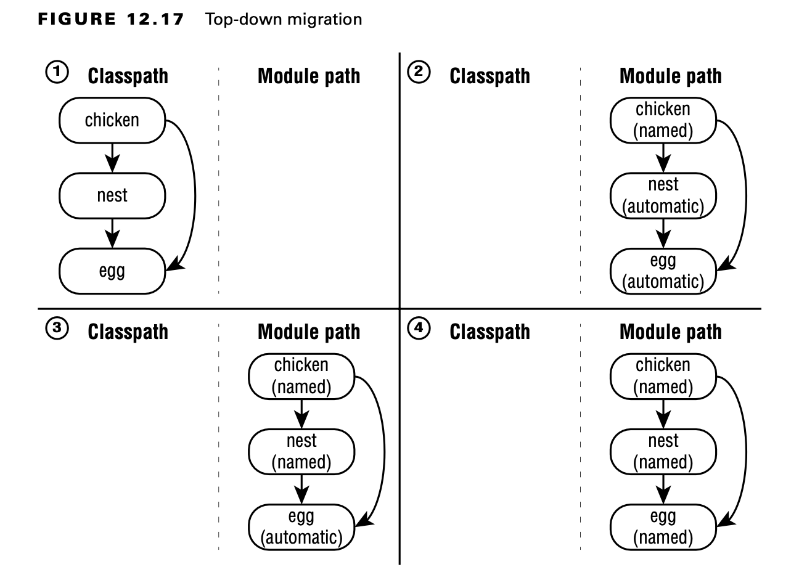
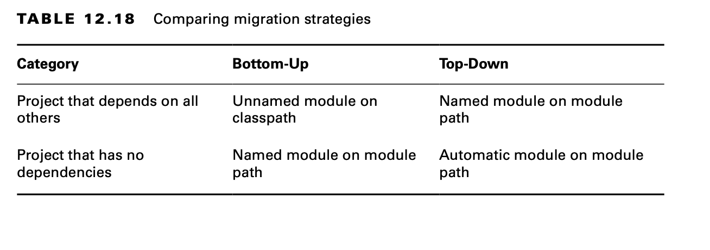
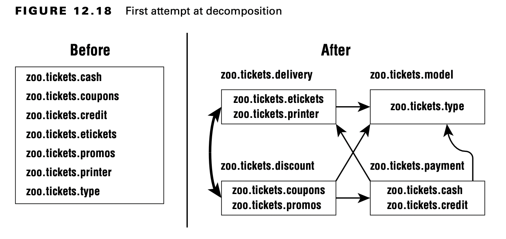

# Migrating an Application

Many applications were not designed to use the Java Platform Module System because they were written before it was
created or chose not to use it. Ideally, they were at least designed with projects instead of as a big ball of mud. This
section gives you an overview of strategies for migrating an existing application to use modules. We cover ordering
modules, bottom-up migration, top-down migration, and how to split up an existing project.

**MigratingYour Applications at Work**

The exam exists in a pretend universe where there are no open source dependencies and applications are very small.These
scenarios make learning and discussing migration far easier. In the real world, applications have libraries that haven’t
been updated in 10 or more years, complex dependency graphs, and all sorts of surprises.

Note that you can use all the features of Java 17 without converting your application to modules (except the features in
this module chapter, of course!). Please make sure you have a reason for migration and don’t think it is required.

## Determining the Order

Before we can migrate our application to use modules, we need to know how the packages and libraries in the existing
application are structured.

The right side of the diagram makes it easier to identify the top and bottom that top-down and bottom-up migration
refer to. Projects that do not have any dependencies are at the bottom. Projects that do have dependencies are at the
top.

In this example, there is only one order from top to bottom that honors all the dependencies. Figure 12.15 shows that
the order is not always unique. Since two of the projects do not have an arrow between them, either order is allowed
when deciding migration order.

## Exploring a Bottom-Up Migration Strategy

The easiest approach to migration is a bottom-up migration. This approach works best when you have the power to convert
any JAR files that aren’t already modules. For a bottom-up migration, you follow these steps:

1. Pick the lowest-level project that has not yet been migrated. (Remember the way we ordered them by dependencies in
   the previous section?)
2. Add a module-info.java file to that project. Be sure to add any exports to expose any package used by higher-level
   JAR files. Also, add a requires directive for any modules this module depends on.
3. Move this newly migrated named module from the classpath to the module path.
4. Ensure that any projects that have not yet been migrated stay as unnamed modules on
   the classpath.
5. Repeat with the next-lowest-level project until you are done.

With a bottom-up migration, you are getting the lower-level projects in good shape. This makes it easier to migrate the
top-level projects at the end. It also encourages care in what is exposed.

During migration, you have a mix of named modules and unnamed modules. The named modules are the lower-level ones that
have been migrated. They are on the module path and not allowed to access any unnamed modules.

The unnamed modules are on the classpath. They can access JAR files on both the classpath and the module path.

## Exploring a Top-Down Migration Strategy

A top-down migration strategy is most useful when you don’t have control of every JAR file used by your application. For
example, suppose another team owns one project. They are just too busy to migrate. You wouldn't want this situation to
hold up your entire migration.

For a top-down migration, you follow these steps:

1. Place all projects on the module path.
2. Pick the highest-level project that has not yet been migrated.
3. Add a module-info.java file to that project to convert the automatic module into a named module. Again, remember to
   add any exports or requires directives. You can use the automatic module name of other modules when writing the
   requires directive since most of the projects on the module path do not have names yet.
4. Repeat with the next-highest-level project until you are done.

With a top-down migration, you are conceding that all of the lower-level dependencies are not ready but that you want to
make the application itself a module.

During migration, you have a mix of named modules and automatic modules. The named modules are the higher-level ones
that have been migrated. They are on the module path and have access to the automatic modules. The automatic modules are
also on the module path.

## Splitting a Big Project into Modules

For the exam, you need to understand the basic process of splitting a big project into modules. You won’t be given a
big project, of course. After all, there is only so much space to ask a question. Luckily, the process is the same for a
small project.

Suppose you start with an application that has a number of packages. The first step is to break them into logical
groupings and draw the dependencies between them.

There’s a problem with this decomposition. Do you see it? The Java Platform
Module System does not allow for cyclic dependencies. A cyclic dependency, or circular dependency, is when two things
directly or indirectly depend on each other. If the zoo.tickets.delivery module requires the zoo.tickets.discount
module, zoo.tickets.discount is not allowed to require the zoo.tickets.delivery module.

Now that we know that the decomposition in Figure 12.18 won’t work, what can we do about it? A common technique is to
introduce another module. That module contains the code that the other two modules share. Figure 12.19 shows the new
modules without any cyclic dependencies. Notice the new module zoo.tickets.etech. We created new packages to put in
that module. This allows the developers to put the common code in there and break the dependency. No more cyclic
dependencies!

## Failing to Compile with a Cyclic Dependency

It is extremely important to understand that Java will not allow you to compile modules that have circular dependencies.
In this section, we look at an example leading to that compiler error.

Consider the zoo.butterfly module described here:

      package zoo.butterfly; 
      public class Butterfly {
         private Caterpillar caterpillar; 
      }

      module zoo.butterfly { 
         exports zoo.butterfly; 
         requires zoo.caterpillar;
      }

We can’t compile this yet as we need to build zoo.caterpillar first. After all, our butterfly requires it. Now we look
at zoo.caterpillar:

      package zoo.caterpillar; 
      public class Caterpillar {
         Butterfly emergeCocoon() { // logic omitted
         } 
      }

      module zoo.caterpillar { 
         exports zoo.caterpillar; 
         requires zoo.butterfly;
      }

Now we have a stalemate. Neither module can be compiled. This is our circular dependency problem at work.
This is one of the advantages of the module system. It prevents you from writing code that has a cyclic dependency. Such
code won’t even compile!

Java will still allow you to have a cyclic dependency between packages within a module. It enforces that you do not have
a cyclic dependency between modules.

