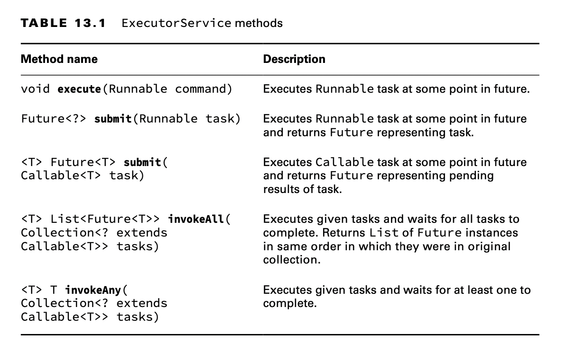
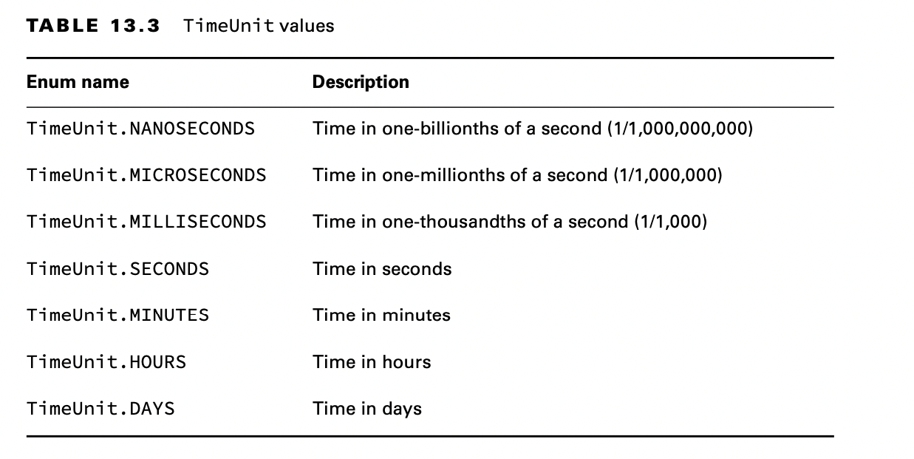
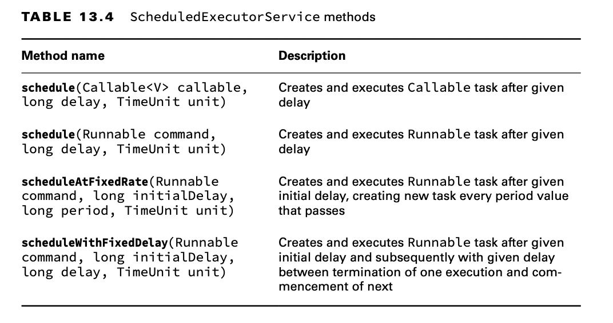
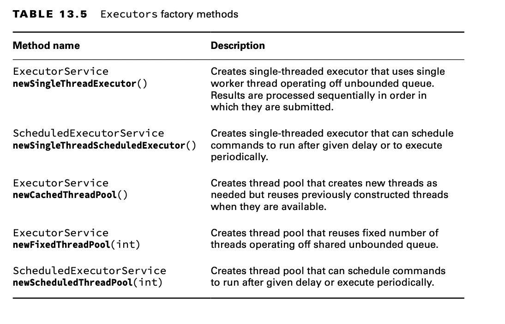

# Creating Threads with the Concurrency API

Java includes the java.util.concurrent package, which we refer to as the Concurrency API, to handle the complicated
work of managing threads for you. The Concurrency API includes the ExecutorService interface, which defines services
that create and manage threads.

When writing multithreaded programs in practice, it is often better to use the Concurrency API (or some other
multithreaded SDK) rather than work with Thread objects directly. The libraries are much more robust, and it is easier
to handle complex interactions.

## Introducing the Single-Thread Executor

Since ExecutorService is an interface, how do you obtain an instance of it? The Concurrency API includes the Executors
factory class that can be used to create instances of the ExecutorService object. Let’s rewrite our earlier example with
the two Runnable instances to using an ExecutorService.

    Runnable printInventory = () -> System.out.println("Printing zoo inventory");
    Runnable printRecords = () -> {
        for (int i = 0; i < 3; i++)
            System.out.println("Printing record: " + i);
    };

    ExecutorService service = Executors.newSingleThreadExecutor();
    try {
        System.out.println("begin");
        service.execute(printInventory);
        service.execute(printRecords);
        service.execute(printInventory);
        System.out.println("end");
    } finally {
        service.shutdown();
    }

Notice that the printRecords loop is no longer interrupted by other Runnable tasks sent to the thread executor. With a
single-thread executor, tasks are guaranteed to be executed sequentially. Notice that the end text is output while our
thread executor tasks are still running. This is because the main() method is still an independent thread from the
ExecutorService.

## Shutting Down a Thread Executor

Once you have finished using a thread executor, it is important that you call the shutdown() method. A thread executor
creates a non-daemon thread on the first task that is executed, so failing to call shutdown() will result in your
application never terminating.

The shutdown process for a thread executor involves first rejecting any new tasks submitted to the thread executor
while continuing to execute any previously submitted tasks. During this time, calling isShutdown() will return true,
while isTerminated() will return false.

If a new task is submitted to the thread executor while it is shutting down, a RejectedExecutionException will be
thrown. Once all active tasks have been completed, isShutdown() and isTerminated() will both return true.

For the exam, you should be aware that shutdown() does not stop any tasks that have already been submitted to the thread
executor.

What if you want to cancel all running and upcoming tasks? The ExecutorService provides a method called shutdownNow(),
which attempts to stop all running tasks and discards any that have not been started yet. It is not guaranteed to
succeed because it is possible to create a thread that will never terminate, so any attempt to interrupt it may be
ignored.

As you learned in Chapter 11, “Exceptions and Localization,” resources such as thread executors should be properly
closed to prevent memory leaks. Unfortunately, the ExecutorService interface does not extend the AutoCloseable
interface, so you cannot use a try-with-resources statement. You can still use a finally block, as we do throughout this
chapter. While you are not required to use a finally block, it is considered a good practice to do so.

## Submitting Tasks

You can submit tasks to an ExecutorService instance multiple ways. The first method we presented, execute(), is
inherited from the Executor interface, which the ExecutorService interface extends.

The execute() method takes a Runnable instance and completes the task asynchronously.
Because the return type of the method is void, it does not tell us anything about the result of the task. It is
considered a “fire-and-forget” method, as once it is submitted, the results are not directly available to the calling
thread.

Fortunately, the writers of Java added submit() methods to the ExecutorService interface, which, like execute(), can be
used to complete tasks asynchronously. Unlike execute(), though, submit() returns a Future instance that can be used to
determine whether the task is complete. It can also be used to return a generic result object after the task has been
completed.

In practice, using the submit() method is quite similar to using the execute() method, except that the submit() method
returns a Future instance that can be used to determine whether the task has completed execution.

**Submitting Tasks: execute() vs. submit()**

As you might have noticed, the execute() and submit() methods are nearly identical when applied to Runnable expressions.
The submit() method has the obvious advantage of doing the same thing execute() does, but with a return object that can
be used to track the result. Because of this advantage and the fact that execute() does not support Callable
expressions, we tend to prefer submit() over execute(), even if we don’t store the Future reference.

For the exam, you need to be familiar with both execute() and submit(), but in your own code we recommend submit() over
execute() whenever possible.

## Waiting for Results

How do we know when a task submitted to an ExecutorService is complete? As mentioned in the previous section, the
submit() method returns a Future<V> instance that can be used to determine this result.

    Future<?> future = service.submit(() -> System.out.println("Hello"));

The Future type is actually an interface. For the exam, you don’t need to know any of the classes that implement Future,
just that a Future instance is returned by various API methods.

    public class CheckResults {
        private static int counter = 0;
    
        public static void main(String[] unused) throws Exception {
            ExecutorService service = Executors.newSingleThreadExecutor();
            try {
                Future<?> result = service.submit(() -> {
                    for (int i = 0; i < 1_000_000; i++) counter++;
                }
                );
                result.get(10, TimeUnit.SECONDS); // Returns null for Runnable
                System.out.println("Reached!");
            } catch (TimeoutException e) {
                System.out.println("Not reached in time");
            } finally {
                service.shutdown();
            }
        }
    }

This example is similar to our earlier polling implementation, but it does not use the Thread class directly. In part,
this is the essence of the Concurrency API: to do complex things with threads without having to manage threads directly.
It also waits at most 10 seconds, throwing a TimeoutException on the call to result.get() if the task is not done.

What is the return value of this task? As Future<V> is a generic interface, the type V is determined by the return type
of the Runnable method. Since the return type of Runnable.run() is void, the get() method always returns null when
working with Runnable expressions.

The Future.get() method can take an optional value and enum type java.util.concurrent.TimeUnit. Table 13.3 presents the
full list of TimeUnit values since numerous methods in the Concurrency API use this enum.

## Introducing Callable

The java.util.concurrent.Callable functional interface is similar to Runnable except that its call() method returns a
value and can throw a checked exception. The following is the definition of the Callable interface:

    @FunctionalInterface 
    public interface Callable<V> { 
        V call() throws Exception;
    }

The Callable interface is often preferable over Runnable, since it allows more details to be retrieved easily from the
task after it is completed.

Luckily, the ExecutorService includes an overloaded version of the submit() method that takes a Callable object and
returns a generic Future<T> instance.

Unlike Runnable, in which the get() methods always return null, the get() methods on a Future instance return the
matching generic type (which could also be a null value).

    var service = Executors.newSingleThreadExecutor();
    try {
        Future<Integer> result = service.submit(() -> 30 + 11);
        System.out.println(result.get()); // 41
        service.shutdown();
    } finally {
        service.shutdown();
    }

## Waiting for All Tasks to Finish

After submitting a set of tasks to a thread executor, it is common to wait for the results. As you saw in the previous
sections, one solution is to call get() on each Future object returned by the submit() method. If we don’t need the
results of the tasks and are finished using our thread executor, there is a simpler approach.

First, we shut down the thread executor using the shutdown() method. Next, we use the awaitTermination() method
available for all thread executors. The method waits the specified time to complete all tasks, returning sooner if all
tasks finish or an InterruptedException is detected. You can see an example of this in the following code snippet:

    public static void main(String[] args) throws InterruptedException {

        Runnable printInventory = () -> System.out.println("Printing zoo inventory");
        Runnable printRecords = () -> {
            for (int i = 0; i < 3; i++) {
                System.out.println("Printing record: " + i);
                try {
                    Thread.sleep(500);
                } catch (InterruptedException e) {
                    throw new RuntimeException(e);
                }
            }
        };

        ExecutorService service = Executors.newSingleThreadExecutor();
        try {

            System.out.println("begin");
            service.execute(printInventory);
            service.execute(printRecords);
            service.execute(printInventory);
            System.out.println("end");

        } finally {
            service.shutdown();
        }
        service.awaitTermination(1, TimeUnit.SECONDS);
        // Check whether all tasks are finished

        if (service.isTerminated())
            System.out.println("Finished!");
        else
            System.out.println("At least one task is still running");
    }

## Scheduling Tasks

Often in Java, we need to schedule a task to happen at some future time. We might even need to schedule the task to
happen repeatedly, at some set interval. For example, imagine that we want to check the supply of food for zoo animals
once an hour and fill it as needed. ScheduledExecutorService, which is a subinterface of ExecutorService, can be used
for just such a task.

Like ExecutorService, we obtain an instance of ScheduledExecutorService using a factory method in the Executors class,
as shown in the following snippet:

    ScheduledExecutorService service = Executors.newSingleThreadScheduledExecutor();

We could store an instance of ScheduledExecutorService in an ExecutorService variable, although doing so would mean we’d
have to cast the object to call any scheduling methods.

In practice, these methods are among the most convenient in the Concurrency API, as they perform relatively complex
tasks with a single line of code. The delay and period parameters rely on the TimeUnit argument to determine the format
of the value, such as seconds or milliseconds.

The first two schedule() methods in Table 13.4 take a Callable or Runnable, respectively; perform the task after some
delay; and return a ScheduledFuture instance. The ScheduledFuture interface is identical to the Future interface, except
that it includes a getDelay() method that returns the remaining delay. The following uses the schedule()
method with Callable and Runnable tasks:

    public static void main(String[] args) {

        ScheduledExecutorService service = Executors.newSingleThreadScheduledExecutor();
        Runnable task1 = () -> System.out.println("Hello Zoo");
        Callable<String> task2 = () -> "Monkey";
        ScheduledFuture<?> r1 = service.schedule(task1, 10, TimeUnit.SECONDS);
        ScheduledFuture<?> r2 = service.schedule(task2, 8, TimeUnit.MINUTES);
    }

The first task is scheduled 10 seconds in the future, whereas the second task is scheduled 8 minutes in the future.

While these tasks are scheduled in the future, the actual execution may be delayed. For example, there may be no threads
available to perform the tasks, at which point they will just wait in the queue. Also, if the ScheduledExecutorService
is shut down by the time the scheduled task execution time is reached, then these tasks will be discarded.

Each of the ScheduledExecutorService methods is important and has real-world applications. For example, you can use the
schedule() command to check on the state of cleaning a lion’s cage. It can then send out notifications if it is not
finished or even call schedule() to check again later.

The last two methods in Table 13.4 might be a little confusing if you have not seen them before. Conceptually, they are
similar as they both perform the same task repeatedly after an initial delay. The difference is related to the timing of
the process and when the next task starts.

The scheduleAtFixedRate() method creates a new task and submits it to the executor every period, regardless of whether
the previous task finished. The following example executes a Runnable task every minute, following an initial
five-minute delay:

    service.scheduleAtFixedRate(command, 5, 1, TimeUnit.MINUTES

The scheduleAtFixedRate() method is useful for tasks that need to be run at specific intervals, such as checking the
health of the animals once a day. Even if it takes two hours to examine an animal on Monday, this doesn’t mean that
Tuesday’s exam should start any later in the day.

Bad things can happen with scheduleAtFixedRate() if each task consistently takes longer to run than the execution
interval. Imagine if your boss came by your desk every minute and dropped off a piece of paper. Now imagine that it took
you five minutes to read each piece of paper. Before long, you would be drowning in piles of paper. This is how an
executor feels. Given enough time, the program would submit more tasks to the executor service than could fit in memory,
causing the program to crash.

On the other hand, the scheduleWithFixedDelay() method creates a new task only after the previous task has finished. For
example, if a task runs at 12:00 and takes five minutes to finish, with a period between executions of two minutes, the
next task will start at 12:07.

    service.scheduleWithFixedDelay(task1, 0, 2, TimeUnit.MINUTES);

The scheduleWithFixedDelay() method is useful for processes that you want to happen repeatedly but whose specific time
is unimportant. For example, imagine that we have a zoo cafeteria worker who periodically restocks the salad bar
throughout the day. The process can take 20 minutes or more, since it requires the worker to haul a large number of
items from the back room. Once the worker has filled the salad bar with fresh food, they don’t need to check at some
specific time, just after enough time has passed for it to become low on stock again.

## Increasing Concurrency with Pools

All of our examples up until now have been with a single-thread executor, which, while interesting, weren’t particularly
useful. After all, the name of this chapter is “Concurrency,” and you can’t do a lot of that with a single-thread
executor!

We now present three additional factory methods in the Executors class that act on a pool of threads rather than on a
single thread. A thread pool is a group of pre-instantiated reusable threads that are available to perform a set of
arbitrary tasks. Table 13.5 includes our two previous single-thread executor methods, along with the new ones that you
should know for the exam.

As shown in Table 13.5, these methods return the same instance types, ExecutorService and ScheduledExecutorService, that
we used earlier in this chapter. In other words, all of our previous examples are compatible with these new
pooled-thread executors!

The difference between a single-thread and a pooled-thread executor is what happens when a task is already running.
While a single-thread executor will wait for the thread to become available before running the next task, a
pooled-thread executor can execute the next task concurrently. If the pool runs out of available threads, the task will
be queued by the thread executor and wait to be completed.
