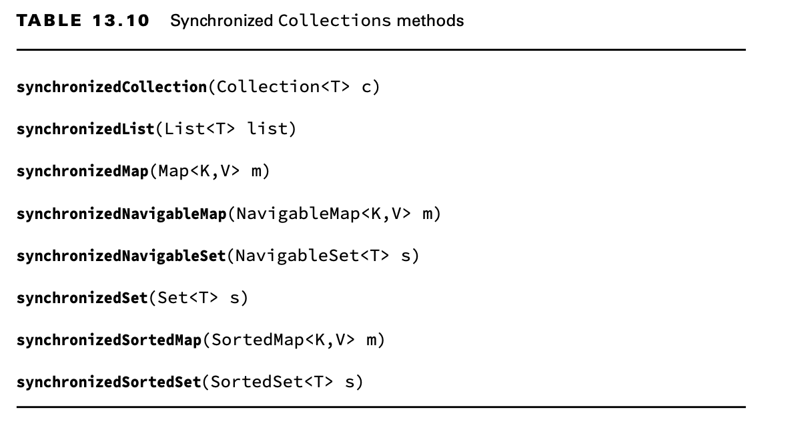

# Using Concurrent Collections

Besides managing threads, the Concurrency API includes interfaces and classes that help you coordinate access to
collections shared by multiple tasks.

## Understanding Memory Consistency Errors

The purpose of the concurrent collection classes is to solve common memory consistency errors. A memory consistency
error occurs when two threads have inconsistent views of what should be the same data. Conceptually, we want writes on
one thread to be available to another thread if it accesses the concurrent collection after the write has occurred.

When two threads try to modify the same nonconcurrent collection, the JVM may throw a ConcurrentModificationException at
runtime. In fact, it can happen with a single thread. Take a look at the following code snippet:

    var foodData = new HashMap<String, Integer>();
    foodData.put("penguin", 1);
    foodData.put("flamingo", 2);
    for (String key : foodData.keySet())
    foodData.remove(key); // java.util.ConcurrentModificationException

This snippet will throw a ConcurrentModificationException during the second iteration of the loop, since the iterator on
keySet() is not properly updated after the first element is removed.

Changing the first line to use a ConcurrentHashMap will prevent the code from throwing an exception at runtime.

    var foodData = new ConcurrentHashMap<String, Integer>();

Although we don’t usually modify a loop variable, this example highlights the fact that the ConcurrentHashMap is
ordering read/write access such that all access to the class is consistent. In this code snippet, the iterator created
by keySet() is updated as soon as an object is removed from the Map.

The concurrent classes were created to help avoid common issues in which multiple threads are adding and removing
objects from the same collections. At any given instance, all threads should have the same consistent view of the
structure of the collection.

## Working with Concurrent Classes

You should use a concurrent collection class any time you have multiple threads modify a collection outside a
synchronized block or method, even if you don’t expect a concurrency problem. Without the concurrent collections,
multiple threads accessing a collection could result in an exception being thrown or, worse, corrupt data!

If the collection is immutable (and contains immutable objects), the concurrent collections are not necessary. Immutable
objects can be accessed by any number of threads and do not require synchronization. By definition, they do not change,
so there is no chance of a memory consistency error.

The Skip classes might sound strange, but they are just “sorted” versions of the associ- ated concurrent collections.
When you see a class with Skip in the name, just think “sorted concurrent” collections, and the rest should follow
naturally.

The CopyOnWrite classes behave a little differently than the other concurrent examples you have seen. These classes
create a copy of the collection any time a reference is added, removed, or changed in the collection and then update the
original collection reference to point to the copy.

    List<Integer> favNumbers = new CopyOnWriteArrayList<>(List.of(4, 3, 42));
    for (var n : favNumbers) {
        System.out.print(n + " "); // 4 3 42
        favNumbers.add(n + 1);
    }

    System.out.println();
    System.out.println("Size: " + favNumbers.size()); // Size: 6
    System.out.println(favNumbers); // [4, 3, 42, 5, 4, 43]

Despite adding elements, the iterator is not modified, and the loop executes exactly three times. Alternatively, if we
had used a regular ArrayList object, a ConcurrentModificationException would have been thrown at runtime. The
CopyOnWrite classes can use a lot of memory, since a new collection structure is created any time the collection is
modified. Therefore, they are commonly used in multithreaded environment situations where reads are far more common than
writes.

A CopyOnWrite instance is similar to an immutable object, as a new underlying structure is created every time the
collection is modified. Unlike a true immutable object, though, the reference to the object stays the same even while
the underlying data is changed.

LinkedBlockingQueue, which implements the concurrent BlockingQueue interface. This class is just like a regular Queue,
except that it includes overloaded versions of offer() and poll() that take a timeout. These methods wait (or block) up
to a specific amount of time to complete an operation.

## Obtaining Synchronized Collections

Besides the concurrent collection classes that we have covered, the Concurrency API also includes methods for obtaining
synchronized versions of existing nonconcurrent collection objects. These synchronized methods are defined in the
Collections class. They operate on the inputted collection and return a reference that is the same type as the
underlying collection.

If you’re writing code to create a collection and it requires synchronization, you should use the classes defined in
Table 13.9. On the other hand, if you are passed a nonconcurrent collection and need synchronization, use the methods in
Table 13.10.