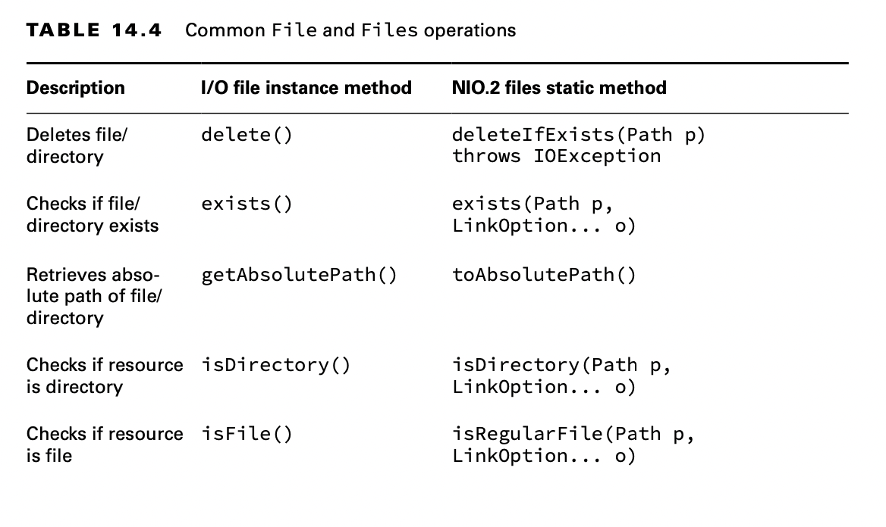
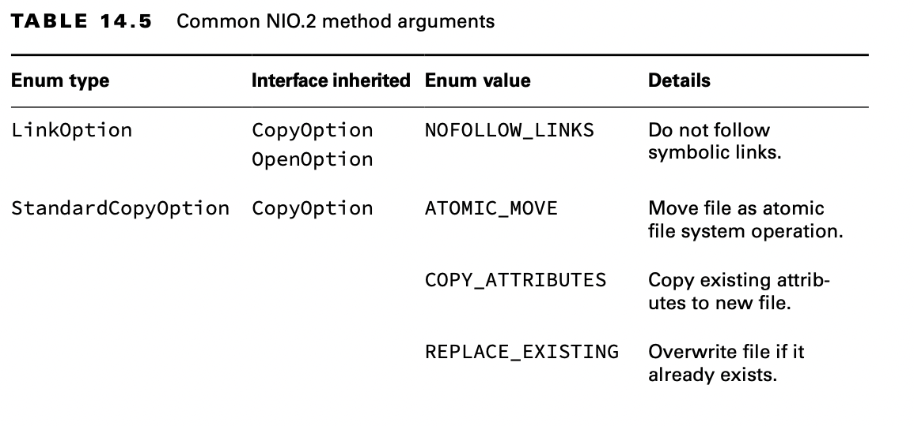

# Operating on File and Path

Now that we know how to create File and Path objects, we can start using them to do useful things.

## Using Shared Functionality

Many operations can be done using both the I/O and NIO.2 libraries.

    private static void io(File file) {
        if (file.exists()) {
            System.out.println("Absolute Path: " + file.getAbsolutePath());
            System.out.println("Is Directory: " + file.isDirectory());
            System.out.println("Parent Path: " + file.getParent());
            if (file.isFile()) {
                System.out.println("Size: " + file.length());
                System.out.println("Last Modified: " + file.lastModified());
            } else {

                for (File subfile : file.listFiles()) {
                    System.out.println(" " + subfile.getName());
                }
            }
        }
    }

In these examples, you see that the output of an I/O-based program is completely dependent on the directories and files
available at runtime in the underlying file system.

On the exam, you might see paths that look like files but are directories or vice versa. For example, /data/zoo.txt
could be a file or a directory, even though it has a file extension.

    public static void nio(Path path) throws IOException {

        if (Files.exists(path)) {
            System.out.println("Absolute Path: " + path.toAbsolutePath());
            System.out.println("Is Directory: " + Files.isDirectory(path));
            System.out.println("Parent Path: " + path.getParent());
    
            if (Files.isRegularFile(path)) {
                System.out.println("Size: " + Files.size(path));
                System.out.println("Last Modified: " + Files.getLastModifiedTime(path));
            } else {
                try (Stream<Path> stream = Files.list(path)) {
                    stream.forEach(p -> System.out.println(" " + p.getName(0)));
                }
            }
    
        }

    }

Most of this example is equivalent and replaces the I/O method calls in the previous tables with the NIO.2 versions.

**Closing the Stream**

Did you notice that in the last code sample, we put our Stream object inside a try-with- resources?The NIO.2
stream-based methods open a connection to the file system that must be properly closed; otherwise, a resource leak could
ensue. A resource leak within the file system means the path may be locked from modification long after the process that
used it is completed.

If you assumed that a stream’s terminal operation would automatically close the underlying file resources, you’d be
wrong.There was a lot of debate about this behavior when it was first presented; in short, requiring developers to close
the stream won out.

Finally, the exam doesn’t always properly close NIO.2 resources.To match the exam, we sometimes skip closing NIO.2
resources in review and practice questions. Always use try- with-resources statements with these NIO.2 methods in your
own code.

## Handling Methods That Declare IOException

Many of the methods presented in this chapter declare IOException. Common causes of a method throwing this exception
include the following:

- Loss of communication to the underlying file system.
- File or directory exists but cannot be accessed or modified.
- File exists but cannot be overwritten.
- File or directory is required but does not exist.

Methods that access or change files and directories, such as those in the Files class, often declare IOException. There
are exceptions to this rule, as we will see. For example, the method Files.exists() does not declare IOException. If it
did throw an exception when the file did not exist, it would never be able to return false! As a rule of thumb,
if a NIO.2 method declares an IOException, it usually requires the paths it operates on to exist.

## Providing NIO.2 Optional Parameters

Many of the NIO.2 methods in this chapter include a varargs that takes an optional list of values. Table 14.5 presents
the arguments you should be familiar with for the exam.

With the exceptions of Files.copy() and Files.move(), we won’t discuss these varargs parameters each time we present a
method. Their behavior should be straightforward, though. For example, can you figure out what the following call to
Files.exists() with the LinkOption does in the following code snippet?

    Path path = Paths.get("schedule.xml");
    boolean exists = Files.exists(path, LinkOption.NOFOLLOW_LINKS);

The Files.exists() simply checks whether a file exists. But if the parameter is a symbolic link, the method checks
whether the target of the symbolic link exists, instead. Providing LinkOption.NOFOLLOW_LINKS means the default behavior
will be overridden, and the method will check whether the symbolic link itself exists.

Note that some of the enums in Table 14.5 inherit an interface. That means some methods accept a variety of enum types.
For example, the Files.move() method takes a CopyOption vararg so it can take enums of different types, and more options
can be added over time.

    void copy(Path source, Path target) throws IOException { 
        Files.move(source, target,LinkOption.NOFOLLOW_LINKS,StandardCopyOption.ATOMIC_MOVE); 
    }