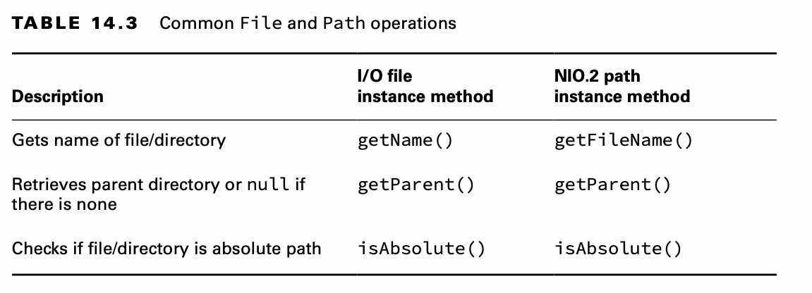
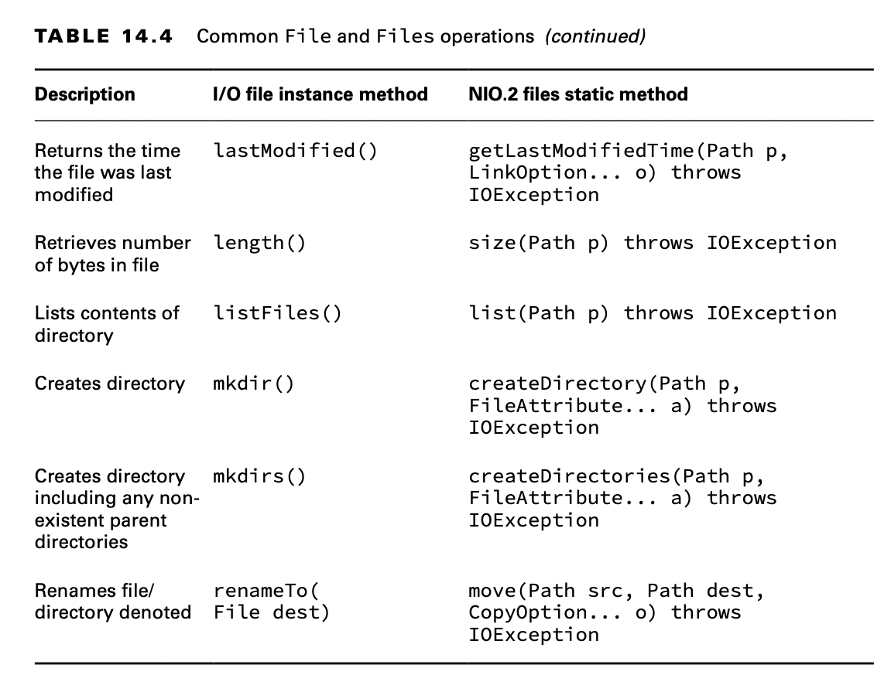

# Operating on File and Path

Now that we know how to create File and Path objects, we can start using them to do useful things.

## Using Shared Functionality

Many operations can be done using both the I/O and NIO.2 libraries.

    private static void io(File file) {
        if (file.exists()) {
            System.out.println("Absolute Path: " + file.getAbsolutePath());
            System.out.println("Is Directory: " + file.isDirectory());
            System.out.println("Parent Path: " + file.getParent());
            if (file.isFile()) {
                System.out.println("Size: " + file.length());
                System.out.println("Last Modified: " + file.lastModified());
            } else {

                for (File subfile : file.listFiles()) {
                    System.out.println(" " + subfile.getName());
                }
            }
        }
    }

In these examples, you see that the output of an I/O-based program is completely dependent on the directories and files
available at runtime in the underlying file system.

On the exam, you might see paths that look like files but are directories or vice versa. For example, /data/zoo.txt
could be a file or a directory, even though it has a file extension.

    public static void nio(Path path) throws IOException {

        if (Files.exists(path)) {
            System.out.println("Absolute Path: " + path.toAbsolutePath());
            System.out.println("Is Directory: " + Files.isDirectory(path));
            System.out.println("Parent Path: " + path.getParent());
    
            if (Files.isRegularFile(path)) {
                System.out.println("Size: " + Files.size(path));
                System.out.println("Last Modified: " + Files.getLastModifiedTime(path));
            } else {
                try (Stream<Path> stream = Files.list(path)) {
                    stream.forEach(p -> System.out.println(" " + p.getName(0)));
                }
            }
    
        }

    }

Most of this example is equivalent and replaces the I/O method calls in the previous tables with the NIO.2 versions.

**Closing the Stream**

Did you notice that in the last code sample, we put our Stream object inside a try-with- resources?The NIO.2
stream-based methods open a connection to the file system that must be properly closed; otherwise, a resource leak could
ensue. A resource leak within the file system means the path may be locked from modification long after the process that
used it is completed.

If you assumed that a stream’s terminal operation would automatically close the underlying file resources, you’d be
wrong.There was a lot of debate about this behavior when it was first presented; in short, requiring developers to close
the stream won out.

Finally, the exam doesn’t always properly close NIO.2 resources.To match the exam, we sometimes skip closing NIO.2
resources in review and practice questions. Always use try- with-resources statements with these NIO.2 methods in your
own code.

## Handling Methods That Declare IOException

Many of the methods presented in this chapter declare IOException. Common causes of a method throwing this exception
include the following:

- Loss of communication to the underlying file system.
- File or directory exists but cannot be accessed or modified.
- File exists but cannot be overwritten.
- File or directory is required but does not exist.

Methods that access or change files and directories, such as those in the Files class, often declare IOException. There
are exceptions to this rule, as we will see. For example, the method Files.exists() does not declare IOException. If it
did throw an exception when the file did not exist, it would never be able to return false! As a rule of thumb,
if a NIO.2 method declares an IOException, it usually requires the paths it operates on to exist.

## Providing NIO.2 Optional Parameters

Many of the NIO.2 methods in this chapter include a varargs that takes an optional list of values. Table 14.5 presents
the arguments you should be familiar with for the exam.

With the exceptions of Files.copy() and Files.move(), we won’t discuss these varargs parameters each time we present a
method. Their behavior should be straightforward, though. For example, can you figure out what the following call to
Files.exists() with the LinkOption does in the following code snippet?

    Path path = Paths.get("schedule.xml");
    boolean exists = Files.exists(path, LinkOption.NOFOLLOW_LINKS);

The Files.exists() simply checks whether a file exists. But if the parameter is a symbolic link, the method checks
whether the target of the symbolic link exists, instead. Providing LinkOption.NOFOLLOW_LINKS means the default behavior
will be overridden, and the method will check whether the symbolic link itself exists.

Note that some of the enums in Table 14.5 inherit an interface. That means some methods accept a variety of enum types.
For example, the Files.move() method takes a CopyOption vararg so it can take enums of different types, and more options
can be added over time.

    void copy(Path source, Path target) throws IOException { 
        Files.move(source, target,LinkOption.NOFOLLOW_LINKS,StandardCopyOption.ATOMIC_MOVE); 
    }

## Interacting with NIO.2 Paths

Just like String values, Path instances are immutable. In the following example, the Path operation on the second line
is lost since p is immutable:

    Path p = Path.of("whale");
    p.resolve("krill");
    System.out.println(p); // whale

### Viewing the Path

The Path interface contains three methods to retrieve basic information about the path rep- resentation. The toString()
method returns a String representation of the entire path. In fact, it is the only method in the Path interface to
return a String. Many of the other methods in the Path interface return Path instances.

The getNameCount() and getName() methods are often used together to retrieve the number of elements in the path and a
reference to each element, respectively.

    Path path = Paths.get("/land/hippo/harry.happy");
    System.out.println("The Path Name is: " + path);
    for (int i = 0; i < path.getNameCount(); i++)
        System.out.println(" Element " + i + " is: " + path.getName(i));

The code prints the following:

    The Path Name is: /land/hippo/harry.happy
    Element 0 is: land
    Element 1 is: hippo
    Element 2 is: harry.happy

Even though this is an absolute path, the root element is not included in the list of names. As we said, these methods
do not consider the root part of the path.

    var p = Path.of("/");
    System.out.print(p.getNameCount()); // 0 
    System.out.print(p.getName(0)); // IllegalArgumentException

Notice that if you try to call getName() with an invalid index, it will throw an exception at runtime.

### Creating Part of the Path

The Path interface includes the subpath() method to select portions of a path. It takes two parameters: an inclusive
beginIndex and an exclusive endIndex.

    var p = Paths.get("/mammal/omnivore/raccoon.image");
    System.out.println("Path is: " + p);
    for (int i = 0; i < p.getNameCount(); i++) {
        System.out.println(" Element " + i + " is: " + p.getName(i));
    }

    System.out.println();
    System.out.println("subpath(0,3): " + p.subpath(0, 3));
    System.out.println("subpath(1,2): " + p.subpath(1, 2));
    System.out.println("subpath(1,3): " + p.subpath(1, 3));

The output of this code snippet is the following:

    Path is: /mammal/omnivore/raccoon.image
    Element 0 is: mammal
    Element 1 is: omnivore
    Element 2 is: raccoon.image
    
    subpath(0,3): mammal/omnivore/raccoon.image
    subpath(1,2): omnivore
    subpath(1,3): omnivore/raccoon.image

Like getNameCount() and getName(), subpath() is zero-indexed and does not include the root. Also like getName(),
subpath() throws an exception if invalid indices are provided.

    var q = p.subpath(0, 4); // IllegalArgumentException 
    var x = p.subpath(1, 1); // IllegalArgumentException

### Accessing Path Elements

The getFileName() method returns the Path element of the current file or directory, while getParent() returns the full
path of the containing directory.

The getParent() method returns null if operated on the root path or at the top of a relative path. The getRoot() method
returns the root element of the file within the file system, or null if the path is a relative path.

    public static void main(String[] args) {

        printPathInformation(Path.of("zoo"));
        printPathInformation(Path.of("/zoo/armadillo/shells.txt"));
        printPathInformation(Path.of("./armadillo/../shells.txt"));
    }

    public static void printPathInformation(Path path) {
        System.out.println("Filename is: " + path.getFileName());
        System.out.println(" Root is: " + path.getRoot());
        Path currentParent = path;
        while ((currentParent = currentParent.getParent()) != null)
            System.out.println(" Current parent is: " + currentParent);
        System.out.println();
    }

### Resolving Paths

The resolve() method provides overloaded versions that let you pass either a Path or String parameter. The object on
which the resolve() method is invoked becomes the basis of the new Path object, with the input argument being appended
onto the Path.

    Path path1 = Path.of("/cats/../panther"); 
    Path path2 = Path.of("food"); 
    System.out.println(path1.resolve(path2));

The code snippet generates the following output:

    /cats/../panther/food

Like the other methods we’ve seen, resolve() does not clean up path symbols. In this example, the input argument to the
resolve() method was a relative path, but what if it had been an absolute path?

    Path path3 = Path.of("/turkey/food"); 
    System.out.println(path3.resolve("/tiger/cage"));

    /tiger/cage

For the exam, you should be cognizant of mixing absolute and relative paths with the resolve() method. If an absolute
path is provided as input to the method, that is the value returned. Simply put, you cannot combine two absolute paths
using resolve().

On the exam, when you see resolve(), think concatenation.

### Relativizing a Path

The Path interface includes a relativize() method for constructing the relative path from one Path to another, often
using path symbols. What do you think the following examples will print?

    var path1 = Path.of("fish.txt");
    var path2 = Path.of("friendly/birds.txt"); 
    System.out.println(path1.relativize(path2)); 
    System.out.println(path2.relativize(path1));

The examples print the following:

    ../friendly/birds.txt
    ../../fish.txt

The idea is this: if you are pointed at a path in the file system, what steps would you need to take to reach the other
path? For example, to get to fish.txt from friendly/birds.txt, you need to go up two levels (the file itself counts as
one level) and then select fish.txt.

If both path values are relative, the relativize() method computes the paths as if they are in the same current working
directory. Alternatively, if both path values are absolute, the method computes the relative path from one absolute
location to another, regardless of the current working directory.

    Path path3 = Paths.get("/habitat");
    Path path4 = Paths.get("/sanctuary/raven/poe.txt");
    System.out.println(path3.relativize(path4));
    System.out.println(path4.relativize(path3));

This code snippet produces the following output:

    ../sanctuary/raven/poe.txt
    ../../../habitat

The relativize() method requires both paths to be absolute or relative and throws an exception if the types are mixed.

    Path path1 = Paths.get("/primate/chimpanzee");
    Path path2 = Paths.get("bananas.txt"); 
    path1.relativize(path2); // IllegalArgumentException

On Windows-based systems, it also requires that if absolute paths are used, both paths must have the same root directory
or drive letter. For example, the following would also throw an IllegalArgumentException on a Windows-based system:

    Path path3 = Paths.get("C:\\primate\\chimpanzee"); 
    Path path4 = Paths.get("D:\\storage\\bananas.txt"); 
    path3.relativize(path4); // IllegalArgumentException

### Normalizing a Path

Java provides the normalize() method to eliminate unnecessary redundancies in a path.
Remember, the path symbol .. refers to the parent directory, while the path symbol . refers to the current directory. We
can apply normalize() to some of our previous paths.

    var p1 = Path.of("./armadillo/../shells.txt"); 
    System.out.println(p1.normalize()); // shells.txt

    var p2 = Path.of("/cats/../panther/food");
    System.out.println(p2.normalize()); // /panther/food

    var p3 = Path.of("../../fish.txt");
    System.out.println(p3.normalize()); // ../../fish.txt

The normalize() method does not remove all of the path symbols, only the ones that can be reduced.

The normalize() method also allows us to compare equivalent paths. Consider the fol- lowing example:

    var p1 = Paths.get("/pony/../weather.txt");
    var p2 = Paths.get("/weather.txt"); 
    System.out.println(p1.equals(p2)); // false 
    System.out.println(p1.normalize().equals(p2.normalize())); // true

The equals() method returns true if two paths represent the same value. In the first comparison, the path values are
different. In the second comparison, the path values have both been reduced to the same normalized value, /weather.txt.
This is the primary function of the normalize() method: to allow us to better compare different paths.

### Retrieving the Real File System Path

While working with theoretical paths is useful, sometimes you want to verify that the path exists within the file system
using toRealPath(). This method is similar to normalize() in that it eliminates any redundant path symbols. It is also
similar to toAbsolutePath(), in that it will join the path with the current working directory if the path is relative.

Unlike those two methods, though, toRealPath() will throw an exception if the path does not exist. In addition, it will
follow symbolic links, with an optional LinkOption varargs parameter to ignore them.

Let’s say that we have a file system in which we have a symbolic link from /zebra to /horse. What do you think the
following will print, given a current working directory of /horse/schedule?

    System.out.println(Paths.get("/zebra/food.txt").toRealPath()); 
    System.out.println(Paths.get(".././food.txt").toRealPath());

The output of both lines is the following:

    /horse/food.txt

We can also use the toRealPath() method to gain access to the current working directory as a Path object.

    System.out.println(Paths.get(".").toRealPath());

### Reviewing NIO.2 Path APIs

## Creating, Moving, and Deleting Files and Directories

### Making Directories

To create a directory, we use these Files methods:

    public static Path createDirectory(Path dir, FileAttribute<?>... attrs) throws IOException

    public static Path createDirectories(Path dir, FileAttribute<?>... attrs) throws IOException

The createDirectory() method will create a directory and throw an exception if it already exists or if the paths leading
up to the directory do not exist.

The createDirectories() method creates the target directory along with any nonexistent parent directories leading up to
the path. If all of the directories already exist, createDirectories() will simply complete without doing anything. This
is useful in situations where you want to ensure a directory exists and create it if it does not.

    Files.createDirectory(Path.of("/bison/field")); 
    Files.createDirectories(Path.of("/bison/field/pasture/green"));

### Copying Files

The Files class provides a method for copying files and directories within the file system.

    public static Path copy(Path source, Path target,CopyOption... options) throws IOException

The method copies a file or directory from one location to another using Path objects.
The following shows an example of copying a file and a directory:

    Files.copy(Paths.get("/panda/bamboo.txt"), Paths.get("/panda-save/bamboo.txt"));

    Files.copy(Paths.get("/turtle"), Paths.get("/turtleCopy"));

When directories are copied, the copy is shallow. A shallow copy means that the files and subdirectories within the
directory are not copied. A deep copy means that the entire tree is copied, including all of its content and
subdirectories. A deep copy typically requires recursion, where a method calls itself.

    public static void copyPath(Path source, Path target) {
        try {
            Files.copy(source, target);
            if (Files.isDirectory(source))
                try (Stream<Path> s = Files.list(source)) {
                    s.forEach(p -> copyPath(p,
                            target.resolve(p.getFileName())));
                }
        } catch (IOException e) { // Handle exception
            System.out.println(e);
        }
    }

### Copying and Replacing Files

By default, if the target already exists, the copy() method will throw an exception. You can change this behavior by
providing the StandardCopyOption enum value REPLACE_EXISTING to the method. The following method call will overwrite the
movie.txt file if it already exists:

    Files.copy(Paths.get("book.txt"), Paths.get("movie.txt"), StandardCopyOption.REPLACE_EXISTING);

For the exam, you need to know that without the REPLACE_EXISTING option, this method will throw an exception if the file
already exists.

### Copying Files with I/O Streams

The Files class includes two copy() methods that operate with I/O streams.

    public static long copy(InputStream in, Path target,CopyOption... options) throws IOException

    public static long copy(Path source, OutputStream out)throws IOException

The first method reads the contents of an I/O stream and writes the output to a file. The second method reads the
contents of a file and writes the output to an I/O stream. These methods are quite convenient if you need to quickly
read/write data from/to disk. The following are examples of each copy() method:

    try (var is = new FileInputStream("source-data.txt")) { // Write I/O stream data to a file
        Files.copy(is, Paths.get("/mammals/wolf.txt"));
    }

    Files.copy(Paths.get("/fish/clown.xsl"), System.out);

### Copying Files into a Directory

For the exam, it is important that you understand how the copy() method operates on both files and directories. For
example, let’s say we have a file, food.txt, and a directory, /enclosure. Both the file and directory exist. What do you
think is the result of executing the following process?

    var file = Paths.get("food.txt");
    var directory = Paths.get("/enclosure"); 
    Files.copy(file, directory);

If you said it would create a new file at /enclosure/food.txt, you’re way off. It throws an exception. The command tries
to create a new file named /enclosure. Since the path /enclosure already exists, an exception is thrown at runtime.

On the other hand, if the directory did not exist, the process would create a new file with the contents of food.txt,
but the file would be called /enclosure. Remember, we said files may not need to have extensions, and in this example,
it matters.

    var file = Paths.get("food.txt");
    var directory = Paths.get("/enclosure/food.txt"); 
    Files.copy(file, directory);

### Moving or Renaming Paths with move()

The Files class provides a useful method for moving or renaming files and directories.

    public static Path move(Path source, Path target, CopyOption... options) throws IOException
    
    The following sample code uses the move() method:

    Files.move(Path.of("C:\\zoo"), Path.of("C:\\zoo-new"));

    Files.move(Path.of("C:\\user\\addresses.txt"), Path.of("C:\\zoo-new\\addresses2.txt"));

### Similarities between move() and copy()

Like copy(), move() requires REPLACE_EXISTING to overwrite the target if it exists; oth- erwise, it will throw an
exception. Also like copy(), move() will not put a file in a directory if the source is a file and the target is a
directory. Instead, it will create a new file with the name of the directory.

### Performing an Atomic Move

Another enum value that you need to know for the exam when working with the move() method is the StandardCopyOption
value ATOMIC_MOVE.

    Files.move(Path.of("mouse.txt"), Path.of("gerbil.txt"), StandardCopyOption.ATOMIC_MOVE);

An atomic move is one in which a file is moved within the file system as a single indivisible operation. Put another
way, any process monitoring the file system never sees an incomplete or partially written file. If the file system does
not support this feature, an AtomicMoveNotSupportedException will be thrown.

Note that while ATOMIC_MOVE is available as a member of the StandardCopyOption type, it will likely throw an exception
if passed to a copy() method.

### Deleting a File with delete() and deleteIfExists()

The Files class includes two methods that delete a file or empty directory within the file system.

    public static void delete(Path path) throws IOException

    public static boolean deleteIfExists(Path path) throws IOException

To delete a directory, it must be empty. Both of these methods throw an exception if operated on a nonempty directory.
In addition, if the path is a symbolic link, the symbolic link will be deleted, not the path that the symbolic link
points to.

The methods differ on how they handle a path that does not exist. The delete() method throws an exception if the path
does not exist, while the deleteIfExists() method returns true if the delete was successful or false otherwise.

Similar to createDirectories(), deleteIfExists() is useful in situations where you want to ensure that a path does not
exist and delete it if it does.

    Files.delete(Paths.get("/vulture/feathers.txt"));
    Files.deleteIfExists(Paths.get("/pigeon"));

The first example deletes the feathers.txt file in the vulture directory, and it throws a NoSuchFileException if the
file or directory does not exist. The second example deletes the pigeon directory, assuming it is empty. If the pigeon
directory does not exist, the second line will not throw an exception.

## Comparing Files with isSameFile() and mismatch()

Since a path may include path symbols and symbolic links within a file system, the equals() method can’t be relied on to
know if two Path instances refer to the same file. Luckily, there is the isSameFile() method.

This method takes two Path objects as input,resolves all path symbols, and follows symbolic links. Despite the name, the
method can also be used to determine whether two Path objects refer to the same directory.

While most uses of isSameFile() will trigger an exception if the paths do not exist, there is a special case in which it
does not. If the two path objects are equal in terms of equals(), the method will just return true without checking
whether the file exists.

Given the structure defined in Figure 14.4, what does the following output?

    System.out.println(Files.isSameFile( Path.of("/animals/cobra"), Path.of("/animals/snake")));

    System.out.println(Files.isSameFile( Path.of("/animals/monkey/ears.png"), Path.of("/animals/wolf/ears.png")));  

Since snake is a symbolic link to cobra, the first example outputs true. In the second example, the paths refer to
different files, so false is printed.

Sometimes you want to compare the contents of the file rather than whether it is physi- cally the same file. For
example, we could have two files with text hello. The mismatch() method was introduced in Java 12 to help us out here.
It takes two Path objects as input. The method returns -1 if the files are the same; otherwise, it returns the index of
the first position in the file that differs.

    System.out.println(Files.mismatch( Path.of("/animals/monkey.txt"), Path.of("/animals/wolf.txt")));

Suppose monkey.txt contains the name Harold and wolf.txt contains the name Howler. The previous code prints 1 in that
case because the second position is different, and we use zero-based indexing in Java. Given those values, what do you
think this code prints?

    System.out.println(Files.mismatch( Path.of("/animals/wolf.txt"), Path.of("/animals/monkey.txt")));    

The answer is the same as the previous example. The code prints 1 again. The mismatch() method is symmetric and returns
the same result regardless of the order of the parameters.
