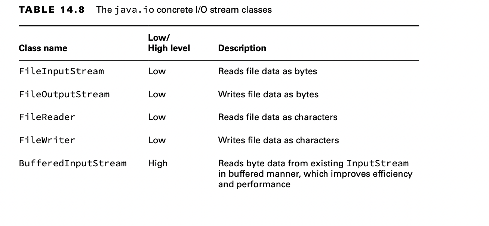
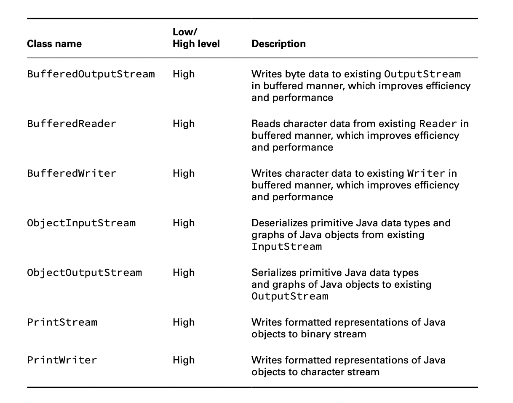

# Introducing I/O Streams

## Understanding I/O Stream Fundamentals

The contents of a file may be accessed or written via an I/O stream, which is a list of data elements presented
sequentially. An I/O stream can be conceptually thought of as a long, nearly never-ending stream of water with data
presented one wave at a time.

Although the java.io API is full of I/O streams that handle characters, strings, groups of bytes, and so on, nearly all
are built on top of reading or writing an individual byte or an array of bytes at a time. Higher-level I/O streams exist
for convenience as well as performance.

## Learning I/O Stream Nomenclature

The java.io API provides numerous classes for creating, accessing, and manipulating I/O streams—so many that it tends to
overwhelm many new Java developers. Stay calm! We review the major differences between each I/O stream class and show
you how to distinguish between them.

### Storing Data as Bytes

Data is stored in a file system (and memory) as a 0 or 1, called a bit. Since it’s really hard for humans to read/write
data that is just 0s and 1s, they are grouped into a set of 8 bits, called a byte.

What about the Java byte primitive type? As you learn later, when we use I/O streams, values are often read or written
using byte values and arrays.

## Byte Streams vs. Character Streams

The java.io API defines two sets of I/O stream classes for reading and writing I/O streams: byte I/O streams and
character I/O streams. We use both types of I/O streams throughout this chapter.

**Differences between Byte and Character I/O Streams**

- Byte I/O streams read/write binary data (0s and 1s) and have class names that end in InputStream or OutputStream.
- Character I/O streams read/write text data and have class names that end in Reader or Writer.

The API frequently includes similar classes for both byte and character I/O streams, such as FileInputStream and
FileReader. The difference between the two classes is based on how the bytes are read or written.

The byte I/O streams are primarily used to work with binary data, such as an image or executable file, while character
I/O streams are used to work with text files. For example, you can use a Writer class to output a String value to a file
without necessarily having to worry about the underlying character encoding of the file.

**Character Encoding in Java**

In Java, the character encoding can be specified using the Charset class by passing a name value to the static
Charset.forName() method, such as in the following examples:

    Charset usAsciiCharset = Charset.forName("US-ASCII"); 
    Charset utf8Charset = Charset.forName("UTF-8"); 
    Charset utf16Charset = Charset.forName("UTF-16");

## Input vs. Output Streams

Most InputStream classes have a corresponding OutputStream class, and vice versa. For example, the FileOutputStream
class writes data that can be read by a FileInputStream. If you understand the features of a particular Input or Output
stream class, you should naturally know what its complementary class does.

It follows, then, that most Reader classes have a corresponding Writer class. For example, the FileWriter class writes
data that can be read by a FileReader.

There are exceptions to this rule. For the exam, you should know that PrintWriter has no accompanying PrintReader class.
Likewise, the PrintStream is an OutputStream that has no corresponding InputStream class. It also does not have Output
in its name.

## Low-Level vs. High-Level Streams

A low-level stream connects directly with the source of the data, such as a file, an array, or a String. Low-level I/O
streams process the raw data or resource and are accessed in a direct and unfiltered manner. For example, a
FileInputStream is a class that reads file data one byte at a time.

Alternatively, a high-level stream is built on top of another I/O stream using wrapping. Wrapping is the process by
which an instance is passed to the constructor of another class, and operations on the resulting instance are filtered
and applied to the original instance.
For example, take a look at the FileReader and BufferedReader objects in the following sample code:

    try (var br = new BufferedReader(new FileReader("zoo-data.txt"))) { 
        System.out.println(br.readLine());
    }

In this example, FileReader is the low-level I/O stream, whereas BufferedReader is the high-level I/O stream that takes
a FileReader as input. Many operations on the high-level I/O stream pass through as operations to the underlying
low-level I/O stream, such as read() or close(). Other operations override or add new functionality to the low-level I/O
stream methods. The high-level I/O stream may add new methods, such as readLine(), as well as performance enhancements
for reading and filtering the low-level data.

High-level I/O streams can also take other high-level I/O streams as input.

    try (var ois = new ObjectInputStream( 
        new BufferedInputStream(
            new FileInputStream("zoo-data.txt")))) { 
        System.out.print(ois.readObject());
    }

## Stream Base Classes

The java.io library defines four abstract classes that are the parents of all I/O stream classes defined within the API:
InputStream, OutputStream, Reader, and Writer.

The constructors of high-level I/O streams often take a reference to the abstract class. For example, BufferedWriter
takes a Writer object as input, which allows it to take any subclass of Writer.

    new BufferedInputStream(new FileReader("z.txt")); // DOES NOT COMPILE 
    new BufferedWriter(new FileOutputStream("z.txt")); // DOES NOT COMPILE 
    new ObjectInputStream(
        new FileOutputStream("z.txt")); // DOES NOT COMPILE 
    new BufferedInputStream(new InputStream()); // DOES NOT COMPILE

The first two examples do not compile because they mix Reader/Writer classes with InputStream/OutputStream classes,
respectively. The third example does not compile because we are mixing an OutputStream with an InputStream. Although it
is possible to read data from an InputStream and write it to an OutputStream, wrapping the I/O stream is not the way to
do so. As you see later in this chapter, the data must be copied over. Finally, the last example does not compile
because InputStream is an abstract class, and therefore you cannot create an instance of it.

## Decoding I/O Class Names

Pay close attention to the name of the I/O class on the exam, as decoding it often gives you context clues as to what
the class does. For example, without needing to look it up, it should be clear that FileReader is a class that reads
data from a file as characters or strings. Furthermore, ObjectOutputStream sounds like a class that writes object data
to a byte stream.

