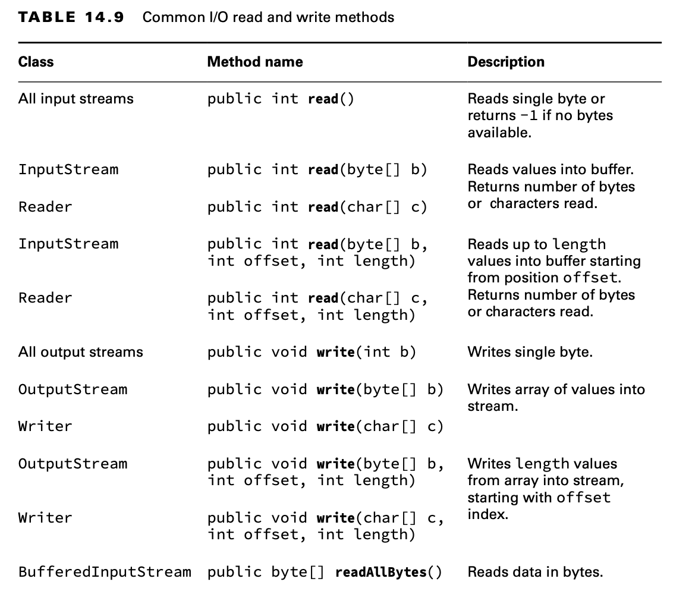

# Reading and Writing Files

## Using I/O Streams

I/O streams are all about reading/writing data, so it shouldn’t be a surprise that the most important methods are read()
and write(). Both InputStream and Reader declare a read() method to read byte data from an I/O stream.

The following copyStream() methods show an example of reading all of the values of an InputStream and Reader and writing
them to an OutputStream and Writer, respectively. In both examples, -1 is used to indicate the end of the stream.

    void copyStream(InputStream in, OutputStream out) throws IOException {
        int b;
        while ((b = in.read()) != -1) {
            out.write(b);
        }
    }

    void copyStream(Reader in, Writer out) throws IOException {
        int b;
        while ((b = in.read()) != -1) {
            out.write(b);
        }
    }

Hold on. We said we are reading and writing bytes, so why do the methods use int instead of byte? Remember, the byte
data type has a range of 256 characters. They needed an extra value to indicate the end of an I/O stream. The authors of
Java decided to use a larger data type, int, so that special values like -1 would indicate the end of an I/O stream. The
output stream classes use int as well, to be consistent with the input stream classes.

    void copyStreamV2(InputStream in, OutputStream out) throws IOException {
        int batchSize = 1024;
        var buffer = new byte[batchSize];
        int lengthRead;
        while ((lengthRead = in.read(buffer, 0, batchSize)) > 0) {
            out.write(buffer, 0, lengthRead);
            out.flush();
        }
    }

Instead of reading the data one byte at a time, we read and write up to 1024 bytes at a time on line 14. The return
value lengthRead is critical for determining whether we are at the end of the stream and knowing how many bytes we
should write into our output stream.

We also added a flush() method on line 16 to reduce the amount of data lost if the application terminates unexpectedly.
When data is written to an output stream, the underlying operating system does not guarantee that the data will make
it to the file system immediately. The flush() method requests that all accumulated data be written immediately to
disk. It is not without cost, though. Each time it is used, it may cause a noticeable delay in the application,
especially for large files. Unless the data that you are writing is extremely critical, the flush() method should be
used only intermittently. For example, it should not necessarily be called after every write, as it is in this example.

The previous example makes reading and writing a file look like a lot to think about. That’s because it only uses
low-level I/O streams. Let’s try again using high-level streams.

    void copyTextFile(File src, File dest) throws IOException {
        try (var reader = new BufferedReader(new FileReader(src));
             var writer = new BufferedWriter(new FileWriter(dest))) {
            String line = null;
            while ((line = reader.readLine()) != null) {
                writer.write(line);
                writer.newLine();
            }
        }
    }

The key is to choose the most useful high-level classes. In this case, we are dealing with a File, so we want to use a
FileReader and FileWriter. Both classes have constructors that can take either a String representing the location or a
File directly.

If the source file does not exist, a FileNotFoundException, which inherits IOException, will be thrown. If the
destination file already exists, this implementation will overwrite it. We can pass an optional boolean second parameter
to FileWriter for an append flag if we want to change this behavior.

Now imagine that we wanted byte data instead of characters. We would need to choose different high-level classes:
BufferedInputStream, BufferedOutputStream, FileInputStream, and FileOuputStream. We would call readAllBytes() instead of
readLine() and store the result in a byte[] instead of a String. Finally, we wouldn’t need to handle new lines since the
data is binary.

We can do a little better than BufferedOutputStream and BufferedWriter by using a PrintStream and PrintWriter. These
classes contain four key methods. The print() and println() methods print data with and without a new line,
respectively. There are also the format() and printf() methods, which we describe in the section on user interactions.

    void copyTextFileV2(File src, File dest) throws IOException {
        try (var reader = new BufferedReader(new FileReader(src));
             var writer = new PrintWriter(new FileWriter(dest))) {
            String line = null;
            while ((line = reader.readLine()) != null)
                writer.println(line);
        }
    }

The print stream classes have the distinction of being the only I/O stream classes we cover that do not have
corresponding input stream classes. And unlike other OutputStream classes, PrintStream does not have Output in its name.

It may surprise you that you’ve been regularly using a PrintStream throughout this book. Both System.out and System.err
are PrintStream objects. Likewise, System.in, often useful for reading user input, is an InputStream.

Unlike the majority of the other I/O streams we’ve covered, the methods in the print stream classes do not throw any
checked exceptions. If they did, you would be required to catch a checked exception any time you called
System.out.print()!

The line separator is \n or \r\n, depending on your operating system. The println() method takes care of this for you.
If you need to get the character directly, either of the following will return it for you:

    System.getProperty("line.separator"); 
    System.lineSeparator();

## Enhancing with Files

The NIO.2 APIs provide even easier ways to read and write a file using the Files class. Let’s
start by looking at three ways of copying a file by reading in the data and writing it back:

    private void copyPathAsString(Path input, Path output) throws IOException {
        String string = Files.readString(input);
        Files.writeString(output, string);
    }

    private void copyPathAsBytes(Path input, Path output) throws IOException {
        byte[] bytes = Files.readAllBytes(input);
        Files.write(output, bytes);
    }

    private void copyPathAsLines(Path input, Path output) throws IOException {
        List<String> lines = Files.readAllLines(input);
        Files.write(output, lines);
    }

That’s pretty concise! You can read a Path as a String, a byte array, or a List. Be aware that the entire file is read
at once for all three of these, thereby storing all of the contents of the file in memory at the same time. If the
file is significantly large, you may trigger an OutOfMemoryError when trying to load all of it into memory. Luckily,
there is an alternative. This time, we print out the file as we read it.

    private void readLazily(Path path) throws IOException {
        try (Stream<String> s = Files.lines(path)) {
            s.forEach(System.out::println);
        }
    }

**Files.readAllLines() vs. Files.lines()**

For the exam, you need to know the difference between readAllLines() and lines(). Both of these examples compile and
run:

    Files.readAllLines(Paths.get("birds.txt")).forEach(System.out::println); 
    Files.lines(Paths.get("birds.txt")).forEach(System.out::println);

The first line reads the entire file into memory and performs a print operation on the result, while the second line
lazily processes each line and prints it as it is read.The advantage of the second code snippet is that it does not
require the entire file to be stored in memory at any time.

You should also be aware of when they are mixing incompatible types on the exam. Do you see why the following does not
compile?

    Files.readAllLines(Paths.get("birds.txt")) 
    .filter(s -> s.length()> 2)
    .forEach(System.out::println);

The readAllLines() method returns a List, not a Stream, so the filter() method is not available.

## Combining with newBufferedReader() and newBufferedWriter()

Sometimes you need to mix I/O streams and NIO.2. Conveniently, Files includes two convenience methods for getting I/O
streams.

    private void copyPath(Path input, Path output) throws IOException { 
        try (var reader = Files.newBufferedReader(input);
            var writer = Files.newBufferedWriter(output)) {

            String line = null;
    
            while ((line = reader.readLine()) != null) writer.write(line);
                writer.newLine();
            }
        } 
    }

## Reviewing Common Read and Write Methods

Table 14.9 reviews the public common I/O stream methods you should know for reading and writing. We also include close()
and flush() since they are used when performing these actions. Table 14.10 does the same for common public NIO.2 read
and write methods.

