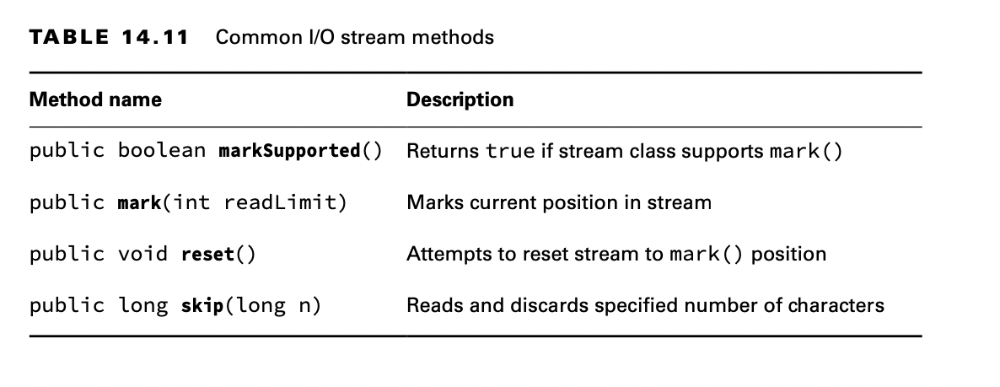
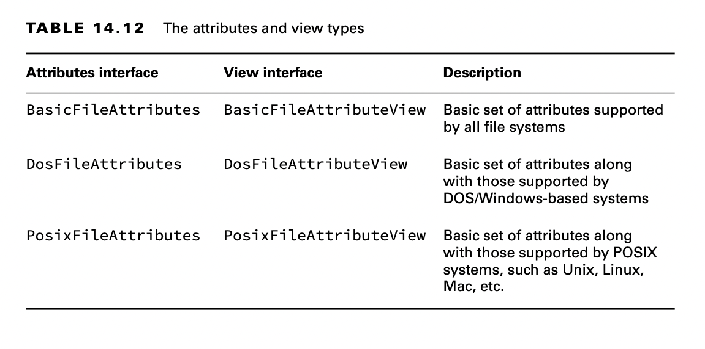

# Working with Advanced APIs

## Manipulating Input Streams

All input stream classes include the following methods to manipulate the order in which data is read from an I/O stream:

    // InputStream and Reader
    public boolean markSupported()
    public void mark(int readLimit)
    public void reset() throws IOException 
    public long skip(long n) throws IOException

The mark() and reset() methods return an I/O stream to an earlier position. Before calling either of these methods, you
should call the markSupported() method, which returns true only if mark() is supported. The skip() method is pretty
simple; it basically reads data from the I/O stream and discards the contents.

Not all input stream classes support mark() and reset(). Make sure to call markSupported() on the I/O stream before
calling these methods, or an exception will be thrown at runtime.

### Marking Data

Assume that we have an InputStream instance whose next values are LION. Consider the following code snippet:

    public void readData(InputStream is) throws IOException {
        System.out.print((char) is.read()); // L
        if (is.markSupported()) {
            is.mark(100); // Marks up to 100 bytes
            System.out.print((char) is.read()); // I
            System.out.print((char) is.read()); // O
            is.reset(); // Resets stream to position before I
        }

        System.out.print((char) is.read()); // I
        System.out.print((char) is.read()); // O
        System.out.print((char) is.read());  // N
    }

The code snippet will output LIOION if mark() is supported and LION otherwise. It’s a good practice to organize your
read() operations so that the I/O stream ends up at the same position regardless of whether mark() is supported.

What about the value of 100 that we passed to the mark() method? This value is called the readLimit. It instructs the
I/O stream that we expect to call reset() after at most 100 bytes. If our program calls reset() after reading more than
100 bytes from calling mark(100), it may throw an exception, depending on the I/O stream class.

In actuality, mark() and reset() are not putting the data back into the I/O stream but are storing the data in a
temporary buffer in memory to be read again. Therefore, you should not call the mark() operation with too large a value,
as this could take up a lot of memory.

### Skipping Data

Assume that we have an InputStream instance whose next values are TIGERS. Consider the following code snippet:

    System.out.print((char) is.read()); // T
    is.skip(2); // Skips I and G
    is.read(); // Reads E but doesn't output it
    System.out.print((char) is.read()); // R
    System.out.print((char) is.read()); // S

This code prints TRS at runtime. We skipped two characters, I and G. We also read E but didn’t use it anywhere, so it
behaved like calling skip(1).

## Reviewing Manipulation APIs

## Discovering File Attributes

### Checking for Symbolic Links

Earlier, we saw that the Files class has methods called isDirectory() and isRegularFile(), which are similar to the
isDirectory() and isFile() methods on File. While the File object can’t tell you if a reference is a symbolic link, the
isSymbolicLink() method on Files can.

It is possible for isDirectory() or isRegularFile() to return true for a symbolic link, as long as the link resolves to
a directory or regular file, respectively.

    System.out.print(Files.isDirectory(Paths.get("/canine/fur.jpg"))); 
    System.out.print(Files.isSymbolicLink(Paths.get("/canine/coyote"))); 
    System.out.print(Files.isRegularFile(Paths.get("/canine/types.txt")));

### Checking File Accessibility

In many file systems, it is possible to set a boolean attribute to a file that marks it hidden, readable, or executable.
The Files class includes methods that expose this information: isHidden(), isReadable(), isWriteable(), and
isExecutable().

    System.out.print(Files.isHidden(Paths.get("/walrus.txt")));
    System.out.print(Files.isReadable(Paths.get("/seal/baby.png")));
    System.out.print(Files.isWritable(Paths.get("dolphin.txt")));
    System.out.print(Files.isExecutable(Paths.get("whale.png")));

### Improving Attribute Access

Up until now, we have been accessing individual file attributes with multiple method calls. While this is functionally
correct, there is often a cost each time one of these methods is called. Put simply, it is far more efficient to ask the
file system for all of the attributes at once rather than performing multiple round trips to the file system.
Furthermore, some attributes are file system–specific and cannot be easily generalized for all file systems.

NIO.2 addresses both of these concerns by allowing you to construct views for various file systems with a single method
call. A view is a group of related attributes for a particular file system type. That’s not to say that the earlier
attribute methods that we just finished discussing do not have their uses. If you need to read only one attribute of a
file or directory, requesting a view is unnecessary.

### Understanding Attribute and View Types

NIO.2 includes two methods for working with attributes in a single method call: a read-only attributes method and an
updatable view method. For each method, you need to provide a file system type object, which tells the NIO.2 method
which type of view you are requesting. By updatable view, we mean that we can both read and write attributes with the
same object.

### Retrieving Attributes

The Files class includes the following method to read attributes of a class in a read- only capacity:

    public static <A extends BasicFileAttributes> A readAttributes( 
        Path path,
        Class<A> type,
        LinkOption... options) throws IOException

Applying it requires specifying the Path and BasicFileAttributes.class parameters.

    var path = Paths.get("/turtles/sea.txt");
    BasicFileAttributes data = Files.readAttributes(path, BasicFileAttributes.class);

    System.out.println("Is a directory? " + data.isDirectory()); 
    System.out.println("Is a regular file? " +data.isRegularFile());
    System.out.println("Is a symbolic link? " + data.isSymbolicLink()); 
    System.out.println("Size (inbytes): " + data.size()); 
    System.out.println("Last modified: " + data.lastModifiedTime());

### Modifying Attributes

The following Files method returns an updatable view:

    public static <V extends FileAttributeView> V getFileAttributeView( 
        Path path,
        Class<V> type, 
        LinkOption... options)

We can use the updatable view to increment a file’s last modified date/time value by 10,000 milliseconds, or 10 seconds.

    // Read file attributes
    var path = Paths.get("/turtles/sea.txt"); 
    BasicFileAttributeView view = Files.getFileAttributeView(path,BasicFileAttributeView.class);
    BasicFileAttributes attributes = view.readAttributes();

    // Modify file last modified time
    FileTime lastModifiedTime = FileTime.fromMillis(attributes.lastModifiedTime().toMillis() + 10_000);
    view.setTimes(lastModifiedTime, null, null);

After the updatable view is retrieved, we need to call readAttributes() on the view to obtain the file metadata. From
there, we create a new FileTime value and set it using the setTimes() method:

    // BasicFileAttributeView instance method 
    public void setTimes(FileTime lastModifiedTime,FileTime lastAccessTime, FileTime createTime)

Not all file attributes can be modified with a view. For example, you cannot set a property that changes a file into a
directory. Likewise, you cannot change the size of the object without modifying its contents.
