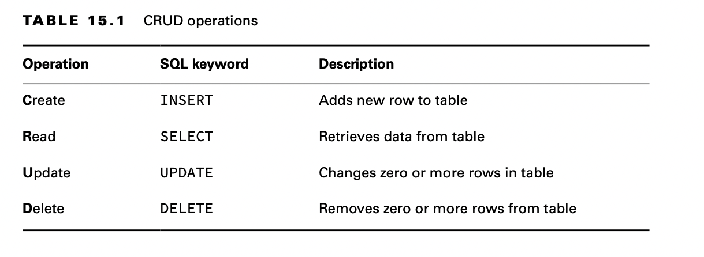

# JDBC

JDBC stands for Java Database Connectivity. This chapter introduces you to the basics of accessing databases from Java.

# Introducing Relational Databases and SQL

A database is an organized collection of data. In the real world, a file cabinet is a type of database. It has file
folders, each of which contains pieces of paper. The file folders are organized in some way, often alphabetically.

A relational database is a database that is organized into tables, which consist of rows and columns. You can think of a
table as a spreadsheet. There are two main ways to access a relational database from Java:

- Java Database Connectivity (JDBC): Accesses data as rows and columns. JDBC is the API covered in this chapter.
- Java Persistence API (JPA): Accesses data through Java objects using a concept called object-relational mapping (ORM).

A relational database is accessed through Structured Query Language (SQL). SQL is a programming language used to
interact with database records. JDBC works by sending a SQL command to the database and then processing the response.

In addition to relational databases, there is another type of database called a NoSQL database. These databases store
their data in a format other than tables, such as key/value, document stores, and graph-based databases.

## Identifying the Structure of a Relational Database

Our sample database has two tables. One has a row for each species that is in our zoo. The other has a row for each
animal. These two relate to each other because an animal belongs to a species.

Each table has a primary key, which gives us a unique way to reference each row. After all, two animals might have the
same name, but they can’t have the same ID.

## Writing Basic SQL Statements

The most important thing that you need to know about SQL for the exam is that there are four types of statements for
working with the data in tables. They are referred to as CRUD (Create, Read, Update, Delete).

Unlike Java, SQL keywords are case insensitive. This means select, SELECT, and Select are all equivalent.

Like Java primitive types, SQL has a number of data types. Most are self-explanatory, like INTEGER. There’s also
DECIMAL, which functions a lot like a double in Java. The strangest one is VARCHAR, standing for “variable character,”
which is like a String in Java. The variable part means that the database should use only as much space as it needs to
store the value.

Adds new row with provided values. Defaults to order in which columns were defined in table.

    INSERT INTO exhibits VALUES (3, 'Asian Elephant', 7.5);

Reads data from table with optional WHERE clause to limit data returned. In SELECT, can use * to return all columns,
list specific ones to return, or even call functions like COUNT(*) to return number of matching rows.

    SELECT * FROM exhibits WHERE ID = 3;

Sets column’s value with optional WHERE clause to limit rows updated.

    UPDATE exhibits SET num_acres = num_acres + .5 WHERE name = 'Asian Elephant';

Deletes rows with optional WHERE clause to limit rows deleted.

    DELETE FROM exhibits WHERE name = 'Asian Elephant';