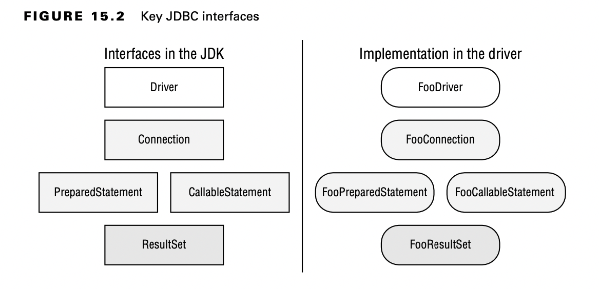

# Introducing the Interfaces of JDBC

For the exam, you need to know five key interfaces of JDBC. The interfaces are declared in the JDK.

With JDBC, the concrete classes come from the JDBC driver. Each database has a different JAR file with these classes.
This driver JAR contains an implementation of these key interfaces along with a number of other interfaces. The key is
that the provided implementations know how to communicate with a database. There are also different types of drivers;
luckily, you don’t need to know about this for the exam.

What do these five interfaces do? On a very high level, we have the following:

- Driver: Establishes a connection to the database
- Connection: Sends commands to a database
- PreparedStatement: Executes a SQL query
- CallableStatement: Executes commands stored in the database
- ResultSet: Reads the results of a query

All database interfaces are in the package java.sql, so we often omit the imports throughout this chapter.

If you are experienced, remember that the exam uses the DriverManager class instead of the DataSource interface.

    public class MyFirstDatabaseConnection {
        public static void main(String[] args) throws SQLException {
            String url = "jdbc:hsqldb:file:zoo";
            try (Connection conn = DriverManager.getConnection(url);
                 PreparedStatement ps = conn.prepareStatement("SELECT name FROM exhibits");
                 ResultSet rs = ps.executeQuery()) {
                while (rs.next())
                    System.out.println(rs.getString(1));
            } catch (SQLException e) {
                throw new RuntimeException(e);
            }
        }
    }

**Compiling with Modules**

Almost all the packages on the exam are in the java.base module. As you may recall from Chapter 12, “Modules,” this
module is included automatically when you run your application as a module.

In contrast, the JDBC classes are all in the module java.sql.They are also in the package java.sql. The names are the
same, so they should be easy to remember. When working with SQL, you need the java.sql module and import java.sql.*.

That said, if you do want to use JDBC code with modules, remember to update your module-info file to include the
following:

    requires java.sql;

