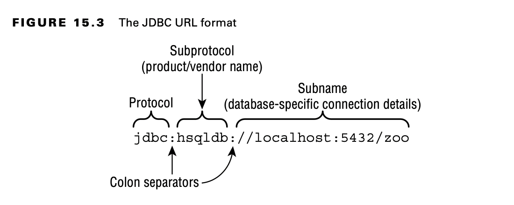

# Connecting to a Database

## Building a JDBC URL

To access a website, you need to know its URL. To access your email, you need to know your username and password. JDBC
is no different. To access a database, you need to know this information about it.

Unlike web URLs, JDBC URLs have a variety of formats. They have three parts in common, as shown in Figure 15.3. The
first piece is always the same. It is the protocol jdbc. The second part is the subprotocol, which is the name of the
database, such as hsqldb, mysql, or postgres. The third part is the subname, which is a database-specific format.
Colons (:) separate the three parts.

The subname typically contains information about the database such as its location and/or name. The syntax varies. You
need to know about the three main parts.

Notice the three parts. It starts with jdbc, and then comes the subprotocol hsqldb. It ends with the subname, which
tells us we are using the file system. The location is then the database name.

Other examples of subnames are shown here:

    jdbc:postgresql://localhost/zoo 
    jdbc:oracle:thin:@123.123.123.123:1521:zoo 
    jdbc:mysql://localhost:3306 
    jdbc:mysql://localhost:3306/zoo?profileSQL=true

## Getting a Database Connection

There are two main ways to get a Connection: DriverManager and DataSource. DriverManager is the one covered on the exam.
Do not use a DriverManager in code someone is paying you to write. A DataSource has more features than DriverManager.
For example, it can pool connections or store the database connection information outside the application.

The DriverManager class is in the JDK, as it is an API that comes with Java. It uses the factory pattern, which means
that you call a static method to get a Connection rather than calling a constructor.

    public class TestConnect {
        public static void main(String[] args) throws SQLException {

            try (Connection conn = DriverManager.getConnection("")) {
                System.out.println(conn
                );
            }
        }
    }

As in Chapter 11, we use a try-with-resources statement to ensure that database resources are closed. We cover closing
database resources in more detail later in the chapter. We also throw the checked SQLException, which means something
went wrong. For example, you might have forgotten to set the location of the database driver in your classpath.

The details of the output aren’t important. Just notice that the class is not Connection. It is a vendor implementation
of Connection.

    import java.sql.*;
    
    public class TestExternal {
        public static void main(String[] args) throws SQLException {
            try (Connection conn = DriverManager.getConnection(
                    "jdbc:postgresql://localhost:5432/ocp-book", "username",
                    "Password20182")) {
                System.out.println(conn);
            }
        }
    }

Notice the three parameters that are passed to getConnection(). The first is the JDBC URL that you learned about in the
previous section. The second is the username for access- ing the database, and the third is the password for accessing
the database.

Unless the exam specifies a command line, you can assume that the correct JDBC driver JAR is in the classpath. The exam
creators explicitly ask about the driver JAR if they want you to think about it.

DriverManager looks through any drivers it can find to see whether they can handle the JDBC URL. If so, it creates a
Connection using that Driver. If not, it gives up and throws a SQLException.

You might see Class.forName() in code. It was required with older drivers (that were designed for older versions of
JDBC) before getting a Connection.